# Data Model

This is the durable human entry point for LocalBrain's effective SQLite model. Implementation truth remains [schema.sql](../../../src/localbrain/schema.sql) for a fresh database and [db.py](../../../src/localbrain/db.py) for compatible startup changes and runtime-only indexes. The documents here explain ownership, meaning, lifecycle, and recovery; they do not replace DDL or approve cleanup.

[Value Dictionaries](data-model/value-dictionaries.md) map bounded physical values, logical meaning, complete presentation modes, and visible-consumer ownership without duplicating the table catalogs below.

## Baseline Identity

- Baseline: `localbrain-data-model-2026-09-01`
- Ordinary tables: `42`
- FTS5 virtual tables: `1` (`search_index`)
- Physical foreign keys: `57`
- Effective explicitly named indexes: `46`
- Focused subject areas: `10`
- `schema.sql` SHA-256: `b200e125b552c30645b16f2b7b50d23dcc015d624cadd1d5da135b89543869fd`
- `db.py` SHA-256: `e86117f629c765c41c7e5762374dedcfd0167f761f7a6dc9e71547968296a6c0`

SQLite primary-key and uniqueness autoindexes and FTS5 shadow tables are implementation internals and are not counted as primary objects or explicitly named indexes. Validation applies `schema.sql` only to an in-memory database; no user database or runtime row is read.

## Subject Ownership

Every primary object has exactly one owner. Cross-subject consumers link back to that owner rather than duplicating its catalog.

| Subject | Primary objects | Durable owner |
| --- | --- | --- |
| Source registry and scans | `sources`, `source_files`, `external_source_instances`, `external_source_capabilities` | [Source Registry And Scans](data-model/source-registry-and-scans.md) |
| Workspace and Session activity | `workspaces`, `sessions`, `activity_events`, `session_pins`, `session_reference_scans`, `session_reference_evidence` | [Workspace And Session Activity](data-model/workspace-and-session-activity.md) |
| Usage and cost records | `usage_price_snapshots`, `usage_model_prices`, `usage_records` | [Usage And Cost Records](data-model/usage-and-cost-records.md) |
| Local Context corpus | `context_roots`, `context_documents` | [Local Context Corpus](data-model/local-context-corpus.md) |
| Work organization and resources | `workstreams`, `threads`, `workstream_links`, `thread_links`, `local_resources`, `external_resources` | [Work Organization And Resources](data-model/work-organization-and-resources.md) |
| Atlassian source memory | `atlassian_sites`, `atlassian_site_bindings`, `atlassian_spaces`, `atlassian_items`, `atlassian_item_urls`, `atlassian_item_remote_state`, `atlassian_item_content`, `atlassian_item_local_state`, `atlassian_classifications`, `atlassian_item_classifications`, `atlassian_evidence_scans`, `atlassian_item_evidence`, `atlassian_structure_references`, `atlassian_structure_reference_urls`, `atlassian_structure_reference_evidence` | [Atlassian Source Memory](data-model/atlassian-source-memory.md) |
| Review and resume continuity | `suggestions`, `checkpoints`, `checkpoint_resource_refs` | [Review And Resume Continuity](data-model/review-and-resume-continuity.md) |
| Maintenance execution | `maintenance_runs`, `external_sync_runs` | [Maintenance Execution](data-model/maintenance-execution.md) |
| Workflow assertions | `workflow_assertions` | [Workflow Assertions](data-model/workflow-assertions.md) |
| Derived retrieval index | `search_index` | [Derived Retrieval Index](data-model/derived-retrieval-index.md) |

## Level-Zero ERD

Solid relationships are SQLite foreign keys. Dotted relationships are application-enforced identities, snapshots, correlations, or projections; SQLite does not validate them. Labels state deletion behavior for physical edges and purpose for application edges. Only identity fields appear here so the global map remains navigable.

```mermaid
erDiagram
    SOURCES { integer id PK }
    SOURCE_FILES { integer id PK }
    EXTERNAL_SOURCE_INSTANCES { integer id PK }
    EXTERNAL_SOURCE_CAPABILITIES { integer source_instance_id PK }
    WORKSPACES { integer id PK }
    SESSIONS { integer id PK }
    ACTIVITY_EVENTS { string id PK }
    SESSION_PINS { integer session_id PK }
    SESSION_REFERENCE_SCANS { integer session_id PK }
    SESSION_REFERENCE_EVIDENCE { integer id PK }
    USAGE_PRICE_SNAPSHOTS { string id PK }
    USAGE_MODEL_PRICES { string snapshot_model PK }
    USAGE_RECORDS { string id PK }
    CONTEXT_ROOTS { integer id PK }
    CONTEXT_DOCUMENTS { integer id PK }
    WORKSTREAMS { integer id PK }
    THREADS { integer id PK }
    WORKSTREAM_LINKS { integer id PK }
    THREAD_LINKS { integer id PK }
    LOCAL_RESOURCES { integer id PK }
    EXTERNAL_RESOURCES { integer id PK }
    ATLASSIAN_SITES { integer id PK }
    ATLASSIAN_SITE_BINDINGS { integer id PK }
    ATLASSIAN_SPACES { integer id PK }
    ATLASSIAN_ITEMS { integer external_resource_id PK }
    ATLASSIAN_ITEM_URLS { integer id PK }
    ATLASSIAN_ITEM_REMOTE_STATE { integer external_resource_id PK }
    ATLASSIAN_ITEM_CONTENT { integer external_resource_id PK }
    ATLASSIAN_ITEM_LOCAL_STATE { integer external_resource_id PK }
    ATLASSIAN_CLASSIFICATIONS { integer id PK }
    ATLASSIAN_ITEM_CLASSIFICATIONS { integer external_resource_id PK integer classification_id PK }
    ATLASSIAN_EVIDENCE_SCANS { integer id PK }
    ATLASSIAN_ITEM_EVIDENCE { integer id PK }
    ATLASSIAN_STRUCTURE_REFERENCES { integer id PK }
    ATLASSIAN_STRUCTURE_REFERENCE_URLS { integer id PK }
    ATLASSIAN_STRUCTURE_REFERENCE_EVIDENCE { integer id PK }
    SUGGESTIONS { integer id PK }
    CHECKPOINTS { integer id PK }
    CHECKPOINT_RESOURCE_REFS { integer id PK }
    MAINTENANCE_RUNS { string id PK }
    EXTERNAL_SYNC_RUNS { string maintenance_run_id PK }
    WORKFLOW_ASSERTIONS { integer id PK string boundary_key UK integer boundary_version UK string source_episode_key string target_episode_key integer supersedes_assertion_id FK }
    SEARCH_INDEX { string entity_key "derived" }

    SOURCES ||--o{ SOURCE_FILES : "physical CASCADE"
    SOURCES ||--o{ SESSIONS : "physical CASCADE"
    SOURCES ||--o{ USAGE_RECORDS : "physical CASCADE"
    SOURCES ||--o{ CONTEXT_DOCUMENTS : "physical CASCADE"
    SESSIONS o|--o{ SOURCE_FILES : "physical SET_NULL mapping"
    EXTERNAL_SOURCE_INSTANCES ||--o| EXTERNAL_SOURCE_CAPABILITIES : "physical CASCADE"
    EXTERNAL_SOURCE_INSTANCES o|--o{ ATLASSIAN_SITES : "physical SET_NULL compatibility"
    EXTERNAL_SOURCE_INSTANCES ||--o{ ATLASSIAN_SITE_BINDINGS : "physical CASCADE"
    EXTERNAL_SOURCE_INSTANCES o|--o{ ATLASSIAN_SPACES : "physical SET_NULL access"
    EXTERNAL_SOURCE_INSTANCES o|--o{ ATLASSIAN_ITEMS : "physical SET_NULL access"
    EXTERNAL_SOURCE_INSTANCES o|--o{ EXTERNAL_SYNC_RUNS : "physical SET_NULL"
    WORKSPACES o|--o{ SESSIONS : "physical SET_NULL"
    WORKSPACES o|--o{ CONTEXT_DOCUMENTS : "physical SET_NULL"
    MAINTENANCE_RUNS o|--o| SESSIONS : "physical SET_NULL unique"
    SESSIONS o|--o{ SESSIONS : "physical parent SET_NULL"
    SESSIONS ||--o{ ACTIVITY_EVENTS : "physical CASCADE"
    SESSIONS ||--o| SESSION_PINS : "physical CASCADE"
    SESSIONS ||--o| SESSION_REFERENCE_SCANS : "physical CASCADE"
    SESSIONS ||--o{ SESSION_REFERENCE_EVIDENCE : "physical CASCADE"
    SESSIONS ||--o{ USAGE_RECORDS : "physical CASCADE"
    USAGE_PRICE_SNAPSHOTS ||--o{ USAGE_MODEL_PRICES : "physical RESTRICT"
    USAGE_PRICE_SNAPSHOTS ||--o{ USAGE_RECORDS : "physical RESTRICT"
    CONTEXT_ROOTS o|--o{ CONTEXT_DOCUMENTS : "physical SET_NULL"
    WORKSTREAMS ||--o{ THREADS : "physical CASCADE"
    WORKSTREAMS ||--o{ WORKSTREAM_LINKS : "physical CASCADE"
    WORKSTREAMS ||--o{ CHECKPOINTS : "physical CASCADE"
    WORKSTREAMS o|--o{ MAINTENANCE_RUNS : "physical SET_NULL"
    MAINTENANCE_RUNS ||--o| EXTERNAL_SYNC_RUNS : "physical CASCADE"
    EXTERNAL_RESOURCES ||--o| ATLASSIAN_ITEMS : "physical CASCADE 1:1"
    ATLASSIAN_SITES ||--o{ ATLASSIAN_SITE_BINDINGS : "physical CASCADE"
    ATLASSIAN_SITES ||--o{ ATLASSIAN_SPACES : "physical RESTRICT"
    ATLASSIAN_SITES ||--o{ ATLASSIAN_ITEMS : "physical RESTRICT"
    ATLASSIAN_SPACES o|--o{ ATLASSIAN_ITEMS : "physical SET_NULL"
    ATLASSIAN_ITEMS ||--o{ ATLASSIAN_ITEM_URLS : "physical composite CASCADE"
    ATLASSIAN_ITEMS ||--o| ATLASSIAN_ITEM_REMOTE_STATE : "physical CASCADE"
    ATLASSIAN_ITEMS ||--o| ATLASSIAN_ITEM_CONTENT : "physical CASCADE"
    ATLASSIAN_ITEMS ||--o| ATLASSIAN_ITEM_LOCAL_STATE : "physical CASCADE"
    ATLASSIAN_ITEMS ||--o{ ATLASSIAN_ITEM_CLASSIFICATIONS : "physical CASCADE"
    ATLASSIAN_CLASSIFICATIONS ||--o{ ATLASSIAN_ITEM_CLASSIFICATIONS : "physical CASCADE"
    ATLASSIAN_ITEMS ||--o{ ATLASSIAN_ITEM_EVIDENCE : "physical CASCADE"
    SESSIONS ||--o{ ATLASSIAN_EVIDENCE_SCANS : "physical CASCADE composite unique"
    CONTEXT_DOCUMENTS ||--o| ATLASSIAN_EVIDENCE_SCANS : "physical CASCADE unique"
    SESSIONS ||--o{ ATLASSIAN_ITEM_EVIDENCE : "physical CASCADE"
    CONTEXT_DOCUMENTS ||--o{ ATLASSIAN_ITEM_EVIDENCE : "physical CASCADE"
    ATLASSIAN_SITES ||--o{ ATLASSIAN_STRUCTURE_REFERENCES : "physical RESTRICT"
    ATLASSIAN_STRUCTURE_REFERENCES ||--o{ ATLASSIAN_STRUCTURE_REFERENCE_URLS : "physical composite CASCADE"
    ATLASSIAN_STRUCTURE_REFERENCES ||--o{ ATLASSIAN_STRUCTURE_REFERENCE_EVIDENCE : "physical CASCADE"
    SESSIONS ||--o{ ATLASSIAN_STRUCTURE_REFERENCE_EVIDENCE : "physical CASCADE"
    CONTEXT_DOCUMENTS ||--o{ ATLASSIAN_STRUCTURE_REFERENCE_EVIDENCE : "physical CASCADE"
    CONTEXT_DOCUMENTS ||--o{ SESSION_REFERENCE_EVIDENCE : "physical CASCADE target"
    ATLASSIAN_ITEMS ||--o{ SESSION_REFERENCE_EVIDENCE : "physical CASCADE target"
    SESSIONS o|--o{ WORKFLOW_ASSERTIONS : "physical source lookup SET_NULL"
    SESSIONS o|--o{ WORKFLOW_ASSERTIONS : "physical target lookup SET_NULL"
    WORKFLOW_ASSERTIONS o|--o| WORKFLOW_ASSERTIONS : "physical supersedes RESTRICT"
    THREADS ||--o{ THREAD_LINKS : "physical CASCADE"
    THREADS o|--o{ CHECKPOINT_RESOURCE_REFS : "physical SET_NULL"
    CHECKPOINTS ||--o{ CHECKPOINT_RESOURCE_REFS : "physical CASCADE"

    SOURCE_FILES ||..o| SESSIONS : "app source_path"
    SOURCE_FILES ||..o| CONTEXT_DOCUMENTS : "app path"
    WORKSPACES o|..o{ USAGE_RECORDS : "app frozen snapshot"
    WORKSTREAM_LINKS }o..o| SESSIONS : "app session target"
    WORKSTREAM_LINKS }o..o| CONTEXT_DOCUMENTS : "app document target"
    WORKSTREAM_LINKS }o..o| WORKSPACES : "app project target"
    WORKSTREAM_LINKS }o..o| EXTERNAL_RESOURCES : "app external target"
    WORKSTREAM_LINKS }o..o| LOCAL_RESOURCES : "app local target"
    THREAD_LINKS }o..o| SESSIONS : "app session target"
    THREAD_LINKS }o..o| CONTEXT_DOCUMENTS : "app document target"
    THREAD_LINKS }o..o| WORKSPACES : "app project target"
    THREAD_LINKS }o..o| EXTERNAL_RESOURCES : "app external target"
    THREAD_LINKS }o..o| LOCAL_RESOURCES : "app local target"
    CHECKPOINT_RESOURCE_REFS }o..o| SESSIONS : "app snapshot target"
    CHECKPOINT_RESOURCE_REFS }o..o| CONTEXT_DOCUMENTS : "app snapshot target"
    CHECKPOINT_RESOURCE_REFS }o..o| WORKSPACES : "app snapshot target"
    CHECKPOINT_RESOURCE_REFS }o..o| EXTERNAL_RESOURCES : "app snapshot target"
    CHECKPOINT_RESOURCE_REFS }o..o| LOCAL_RESOURCES : "app snapshot target"
    SUGGESTIONS }o..o| WORKSTREAMS : "app target"
    SUGGESTIONS }o..o| THREADS : "app target"
    SUGGESTIONS }o..o| MAINTENANCE_RUNS : "app origin"
    WORKFLOW_ASSERTIONS }o..o{ SESSIONS : "app stable Episode identity"
    SEARCH_INDEX }o..o| SESSIONS : "app projection"
    SEARCH_INDEX }o..o| CONTEXT_DOCUMENTS : "app projection"
    SEARCH_INDEX }o..o| ATLASSIAN_ITEMS : "app indexed projection"
    SEARCH_INDEX o|..o| ATLASSIAN_STRUCTURE_REFERENCES : "app indexed projection"
```



## Relationship Rules

### Physical foreign keys

- Physical edges are declared in `schema.sql`, enabled per connection with `PRAGMA foreign_keys = ON`, and use `CASCADE`, `SET NULL`, or `RESTRICT` exactly as labeled.
- A nullable physical key represents optional current resolution, not loss of historical raw identity. For example, `sessions.cwd_raw` survives a missing `workspace_id`, and `context_documents.path` survives a missing `workspace_id` or `context_root_id` until the document itself is removed.
- `usage_price_snapshots` cannot be deleted while model prices or Usage Records refer to it. That preserves calculation evidence.
- `sessions.maintenance_run_id` is a nullable unique FK to `maintenance_runs.id` with `ON DELETE SET NULL`; a linked row must be a primary metadata-only Maintenance Session.
- `session_pins.session_id` is both the primary key and a cascading FK to `sessions.id`; row presence is the complete user-owned pin state, while deletion of the Session removes the now-unresolvable pin.
- `session_reference_scans.session_id` is both its primary key and cascading Session FK. `session_reference_evidence` cascades from its owning Session and, according to target kind, from an exact Context Document or configured Atlassian Item. These target-directed edges remove unresolvable derived evidence but never allow evidence reconciliation to mutate or delete the target.
- `external_source_capabilities.source_instance_id` is both its primary key and an FK to `external_source_instances.id` with `ON DELETE CASCADE`, so each durable registration has at most one replaceable latest observation.
- `external_sync_runs.maintenance_run_id` is both its primary key and an FK to `maintenance_runs.id` with `ON DELETE CASCADE`; its nullable Source Instance FK uses `ON DELETE SET NULL`, preserving historical source/service/scope evidence after explicit registration removal.
- `atlassian_sites` is domain-first and may exist without access. Its nullable legacy/default Source Instance pointer uses `ON DELETE SET NULL`; explicit `atlassian_site_bindings` cascade from either Site or Source Instance. Spaces and Items remain explicitly Site-scoped and hold nullable current-access Source Instance pointers with `SET NULL`. `atlassian_items.external_resource_id` is both primary key and cascading FK to the stable External Resource, while optional Space deletion sets only current containment null.
- `atlassian_item_urls` uses one composite cascading FK to the Item and Site pair. Remote-state, content, and local-state rows are separate zero-or-one cascading extensions of the Item. Classification membership cascades from either the Item or reusable Topic/Tag definition.
- `atlassian_evidence_scans` and `atlassian_item_evidence` each require exactly one Session or Context Document owner through checked nullable cascading FKs. Item evidence also cascades from its stable Atlassian Item. Removing or changing evidence never implies Item deletion.
- `atlassian_structure_references` is Site-scoped with `RESTRICT` deletion and has composite-cascading canonical/alias URL children. Structure evidence cascades from its stable reference and exactly one Session or Context Document owner; evidence loss archives rather than deletes the reference.
- `workflow_assertions` retains stable Episode keys independently from its two
  nullable current-Session lookup aids. Either Session deletion sets only the
  matching lookup ID null, while unique self-supersession uses `RESTRICT` so
  ordinary source cleanup cannot cascade through or fork user correction
  history.

### Application-enforced relationships

- `workstream_links`, `thread_links`, and `checkpoint_resource_refs` store `entity_type` plus text `entity_id`. Types map to `session` → `sessions`, `document` → `context_documents`, `project` → `workspaces`, `external` → `external_resources`, and `local` → `local_resources`. SQLite cannot enforce those targets.
- New Workstream and Thread links pass `_validate_entity`; Session links additionally require a primary work Session. Checkpoint references snapshot already validated links but do not revalidate historical targets.
- `suggestions.target_type` plus `target_id` addresses a Workstream or Thread. `origin_run_id` identifies the maintenance Run that generated structured suggestions when present.
- `usage_records.workspace_id_snapshot` may resolve to the current `workspaces` row for browsing, but Project key, name, path, Git root, basis, and attribution time are frozen values and never change through that join.
- `source_files.session_id` physically maps accepted Session files to their
  normalized Session with `ON DELETE SET NULL`; `source_files.path` still
  correlates legacy Session `source_path` and Context Document `path` values for
  scanner-managed reconciliation.
- `workflow_assertions.source_episode_key` and optional `target_episode_key`
  application-address FEAT-0085 source-scoped Session Episode identities.
  Nullable Session FKs accelerate current resolution but never replace those
  stable keys or authorize cascading deletion.
- `search_index` contains derived `session`, `document`, indexed `atlassian_item`, and active `atlassian_structure_reference` rows. Its entity IDs are text projections and are explicitly deleted or rebuilt with their source objects; current Session/Document consumers filter unsupported types.

## Lifecycle And Recovery Vocabulary

| Class | Rebuildability code | Meaning | Primary objects |
| --- | --- | --- | --- |
| Source-derived and rebuildable | `source-rebuildable` | Normalized from still-available local sources; rescans can recreate content, though stable relational IDs must be preserved during ordinary refreshes. | `sources`, `source_files`, `sessions`, `activity_events`, `context_documents` |
| Mixed source identity and curated references | `conditional-stable-id` | Source-derived identity participates in user-curated links or immutable historical evidence, so delete-and-recreate is not equivalent to an in-place refresh. | `workspaces`, `usage_records`, `atlassian_structure_references`, `atlassian_structure_reference_urls` |
| Code-seeded reference | `code-rebuildable` | Versioned reference data is reproduced from application code and protected once Usage Records cite it. | `usage_price_snapshots`, `usage_model_prices` |
| User-curated and non-rebuildable | `non-rebuildable` | User intent or registration is authoritative and requires database backup for full recovery. | `context_roots`, `workstreams`, `threads`, `workstream_links`, `thread_links`, `local_resources`, `external_resources`, `external_source_instances`, `atlassian_sites`, `atlassian_site_bindings`, `atlassian_items`, `atlassian_item_local_state`, `atlassian_classifications`, `atlassian_item_classifications`, `session_pins`, `workflow_assertions` |
| External last-known memory | `external-last-known` | Approved external reads may refresh the row, but inaccessible prior facts, aliases, and bodies are retained and are recoverable completely only from database backup. | `atlassian_spaces`, `atlassian_item_urls`, `atlassian_item_remote_state`, `atlassian_item_content` |
| Rebuildable operational observation | `operational-rebuildable` | Explicit inspection can recreate the latest bounded operational state; absence must fail closed rather than imply availability. | `external_source_capabilities` |
| Generated review state | `partial-review-history` | Suggestions may be regenerated, but accepted/rejected state and origin evidence are not equivalent after regeneration. | `suggestions` |
| Confirmed continuity snapshot | `non-rebuildable-snapshot` | Human-confirmed resume state and the resource set captured at that time are historical records, not derived views. | `checkpoints`, `checkpoint_resource_refs` |
| Operational history | `database-plus-artifacts` | Execution state, bounded query projections, and artifact references describe what happened; files outside SQLite may be required for complete recovery. | `maintenance_runs`, `external_sync_runs` |
| Fully derived projection | `fully-derived` | Safe to clear and rebuild from current eligible source objects. | `atlassian_evidence_scans`, `atlassian_item_evidence`, `atlassian_structure_reference_evidence`, `session_reference_scans`, `session_reference_evidence`, `search_index` |

The owning subject document records the precise deletion effect and recovery boundary for each table. “Rebuildable” never means cleanup is pre-approved.

## Fresh Schema And Compatible Ownership

- `schema.sql` creates all 42 ordinary tables, `search_index`, all physical constraints, and 38 explicit indexes for a new database. Its idempotent application also creates the Session pin, Session reference scan/evidence, append-only Workflow assertion ledger, external-source capability, external-sync, Atlassian source-memory and optional Site-binding, local-classification, bounded Item evidence, and stable structure-reference identity/URL/evidence tables on older databases without rewriting existing objects.
- `db.py` idempotently adds columns introduced after older installations, including Source latest-success/status/error health, Session-file owner and independent Session/Usage/reference contract mapping, Atlassian Space canonical URL, coverage, and nullable Item/Space access ownership, backup-rebuilds the Source registry to add provider identity while preserving stable Source IDs and descendants, removes the legacy unused `sources.enabled` field and obsolete `workspaces.git_branch`, removes the legacy Activity Event metadata column only after an all-null preflight, backfills non-null continuity and attribution values, migrates Context root associations, and performs the approved backup-backed Usage attribution, Maintenance Run Workstream FK, Maintenance Session, External Resource URL-scope, and Atlassian optional-access repairs without changing retained rows or polymorphic relations. The Atlassian repair makes the legacy Site parent nullable, creates explicit bindings, and backfills current Item/Space access.
- Startup detects the legacy `usage_facts` table before fresh DDL, refuses an ambiguous database where it coexists with `usage_records`, and otherwise renames it in place while replacing only the three explicit legacy index names. Rows, identifiers, columns, constraints, and foreign-key validity remain unchanged.
- Schema presentation generation invokes the same compatible structural and index path with data migrations disabled, so its in-memory database cannot inspect Context paths or mutate rows; normal application startup retains data migrations by default.
- `db.py` converges the fresh index declarations safely and contributes eight effective runtime-only names: `idx_sessions_class`, `idx_sessions_role`, `idx_sessions_parent`, `idx_maintenance_runs_workstream`, `idx_maintenance_runs_status`, `idx_suggestions_origin_run`, `idx_documents_context_root`, and `idx_source_files_session`.
- The union is 46 effective explicit index names. A duplicate declaration is not a second index.
- `usage.ensure_default_price_snapshot` seeds immutable pricing rows after schema and compatible migrations complete. It is a data producer, not DDL ownership.

The fresh schema plus compatible path has no unexplained object, column, named-index, physical relation, Session classification/Run-link, or Usage attribution vocabulary drift. Older databases can still retain approved timestamp-column metadata differences that SQLite `ADD COLUMN` does not reconstruct; several backfilled fields remain nullable or lack the fresh default after their values are populated. The owning subjects record these current differences.

## Baseline-Then-Delta Maintenance

This baseline always describes complete current truth. Later PRDs, Features, Specs, Runs, and evaluations describe only their approved delta.

| Change | Required durable update |
| --- | --- |
| Add or remove an object, move subject ownership, or change a cross-subject edge | Update this entry map and global ERD, the owning subject catalog/ERD, baseline counts and hashes, Architecture if runtime ownership changes, and automated checks. |
| Add, remove, rename, or reinterpret a column or constraint | Update only the owning subject's catalog and focused ERD when the field is structurally important; refresh hashes and checks. |
| Add, remove, or change an index | Update the owning table's index list and fresh/runtime ownership; update the global entry only if counts or ownership change. |
| Change a producer, consumer, authority, lifecycle, deletion, rebuild, or recovery rule | Update only the owning subject catalog; update Architecture only for a broader runtime boundary change. |
| Change a physical or polymorphic relationship | Update the owning subject and every focused ERD that displays the edge; update the global ERD only for cross-subject or object-level changes. |
| Change only migration mechanics while effective truth is unchanged | Update the affected table's migration ownership and the Developer Guide; do not restate unrelated tables. |
| Change the future Schema presentation or screen | Update the presentation contract or UI owner; do not fork this semantic catalog. |

Every schema implementation change must update its durable owner in the same approved execution boundary and pass fresh-schema/compatible parity, Mermaid, link, test, and privacy checks.

## Verification

The packaged, deterministic consumer form of this baseline is defined by [Schema Presentation](schema-presentation.md). Product surfaces consume that derived v1 manifest and do not parse these documents independently.

```bash
uv run python scripts/check-data-model-docs.py
node scripts/check-data-model-mermaid.mjs
uv run python scripts/build-schema-presentation.py check
uv run python -m unittest discover -s tests -v
./scripts/check-repo-privacy.sh
```

The checks are schema-only and synthetic. They never connect to the configured LocalBrain database.
