# Data Model

This is the durable human entry point for LocalBrain's effective SQLite model. Implementation truth remains [schema.sql](../../../src/localbrain/schema.sql) for a fresh database and [db.py](../../../src/localbrain/db.py) for compatible startup changes and runtime-only indexes. The documents here explain ownership, meaning, lifecycle, and recovery; they do not replace DDL or approve cleanup.

## Baseline Identity

- Baseline: `localbrain-data-model-2026-07-18`
- Ordinary tables: `20`
- FTS5 virtual tables: `1` (`search_index`)
- Physical foreign keys: `20`
- Effective explicitly named indexes: `20`
- Focused subject areas: `8`
- `schema.sql` SHA-256: `2a9dc61cac9217e9e2f9961911d443bd1b33d7e6b23b185032dcf6fe6aae03b3`
- `db.py` SHA-256: `d3b4b1494d1db90859a1c1a9b097b50dae912a758a8fa324d0a8a75b0b3f540f`

SQLite primary-key and uniqueness autoindexes and FTS5 shadow tables are implementation internals and are not counted as primary objects or explicitly named indexes. Validation applies `schema.sql` only to an in-memory database; no user database or runtime row is read.

## Subject Ownership

Every primary object has exactly one owner. Cross-subject consumers link back to that owner rather than duplicating its catalog.

| Subject | Primary objects | Durable owner |
| --- | --- | --- |
| Source registry and scans | `sources`, `source_files` | [Source Registry And Scans](data-model/source-registry-and-scans.md) |
| Workspace and Session activity | `workspaces`, `sessions`, `activity_events` | [Workspace And Session Activity](data-model/workspace-and-session-activity.md) |
| Usage and cost records | `usage_price_snapshots`, `usage_model_prices`, `usage_records` | [Usage And Cost Records](data-model/usage-and-cost-records.md) |
| Local Context corpus | `context_roots`, `context_documents` | [Local Context Corpus](data-model/local-context-corpus.md) |
| Work organization and resources | `workstreams`, `threads`, `workstream_links`, `thread_links`, `local_resources`, `external_resources` | [Work Organization And Resources](data-model/work-organization-and-resources.md) |
| Review and resume continuity | `suggestions`, `checkpoints`, `checkpoint_resource_refs` | [Review And Resume Continuity](data-model/review-and-resume-continuity.md) |
| Maintenance execution | `maintenance_runs` | [Maintenance Execution](data-model/maintenance-execution.md) |
| Derived retrieval index | `search_index` | [Derived Retrieval Index](data-model/derived-retrieval-index.md) |

## Level-Zero ERD

Solid relationships are SQLite foreign keys. Dotted relationships are application-enforced identities, snapshots, correlations, or projections; SQLite does not validate them. Labels state deletion behavior for physical edges and purpose for application edges. Only identity fields appear here so the global map remains navigable.

```mermaid
erDiagram
    SOURCES { integer id PK }
    SOURCE_FILES { integer id PK }
    WORKSPACES { integer id PK }
    SESSIONS { integer id PK }
    ACTIVITY_EVENTS { string id PK }
    USAGE_PRICE_SNAPSHOTS { string id PK }
    USAGE_MODEL_PRICES { string snapshot_model PK }
    USAGE_RECORDS { string id PK }
    CONTEXT_ROOTS { integer id PK }
    CONTEXT_DOCUMENTS { integer id PK }
    WORKSTREAMS { integer id PK }
    THREADS { integer id PK }
    WORKSTREAM_LINKS { integer id PK }
    THREAD_LINKS { integer id PK }
    LOCAL_RESOURCES { integer id PK }
    EXTERNAL_RESOURCES { integer id PK }
    SUGGESTIONS { integer id PK }
    CHECKPOINTS { integer id PK }
    CHECKPOINT_RESOURCE_REFS { integer id PK }
    MAINTENANCE_RUNS { string id PK }
    SEARCH_INDEX { string entity_key "derived" }

    SOURCES ||--o{ SOURCE_FILES : "physical CASCADE"
    SOURCES ||--o{ SESSIONS : "physical CASCADE"
    SOURCES ||--o{ USAGE_RECORDS : "physical CASCADE"
    SOURCES ||--o{ CONTEXT_DOCUMENTS : "physical CASCADE"
    WORKSPACES o|--o{ SESSIONS : "physical SET_NULL"
    WORKSPACES o|--o{ CONTEXT_DOCUMENTS : "physical SET_NULL"
    MAINTENANCE_RUNS o|--o| SESSIONS : "physical SET_NULL unique"
    SESSIONS o|--o{ SESSIONS : "physical parent SET_NULL"
    SESSIONS ||--o{ ACTIVITY_EVENTS : "physical CASCADE"
    SESSIONS ||--o{ USAGE_RECORDS : "physical CASCADE"
    USAGE_PRICE_SNAPSHOTS ||--o{ USAGE_MODEL_PRICES : "physical RESTRICT"
    USAGE_PRICE_SNAPSHOTS ||--o{ USAGE_RECORDS : "physical RESTRICT"
    CONTEXT_ROOTS o|--o{ CONTEXT_DOCUMENTS : "physical SET_NULL"
    WORKSTREAMS ||--o{ THREADS : "physical CASCADE"
    WORKSTREAMS ||--o{ WORKSTREAM_LINKS : "physical CASCADE"
    WORKSTREAMS ||--o{ CHECKPOINTS : "physical CASCADE"
    WORKSTREAMS o|--o{ MAINTENANCE_RUNS : "physical SET_NULL"
    THREADS ||--o{ THREAD_LINKS : "physical CASCADE"
    THREADS o|--o{ CHECKPOINT_RESOURCE_REFS : "physical SET_NULL"
    CHECKPOINTS ||--o{ CHECKPOINT_RESOURCE_REFS : "physical CASCADE"

    SOURCE_FILES ||..o| SESSIONS : "app source_path"
    SOURCE_FILES ||..o| CONTEXT_DOCUMENTS : "app path"
    WORKSPACES o|..o{ USAGE_RECORDS : "app frozen snapshot"
    WORKSTREAM_LINKS }o..o| SESSIONS : "app session target"
    WORKSTREAM_LINKS }o..o| CONTEXT_DOCUMENTS : "app document target"
    WORKSTREAM_LINKS }o..o| WORKSPACES : "app project target"
    WORKSTREAM_LINKS }o..o| EXTERNAL_RESOURCES : "app external target"
    WORKSTREAM_LINKS }o..o| LOCAL_RESOURCES : "app local target"
    THREAD_LINKS }o..o| SESSIONS : "app session target"
    THREAD_LINKS }o..o| CONTEXT_DOCUMENTS : "app document target"
    THREAD_LINKS }o..o| WORKSPACES : "app project target"
    THREAD_LINKS }o..o| EXTERNAL_RESOURCES : "app external target"
    THREAD_LINKS }o..o| LOCAL_RESOURCES : "app local target"
    CHECKPOINT_RESOURCE_REFS }o..o| SESSIONS : "app snapshot target"
    CHECKPOINT_RESOURCE_REFS }o..o| CONTEXT_DOCUMENTS : "app snapshot target"
    CHECKPOINT_RESOURCE_REFS }o..o| WORKSPACES : "app snapshot target"
    CHECKPOINT_RESOURCE_REFS }o..o| EXTERNAL_RESOURCES : "app snapshot target"
    CHECKPOINT_RESOURCE_REFS }o..o| LOCAL_RESOURCES : "app snapshot target"
    SUGGESTIONS }o..o| WORKSTREAMS : "app target"
    SUGGESTIONS }o..o| THREADS : "app target"
    SUGGESTIONS }o..o| MAINTENANCE_RUNS : "app origin"
    SEARCH_INDEX }o..o| SESSIONS : "app projection"
    SEARCH_INDEX }o..o| CONTEXT_DOCUMENTS : "app projection"
```



## Relationship Rules

### Physical foreign keys

- Physical edges are declared in `schema.sql`, enabled per connection with `PRAGMA foreign_keys = ON`, and use `CASCADE`, `SET NULL`, or `RESTRICT` exactly as labeled.
- A nullable physical key represents optional current resolution, not loss of historical raw identity. For example, `sessions.cwd_raw` survives a missing `workspace_id`, and `context_documents.path` survives a missing `workspace_id` or `context_root_id` until the document itself is removed.
- `usage_price_snapshots` cannot be deleted while model prices or Usage Records refer to it. That preserves calculation evidence.
- `sessions.maintenance_run_id` is a nullable unique FK to `maintenance_runs.id` with `ON DELETE SET NULL`; a linked row must be a primary metadata-only Maintenance Session.

### Application-enforced relationships

- `workstream_links`, `thread_links`, and `checkpoint_resource_refs` store `entity_type` plus text `entity_id`. Types map to `session` → `sessions`, `document` → `context_documents`, `project` → `workspaces`, `external` → `external_resources`, and `local` → `local_resources`. SQLite cannot enforce those targets.
- New Workstream and Thread links pass `_validate_entity`; Session links additionally require a primary work Session. Checkpoint references snapshot already validated links but do not revalidate historical targets.
- `suggestions.target_type` plus `target_id` addresses a Workstream or Thread. `origin_run_id` identifies the maintenance Run that generated structured suggestions when present.
- `usage_records.workspace_id_snapshot` may resolve to the current `workspaces` row for browsing, but Project key, name, path, Git root, basis, and attribution time are frozen values and never change through that join.
- `source_files.path` correlates scan evidence with Session `source_path` or Context Document `path`; deletion is managed by scanner logic rather than a FK.
- `search_index` contains derived `session` and `document` rows. Its entity IDs are text projections and are explicitly deleted or rebuilt with their source objects.

## Lifecycle And Recovery Vocabulary

| Class | Rebuildability code | Meaning | Primary objects |
| --- | --- | --- | --- |
| Source-derived and rebuildable | `source-rebuildable` | Normalized from still-available local sources; rescans can recreate content, though stable relational IDs must be preserved during ordinary refreshes. | `sources`, `source_files`, `sessions`, `activity_events`, `context_documents` |
| Mixed source identity and curated references | `conditional-stable-id` | Source-derived identity participates in user-curated links or immutable historical evidence, so delete-and-recreate is not equivalent to an in-place refresh. | `workspaces`, `usage_records` |
| Code-seeded reference | `code-rebuildable` | Versioned reference data is reproduced from application code and protected once Usage Records cite it. | `usage_price_snapshots`, `usage_model_prices` |
| User-curated and non-rebuildable | `non-rebuildable` | User intent or registration is authoritative and requires database backup for full recovery. | `context_roots`, `workstreams`, `threads`, `workstream_links`, `thread_links`, `local_resources`, `external_resources` |
| Generated review state | `partial-review-history` | Suggestions may be regenerated, but accepted/rejected state and origin evidence are not equivalent after regeneration. | `suggestions` |
| Confirmed continuity snapshot | `non-rebuildable-snapshot` | Human-confirmed resume state and the resource set captured at that time are historical records, not derived views. | `checkpoints`, `checkpoint_resource_refs` |
| Operational history | `database-plus-artifacts` | Execution state and artifact references describe what happened; files outside SQLite may be required for complete recovery. | `maintenance_runs` |
| Fully derived projection | `fully-derived` | Safe to clear and rebuild from current eligible source objects. | `search_index` |

The owning subject document records the precise deletion effect and recovery boundary for each table. “Rebuildable” never means cleanup is pre-approved.

## Fresh Schema And Compatible Ownership

- `schema.sql` creates all 20 ordinary tables, `search_index`, all physical constraints, and 13 explicit indexes for a new database.
- `db.py` idempotently adds columns introduced after older installations, removes obsolete `workspaces.git_branch`, removes the legacy Activity Event metadata column only after an all-null preflight, backfills non-null continuity and attribution values, migrates Context root associations, marks Session source files stale when parser contracts change, and performs the approved backup-backed Usage attribution, Maintenance Run Workstream FK, and Maintenance Session contract repairs without changing retained rows.
- Startup detects the legacy `usage_facts` table before fresh DDL, refuses an ambiguous database where it coexists with `usage_records`, and otherwise renames it in place while replacing only the three explicit legacy index names. Rows, identifiers, columns, constraints, and foreign-key validity remain unchanged.
- Schema presentation generation invokes the same compatible structural and index path with data migrations disabled, so its in-memory database cannot inspect Context paths or mutate rows; normal application startup retains data migrations by default.
- `db.py` converges seven fresh index declarations safely and contributes seven effective runtime-only names: `idx_sessions_class`, `idx_sessions_role`, `idx_sessions_parent`, `idx_maintenance_runs_workstream`, `idx_maintenance_runs_status`, `idx_suggestions_origin_run`, and `idx_documents_context_root`.
- The union is 20 effective explicit index names. A duplicate declaration is not a second index.
- `usage.ensure_default_price_snapshot` seeds immutable pricing rows after schema and compatible migrations complete. It is a data producer, not DDL ownership.

The fresh schema plus compatible path has no unexplained object, column, named-index, physical relation, Session classification/Run-link, or Usage attribution vocabulary drift. Older databases can still retain approved timestamp-column metadata differences that SQLite `ADD COLUMN` does not reconstruct; several backfilled fields remain nullable or lack the fresh default after their values are populated. The owning subjects record these current differences.

## Baseline-Then-Delta Maintenance

This baseline always describes complete current truth. Later PRDs, Features, Specs, Runs, and evaluations describe only their approved delta.

| Change | Required durable update |
| --- | --- |
| Add or remove an object, move subject ownership, or change a cross-subject edge | Update this entry map and global ERD, the owning subject catalog/ERD, baseline counts and hashes, Architecture if runtime ownership changes, and automated checks. |
| Add, remove, rename, or reinterpret a column or constraint | Update only the owning subject's catalog and focused ERD when the field is structurally important; refresh hashes and checks. |
| Add, remove, or change an index | Update the owning table's index list and fresh/runtime ownership; update the global entry only if counts or ownership change. |
| Change a producer, consumer, authority, lifecycle, deletion, rebuild, or recovery rule | Update only the owning subject catalog; update Architecture only for a broader runtime boundary change. |
| Change a physical or polymorphic relationship | Update the owning subject and every focused ERD that displays the edge; update the global ERD only for cross-subject or object-level changes. |
| Change only migration mechanics while effective truth is unchanged | Update the affected table's migration ownership and the Developer Guide; do not restate unrelated tables. |
| Change the future Schema presentation or screen | Update the presentation contract or UI owner; do not fork this semantic catalog. |

Every schema implementation change must update its durable owner in the same approved execution boundary and pass fresh-schema/compatible parity, Mermaid, link, test, and privacy checks.

## Verification

The packaged, deterministic consumer form of this baseline is defined by [Schema Presentation](schema-presentation.md). Product surfaces consume that derived v1 manifest and do not parse these documents independently.

```bash
uv run python scripts/check-data-model-docs.py
node scripts/check-data-model-mermaid.mjs
uv run python scripts/build-schema-presentation.py check
uv run python -m unittest discover -s tests -v
./scripts/check-repo-privacy.sh
```

The checks are schema-only and synthetic. They never connect to the configured LocalBrain database.
