# Atlassian Source Memory

<!-- schema-objects: atlassian_sites, atlassian_site_bindings, atlassian_spaces, atlassian_items, atlassian_item_urls, atlassian_item_remote_state, atlassian_item_content, atlassian_item_local_state, atlassian_classifications, atlassian_item_classifications, atlassian_evidence_scans, atlassian_item_evidence, atlassian_structure_references, atlassian_structure_reference_urls, atlassian_structure_reference_evidence -->

This subject owns the Atlassian-specific extension of a stable user-linkable External Resource and the separate stable read-only references derived from standard Project, Board, filter, dashboard, portal, and Space URLs. It separates access boundaries, Site domains, optional Spaces, remote identity, URL observations, remote metadata, source bodies, user-authored notes and classifications, freshness evidence, source-backed Session/Local Context sightings, structure-reference evidence, read-only canonical-URL container descriptors, and FTS projection state. Evidence points to Session and Document owners without copying their excerpts or opaque provider payloads. Browse, search, hierarchy projection, local classification, and extraction perform no external or model call.

[Value Dictionary](value-dictionaries/atlassian-source-memory.md) owns this subject's bounded physical/logical/presentation mappings.

## Focused ERD

```mermaid
erDiagram
    EXTERNAL_SOURCE_INSTANCES { integer id PK string service }
    EXTERNAL_RESOURCES { integer id PK string url }
    ATLASSIAN_SITES { integer id PK integer source_instance_id FK string normalized_domain }
    ATLASSIAN_SITE_BINDINGS { integer id PK integer site_id FK integer source_instance_id FK }
    ATLASSIAN_SPACES { integer id PK integer site_id FK integer source_instance_id FK string space_key UK string canonical_url string coverage }
    ATLASSIAN_ITEMS { integer external_resource_id PK integer site_id FK integer source_instance_id FK integer space_id FK string remote_id UK }
    ATLASSIAN_ITEM_URLS { integer id PK integer external_resource_id FK integer site_id FK string normalized_url UK }
    ATLASSIAN_ITEM_REMOTE_STATE { integer external_resource_id PK string last_outcome string last_successful_at }
    ATLASSIAN_ITEM_CONTENT { integer external_resource_id PK string source_hash string normalizer_version }
    ATLASSIAN_ITEM_LOCAL_STATE { integer external_resource_id PK string note }
    ATLASSIAN_CLASSIFICATIONS { integer id PK string kind string normalized_name UK }
    ATLASSIAN_ITEM_CLASSIFICATIONS { integer external_resource_id PK integer classification_id PK }
    ATLASSIAN_EVIDENCE_SCANS { integer id PK integer session_id FK integer document_id FK string source_fingerprint }
    ATLASSIAN_ITEM_EVIDENCE { integer id PK integer external_resource_id FK integer session_id FK integer document_id FK }
    ATLASSIAN_STRUCTURE_REFERENCES { integer id PK integer site_id FK string service string reference_kind string reference_identity }
    ATLASSIAN_STRUCTURE_REFERENCE_URLS { integer id PK integer reference_id FK integer site_id FK string safe_locator_url UK }
    ATLASSIAN_STRUCTURE_REFERENCE_EVIDENCE { integer id PK integer reference_id FK integer session_id FK integer document_id FK }
    SESSIONS { integer id PK }
    CONTEXT_DOCUMENTS { integer id PK }
    SEARCH_INDEX { string entity_key "derived" }

    EXTERNAL_SOURCE_INSTANCES o|--o{ ATLASSIAN_SITES : "physical SET_NULL compatibility"
    EXTERNAL_SOURCE_INSTANCES ||--o{ ATLASSIAN_SITE_BINDINGS : "physical CASCADE"
    ATLASSIAN_SITES ||--o{ ATLASSIAN_SITE_BINDINGS : "physical CASCADE"
    EXTERNAL_SOURCE_INSTANCES o|--o{ ATLASSIAN_SPACES : "physical SET_NULL access"
    EXTERNAL_SOURCE_INSTANCES o|--o{ ATLASSIAN_ITEMS : "physical SET_NULL access"
    EXTERNAL_RESOURCES ||--o| ATLASSIAN_ITEMS : "physical CASCADE 1:1"
    ATLASSIAN_SITES ||--o{ ATLASSIAN_SPACES : "physical RESTRICT"
    ATLASSIAN_SITES ||--o{ ATLASSIAN_ITEMS : "physical RESTRICT"
    ATLASSIAN_SPACES o|--o{ ATLASSIAN_ITEMS : "physical SET_NULL"
    ATLASSIAN_ITEMS ||--o{ ATLASSIAN_ITEM_URLS : "physical composite CASCADE"
    ATLASSIAN_ITEMS ||--o| ATLASSIAN_ITEM_REMOTE_STATE : "physical CASCADE"
    ATLASSIAN_ITEMS ||--o| ATLASSIAN_ITEM_CONTENT : "physical CASCADE"
    ATLASSIAN_ITEMS ||--o| ATLASSIAN_ITEM_LOCAL_STATE : "physical CASCADE"
    ATLASSIAN_ITEMS ||--o{ ATLASSIAN_ITEM_CLASSIFICATIONS : "physical CASCADE"
    ATLASSIAN_CLASSIFICATIONS ||--o{ ATLASSIAN_ITEM_CLASSIFICATIONS : "physical CASCADE"
    ATLASSIAN_ITEMS ||--o{ ATLASSIAN_ITEM_EVIDENCE : "physical CASCADE"
    SESSIONS ||--o{ ATLASSIAN_EVIDENCE_SCANS : "physical CASCADE composite unique"
    CONTEXT_DOCUMENTS ||--o| ATLASSIAN_EVIDENCE_SCANS : "physical CASCADE unique"
    SESSIONS ||--o{ ATLASSIAN_ITEM_EVIDENCE : "physical CASCADE"
    CONTEXT_DOCUMENTS ||--o{ ATLASSIAN_ITEM_EVIDENCE : "physical CASCADE"
    ATLASSIAN_SITES ||--o{ ATLASSIAN_STRUCTURE_REFERENCES : "physical RESTRICT"
    ATLASSIAN_STRUCTURE_REFERENCES ||--o{ ATLASSIAN_STRUCTURE_REFERENCE_URLS : "physical composite CASCADE"
    ATLASSIAN_STRUCTURE_REFERENCES ||--o{ ATLASSIAN_STRUCTURE_REFERENCE_EVIDENCE : "physical CASCADE"
    SESSIONS ||--o{ ATLASSIAN_STRUCTURE_REFERENCE_EVIDENCE : "physical CASCADE"
    CONTEXT_DOCUMENTS ||--o{ ATLASSIAN_STRUCTURE_REFERENCE_EVIDENCE : "physical CASCADE"
    ATLASSIAN_ITEMS o|..o{ SEARCH_INDEX : "app indexed projection"
    ATLASSIAN_STRUCTURE_REFERENCES o|..o| SEARCH_INDEX : "app indexed projection"
```

## Identity And Ownership Contract

- `external_resources.id` is the only linkable local Item identity. `atlassian_items.external_resource_id` is both its primary key and a cascading foreign key, so a second Atlassian Item ID cannot drift from Workstream, Thread, checkpoint, note, or later Topic/Tag relations.
- Site is the local domain/tenant boundary and is resolved from normalized domain independently of access. Source Instance is an optional access and policy boundary. `atlassian_site_bindings` connects either side without making Provider, service, configuration reference, enabled state, or capability part of Site identity.
- Before remote confirmation, URL reuse is scoped by Site and normalized URL. After confirmation, Site, service, and remote ID are authoritative while every previously observed alternate URL remains an alias.
- `external_resources` owns user-visible title, summary, source role, and Workstream/Thread relations. `atlassian_item_remote_state` owns bounded remote metadata and check evidence. `atlassian_item_content` owns the remote body and its deterministic local projection. `atlassian_item_local_state` and the classification tables own user-authored local memory. None can overwrite another owner.
- `atlassian_item_evidence` owns derived sightings from eligible primary work Session text, bounded approved-tool result fields, and enabled Local Context Documents. An authoritative Document sighting keeps its exact bounded source URL in `observed_url`, including query provenance, while evidence-Sync `normalized_url` and Item URL matching use the recognized canonical safe locator. A Session sighting stores the retained safe projection as both values because its original spelling is unavailable and never claims otherwise. Explicit manual Add remains a separate owner: it uses descriptor admission but stores the original normalized input URL under FEAT-0079 alias non-merge semantics. Sightings also retain source location identifiers and optional bounded title/remote-ID observations; they never own the Session/Document text or confirm remote identity.
- Static Atlassian locator classification is a versioned derived contract, not
  a catalog entity or persistence producer. It separates `item`, `structure`,
  `site`, `unsupported`, and `unsafe`. A structure descriptor owns a bounded
  reference kind/identity plus an optional Project/Space container hint; the
  hint is excluded from identity and never confirms containment. Its safe
  locator drops fragment, JQL, and arbitrary query while retaining only
  canonical allowlisted identity projection such as RapidBoard `rapidView` and
  its optional `projectKey` hint. A Confluence locator preserves the recognized
  deployment-context prefix and either a valid Space/Page path or only
  canonical `pageId` on `pages/viewpage.action`. Through the passed foundation,
  evidence Sync admitted only exact Issue/Page `item`; that passed foundation
  created no durable structure-reference row. Explicit Add retains its already
  passed Project/Space producer authority. The implemented successor stores
  independent stable structure-reference identity, privacy-safe canonical and
  alias locators, and source evidence in the three structure-reference tables
  cataloged below. It never reuses `external_resources`, Item, persisted Space,
  access, remote-state, local-memory, classification, or organization tables as
  authority, and it never changes `space_id`.
- `atlassian_evidence_scans` owns extractor freshness independently from generic
  source-file and remote freshness. In the authoritative source-scanner lane,
  source, extractor, or registered Site/service fingerprint changes trigger
  local re-evaluation and unchanged triples skip parsing. Explicit local
  evidence Sync has a narrower currentness owner: persisted Document
  content/source fingerprint, successful status, and the current
  extractor/resolver version. It does not compare registered Site/service
  fingerprint because strict eligible URLs may create their local Site during
  that action. A current explicit-Sync Document is read-only reuse and does not
  rewrite scan, evidence, Item-URL observation, or timestamp state.
- Explicit Sync processes each eligible Session or Document in one source
  transaction. A newly registered Site is reusable through a source-local
  domain/service overlay during that transaction; its domain and
  service-qualified admission mappings are published to the action registry
  only after commit. Rollback removes the Site, Item, URL, and evidence writes
  and discards the overlay, so a later source cannot resolve a rolled-back ID.
- Coverage, attention, and freshness are independent. Freshness is derived rather than persisted as a label.
- Direct preview and registration are local-only. An HTTP(S) Jira issue/project
  or Confluence Page/Space URL infers its service locally, resolves or creates
  its Site from normalized domain, and records an Item or Space without creating
  a Source Instance, Provider alias, configuration reference, capability
  observation, or remote read. Explicit persisted-only Sync uses the same
  strict Jira Issue/Confluence Page recognition to create or reuse a local Site
  and Item from an empty inventory; it does not admit project-only, Space-only,
  REST, generic, key-only, or content-inferred candidates. Bootstrap titles come
  from the URL key, Space key, decoded Page slug, or Page ID fallback. Key-only
  text is never registration evidence.
- Session reference projection may statically recognize additional standard
  Jira project/board/filter/dashboard/JSM and Confluence Space/display paths,
  but retains them only as generic URL targets unless an already approved exact
  Item adapter resolves the same normalized-domain Site/service. Its opaque
  target key derives from semantic domain/service/reference kind/identity, not
  the whole safe URL; locator spelling and container hint do not split identity.
  The safe locator may retain only canonical allowlisted identity projection:
  RapidBoard Board ID plus optional Project hint, Filter ID, or Dashboard ID.
  Raw query, JQL, arbitrary selection, and credentials never become source-
  memory identity.
- The Add first state is one URL and no persisted-scope, service-choice, access, capability, or discovery orientation. Connections separately projects persisted Site, Space, Source Instance, binding, and cached capability facts for optional access and connected discovery. Evidence rows, unregistered URL sightings, and unconfirmed discovery candidates are not Connections inventory inputs. Optional access setup binds a registered Site to an actual Source Instance configuration. Connected discovery posts one explicit Site, compatible binding, and runner; the producer resolves Site, Source Instance, service, and domain from that binding before creating a maintenance Run. Candidate confirmation resolves Site, Source Instance, service, name, and remote identity from the selected Run result rather than trusting client-posted identity fields.
- Accessible-Space discovery is an explicit maintenance Run. The current provider catalog has no complete project/Space-list operation, so LocalBrain performs at most one bounded metadata search call, labels its deduplicated results as partial, and registers nothing until the user confirms one candidate.
- Refresh preview is local-only and resolves exact existing Item membership for Item, Space, Thread, Workstream, or all-known scope. It derives default selection from freshness, displays last-check/content times and calculated reads, and performs no capability inspection, provider call, or model call.
- One submitted refresh contains at most 20 pre-authorized reads. Workstream includes its direct and Thread-linked Items with stable-ID deduplication; Thread includes direct mappings only; all-known never expands beyond existing local Items. An Item or Space keeps its current Source Instance when one is known; an unbound local record may use exactly one enabled same-service Site binding and otherwise remains unavailable. A mixed Source Instance selection remains one maintenance Run with per-target source authorization.
- Jira Space refresh checks only selected known Items. A Confluence full-content Space may explicitly request one catalog page of at most 200 regular Pages. New identities are registered as `indexed`-intent Items with `projection_stale = 1`; their bodies are fetched only in later explicit batches.

## Catalog

### `atlassian_sites`

- Purpose and authority: stable local domain or tenant identity resolved by normalized domain, independent of Provider and access configuration.
- Lifecycle: locally registered and non-rebuildable as stable local identity,
  whether created by one-URL Add, explicit strict-URL Sync, or later remote
  confirmation. Remote Site ID and display metadata can be confirmed again but
  do not replace the local Site owner.
- Producers: `atlassian.py` domain-first Site registration and URL-backed stub
  registration; `atlassian_registration.py` composes URL-only registration and
  separate access binding; `atlassian_evidence_sync.py` may invoke only the
  local normalized-domain registration path for a strict Jira Issue or
  Confluence Page candidate.
- Consumers: Space and Item identity, local inventory, URL collision checks, access binding, and registration or refresh previews.
- Relations and deletion: nullable compatibility/default FK to `external_source_instances.id` with `ON DELETE SET NULL`; parent of bindings with `CASCADE` and Spaces and Items with `RESTRICT`. Removing access does not remove the Site or its local records.
- Recovery: LocalBrain database backup. Reconnecting a domain or Provider does not recreate the same local Site ID automatically.
- DDL ownership: fresh definition plus `idx_atlassian_sites_source` in `schema.sql`; the compatible path repeats the index idempotently.

| Column | Contract |
| --- | --- |
| `id` | `INTEGER PRIMARY KEY`; stable local Site identity. |
| `source_instance_id` | nullable `INTEGER` FK to `external_source_instances.id`, `ON DELETE SET NULL`; legacy/default access projection retained for compatible databases, not Site identity. |
| `normalized_domain` | `TEXT NOT NULL`; lower-cased IDNA host plus non-default port. Domain-first producers reuse one canonical Site before consulting access. |
| `display_name` | nullable `TEXT`; optional remote/display label, not identity. |
| `remote_site_id` | nullable `TEXT`; confirmed provider Site identity, unique within one Source Instance. |
| `canonical_base_url` | `TEXT NOT NULL`; normalized HTTP(S) scheme and domain used for navigation and URL validation. |
| `created_at` | `TEXT NOT NULL DEFAULT CURRENT_TIMESTAMP`; local registration time. |
| `updated_at` | `TEXT NOT NULL DEFAULT CURRENT_TIMESTAMP`; latest identity/label confirmation time. |

Constraints: compatibility uniqueness on `(source_instance_id, normalized_domain)` and `(source_instance_id, remote_site_id)`, non-empty domain, and non-empty optional remote ID. Application producers enforce canonical normalized-domain reuse while retaining legacy rows losslessly. Explicit index: `idx_atlassian_sites_source`.

### `atlassian_site_bindings`

- Purpose and authority: explicit many-to-many access relation between one local Site and one independently configured Source Instance. Provider, Jira/Confluence service, actual configuration reference, enabled state, and capability remain owned by the Source Instance.
- Lifecycle: user-curated and non-rebuildable access intent. Legacy Site ownership is backfilled as a binding; local-only Sites may have zero rows.
- Producers: `atlassian.py` idempotent binding and access-resolution services; `atlassian_registration.py` separate access setup.
- Consumers: connected discovery, refresh authorization, evidence recognition, connection management, and access-scoped inventory filters.
- Relations and deletion: required cascading FKs to Site and Source Instance. Removing either owner removes only the binding; Site descendants and Source Instance capability follow their own owners.
- Recovery: LocalBrain database backup or an explicit user rebind using the real approved configuration reference.
- DDL ownership: fresh definition and `idx_atlassian_site_bindings_source` in `schema.sql`; compatible startup creates the table, index, and legacy bindings idempotently.

| Column | Contract |
| --- | --- |
| `id` | `INTEGER PRIMARY KEY`; stable local binding identity used by connected UI actions. |
| `site_id` | `INTEGER NOT NULL` FK to `atlassian_sites.id`, `ON DELETE CASCADE`. |
| `source_instance_id` | `INTEGER NOT NULL` FK to `external_source_instances.id`, `ON DELETE CASCADE`. |
| `created_at` | `TEXT NOT NULL DEFAULT CURRENT_TIMESTAMP`; explicit or migrated binding creation time. |

Constraints: `UNIQUE(site_id, source_instance_id)`. Explicit index: `idx_atlassian_site_bindings_source`.

### `atlassian_spaces`

- Purpose and authority: optional Jira project or Confluence Space containment within one Site and service, with optional current access ownership.
- Lifecycle: external last-known identity. It can be re-read when access survives, but stable local containment and unavailable historical labels are not assumed recoverable.
- Producers: `atlassian.py` validated Space registration and `atlassian_registration.py` direct-URL or explicitly confirmed partial-catalog registration.
- Consumers: Item containment, registration inventory, hierarchy, explicit coverage display, and refresh scope.
- Relations and deletion: required Site FK with `ON DELETE RESTRICT`; nullable Source Instance FK with `ON DELETE SET NULL`; referenced by Items with `ON DELETE SET NULL`, so explicit Space or access removal keeps Item identity.
- Recovery: database backup or a later explicit external read when the Space remains accessible.
- DDL ownership: fresh definition plus `idx_atlassian_spaces_site` in `schema.sql`; the compatible path repeats the index idempotently.

| Column | Contract |
| --- | --- |
| `id` | `INTEGER PRIMARY KEY`; stable local Space identity. |
| `site_id` | `INTEGER NOT NULL` FK to `atlassian_sites.id`, `ON DELETE RESTRICT`. |
| `source_instance_id` | nullable `INTEGER` FK to `external_source_instances.id`, `ON DELETE SET NULL`; current access owner when known, otherwise local-only. |
| `service` | `TEXT NOT NULL`; constrained to Jira or Confluence and checked against an assigned Source Instance or selected binding by the producer. |
| `remote_id` | nullable `TEXT`; provider Space/project identity, unique within Site and service. |
| `space_key` | nullable `TEXT`; Jira project key or Confluence Space key, unique within Site and service. |
| `name` | `TEXT NOT NULL`; last-confirmed remote/display name. |
| `canonical_url` | `TEXT NOT NULL`; normalized navigation URL retained for local inventory and later explicit refresh scope. It is not a proof that a remote read succeeded. |
| `coverage` | `TEXT NOT NULL`; `selected-content` for Jira projects by default or `full-content` for regular Confluence Pages by default. Existing explicit coverage survives duplicate registration. |
| `created_at` | `TEXT NOT NULL DEFAULT CURRENT_TIMESTAMP`; first local registration time. |
| `updated_at` | `TEXT NOT NULL DEFAULT CURRENT_TIMESTAMP`; latest confirmation time. |

Constraints: service and coverage vocabularies; at least one of `remote_id` or `space_key`; non-empty optional identifiers and canonical URL; `UNIQUE(site_id, service, remote_id)` and `UNIQUE(site_id, service, space_key)`. Explicit index: `idx_atlassian_spaces_site`.

### `atlassian_items`

- Purpose and authority: strict one-to-one Atlassian extension of one stable External Resource, with Site containment, optional current access ownership, and independent coverage/attention axes.
- Lifecycle: non-rebuildable local identity and organization. Remote identifiers can be re-read, but the stable External Resource binding, coverage, attention, and existing relations must survive.
- Producers: `atlassian.py` URL stub registration, in-place remote binding,
  explicit axis changes, and explicit destructive purge;
  `atlassian_registration.py` recognizes strict service-specific URLs before
  invoking the stub contract; `atlassian_evidence_sync.py` may invoke that same
  local Site-scoped stub path for strict Issue/Page evidence.
- Consumers: Workstream/Thread/checkpoint links through `external_resources.id`, registration inventory, refresh target resolution, freshness/content state, FTS projection, and Atlassian browse/detail.
- Relations and deletion: primary key is an FK to `external_resources.id` with `ON DELETE CASCADE`; Site deletion is `RESTRICT`; Source Instance and Space deletion are `SET NULL`. The explicit purge API first removes the Item's FTS row and polymorphic Workstream, Thread, and checkpoint references, then removes the External Resource and all source-specific extension rows. Ordinary refresh never deletes the Resource.
- Recovery: database backup. Remote re-discovery cannot recreate the same local Resource ID or user-managed axes.
- DDL ownership: fresh definition plus `idx_atlassian_items_site` and `idx_atlassian_items_space` in `schema.sql`; compatible startup creates them additively.

| Column | Contract |
| --- | --- |
| `external_resource_id` | `INTEGER PRIMARY KEY` and FK to `external_resources.id`, `ON DELETE CASCADE`; sole local Item identity. |
| `site_id` | `INTEGER NOT NULL` FK to `atlassian_sites.id`, `ON DELETE RESTRICT`. |
| `source_instance_id` | nullable `INTEGER` FK to `external_source_instances.id`, `ON DELETE SET NULL`; current access owner when known, otherwise local-only. |
| `space_id` | nullable `INTEGER` FK to `atlassian_spaces.id`, `ON DELETE SET NULL`. |
| `service` | `TEXT NOT NULL`; Jira or Confluence. When access is assigned it must match that Source Instance or selected binding; URL-only Add and strict local Sync may persist service with no access owner. |
| `item_type` | `TEXT NOT NULL`; paired Jira issue or Confluence Page type. |
| `remote_id` | nullable `TEXT`; confirmed provider identity, unique within Site and service. |
| `remote_key` | nullable `TEXT`; Jira key or readable Page identity, unique within Site and service when present. |
| `coverage` | `TEXT NOT NULL DEFAULT 'reference'`; independent reference, metadata, or indexed persistence intent. |
| `attention` | `TEXT NOT NULL DEFAULT 'normal'`; independent normal, pinned, ignored, or archived local attention. |
| `confirmed_at` | nullable `TEXT`; first successful remote identity confirmation time. |
| `created_at` | `TEXT NOT NULL DEFAULT CURRENT_TIMESTAMP`; stub or binding creation time. |
| `updated_at` | `TEXT NOT NULL DEFAULT CURRENT_TIMESTAMP`; latest identity or local-axis change. |

Constraints: strict service/item-type pairing; coverage and attention vocabularies; non-empty optional identifiers; `UNIQUE(external_resource_id, site_id)` for composite URL ownership; `UNIQUE(site_id, service, remote_id)` and `UNIQUE(site_id, service, remote_key)`. Explicit indexes: `idx_atlassian_items_site`, `idx_atlassian_items_space`.

### `atlassian_item_urls`

- Purpose and authority: exact observed Atlassian links and normalized Site-scoped canonical/alias identity for one Item.
- Lifecycle: external last-known URL evidence. Observed spellings are retained even when canonical navigation changes.
- Producers: `atlassian.py` stub registration and atomic canonical URL
  transition during remote binding, composed by one-URL registration and
  strict persisted-only Sync; `atlassian_evidence_sync.py` may also retain the
  latest exact spelling observed during changed persisted-Document
  reconciliation.
- Consumers: deduplication, safe navigation, alias resolution, FTS path
  projection, Session/Local Context evidence attachment, and the read-only
  Site-first hierarchy descriptor. Exactly one `url_role = 'canonical'` row may
  own URL-derived child grouping; alias and evidence URLs never own or merge a
  hierarchy group.
- Relations and deletion: composite FK `(external_resource_id, site_id)` to `atlassian_items` with `ON DELETE CASCADE`; Site and Item cannot be mixed. URL collision aborts before mutation.
- Recovery: database backup or rediscovery from eligible local evidence and remote identity; rediscovery is not assumed complete.
- DDL ownership: fresh definition, `idx_atlassian_item_urls_item`, and partial unique `idx_atlassian_item_urls_canonical` in `schema.sql`; compatible startup repeats indexes.

| Column | Contract |
| --- | --- |
| `id` | `INTEGER PRIMARY KEY`; URL observation identity. |
| `external_resource_id` | `INTEGER NOT NULL`; composite FK member identifying the Item. |
| `site_id` | `INTEGER NOT NULL`; composite FK member and URL uniqueness boundary. |
| `url_role` | `TEXT NOT NULL`; canonical or alias. |
| `observed_url` | `TEXT NOT NULL`; latest exact HTTP(S) spelling seen or entered. |
| `normalized_url` | `TEXT NOT NULL`; fragment-free normalized URL used for Site-scoped identity. |
| `first_observed_at` | `TEXT NOT NULL DEFAULT CURRENT_TIMESTAMP`; first local observation. |
| `last_observed_at` | `TEXT NOT NULL DEFAULT CURRENT_TIMESTAMP`; latest persisted repeated observation from an owning changed-source reconciliation. Read-only reuse of a current fingerprint is not written as a new observation. |

Constraints: canonical/alias vocabulary; non-empty URL values; `UNIQUE(site_id, normalized_url)`; composite cascading Item FK. Explicit indexes: `idx_atlassian_item_urls_item`; partial unique `idx_atlassian_item_urls_canonical` enforces at most one canonical URL per Item.

### `atlassian_item_remote_state`

- Purpose and authority: bounded remote metadata and explicit check/version/failure evidence, separate from body content and local Resource fields.
- Lifecycle: external last-known state. Successful reads can replace it, but failures retain the prior metadata/version and only append current availability evidence.
- Producers: `atlassian.py` application of host-validated FEAT-0045 target results, coordinated atomically for explicit refresh by `atlassian_refresh.py`.
- Consumers: freshness derivation, refresh preview, Item detail, change gating, and diagnostics.
- Relations and deletion: primary key is an FK to `atlassian_items.external_resource_id` with `ON DELETE CASCADE`, enforcing zero-or-one state row per Item.
- Recovery: explicit approved external read when still accessible; otherwise database backup is the only source for unavailable last-known facts.
- DDL ownership: fresh definition and `idx_atlassian_remote_state_check` in `schema.sql`; compatible startup creates them additively.

| Column | Contract |
| --- | --- |
| `external_resource_id` | `INTEGER PRIMARY KEY` and cascading FK to `atlassian_items`; one remote-state row per Item. |
| `metadata_schema_version` | `TEXT NOT NULL DEFAULT 'localbrain.atlassian-metadata.v1'`; local bounded metadata contract version. |
| `metadata_json` | `TEXT NOT NULL DEFAULT '{}'`; canonical incrementally merged remote metadata excluding Jira description and Confluence body at every nesting level. Unobserved fields survive partial refreshes; explicit returned nulls can clear a field value. |
| `remote_version` | nullable `TEXT`; latest successfully confirmed remote version evidence. |
| `remote_updated_at` | nullable `TEXT`; latest successfully confirmed provider update time. |
| `last_attempted_at` | nullable `TEXT`; latest explicit check attempt, successful or not. |
| `last_successful_at` | nullable `TEXT`; latest successful resolved, unchanged, or changed check. |
| `last_confirmed_at` | nullable `TEXT`; latest successful confirmation of remote state. |
| `last_outcome` | nullable `TEXT`; `resolved`, `unchanged`, `changed`, `unavailable`, `not_found`, or `error`. |
| `last_error_code` | nullable `TEXT`; bounded safe failure code only for unsuccessful outcomes. |
| `known_changed` | `INTEGER NOT NULL DEFAULT 0`; explicit remote change exists without an applied eligible body. |
| `projection_stale` | `INTEGER NOT NULL DEFAULT 0`; the requested local projection is absent or mismatched. |
| `updated_at` | `TEXT NOT NULL DEFAULT CURRENT_TIMESTAMP`; latest state application time. |

Constraints: outcome vocabulary; boolean flags; unsuccessful outcomes require a non-empty application-supplied error code no longer than 80 characters, while successful or absent outcomes forbid one. Freshness is derived as unavailable for a latest failure, stale for either change/projection flag, unknown without success, due at Jira seven days or Confluence 30 days, and current otherwise. Explicit index: `idx_atlassian_remote_state_check`.

### `atlassian_item_content`

- Purpose and authority: source-preserving remote body plus deterministic normalized document/text, hashes, version evidence, and FTS projection fingerprint.
- Lifecycle: external last-known content. Changed source replaces it only after validation; failure and `not_found` outcomes retain it.
- Producers: `atlassian.py` deterministic Jira ADF and Confluence ADF/HTML/Markdown/plain normalization and hash-gated result application, coordinated atomically for explicit refresh by `atlassian_refresh.py`.
- Consumers: indexed-only `search_index` projection, Item detail, no-change detection, and deterministic FTS rebuild.
- Relations and deletion: primary key is an FK to `atlassian_items.external_resource_id` with `ON DELETE CASCADE`, enforcing zero-or-one current body per Item.
- Recovery: explicit approved external read when accessible or database backup. The normalized projection can be rebuilt from `source_body`; FTS can be rebuilt from the normalized row.
- DDL ownership: fresh definition in `schema.sql`; no separate explicit named index because primary-key lookup owns all current access.

| Column | Contract |
| --- | --- |
| `external_resource_id` | `INTEGER PRIMARY KEY` and cascading FK to `atlassian_items`; one current body per Item. |
| `source_format` | `TEXT NOT NULL`; Jira ADF, Confluence ADF/HTML/Markdown, or plain text. |
| `source_body` | `TEXT NOT NULL`; exact text or canonical JSON source body, never rendered authority. |
| `source_hash` | `TEXT NOT NULL`; 64-character SHA-256 of `source_body`. |
| `normalized_document_json` | `TEXT NOT NULL`; versioned deterministic block and warning representation. |
| `normalized_text` | `TEXT NOT NULL`; inert text eligible for local FTS. |
| `normalizer_version` | `TEXT NOT NULL`; code contract that produced the normalized document. |
| `normalization_warning` | nullable `TEXT`; bounded unsupported-node or ignored-active-content evidence. |
| `remote_version` | nullable `TEXT`; version associated with the applied body. |
| `remote_updated_at` | nullable `TEXT`; provider update time associated with the applied body. |
| `applied_at` | `TEXT NOT NULL`; time the changed source hash was applied. |
| `search_projection_hash` | nullable `TEXT`; 64-character fingerprint of the complete current role-separated FTS row set when indexed body content exists. |
| `updated_at` | `TEXT NOT NULL DEFAULT CURRENT_TIMESTAMP`; latest content or projection update time. |

Constraints: source-format vocabulary; 64-character source hash and optional projection hash. Explicit indexes: none.

### `atlassian_item_local_state`

- Purpose and authority: user-authored local note state for one stable Atlassian Item, separate from every remotely replaceable field.
- Lifecycle: non-rebuildable local memory. Remote refresh, unavailable results, coverage changes, and evidence reconciliation cannot replace or clear it.
- Producers: `atlassian_browse.py` local-only Item detail update.
- Consumers: Atlassian browse/detail, local-role FTS projection, and grouped Atlassian search results.
- Relations and deletion: primary key is an FK to `atlassian_items.external_resource_id` with `ON DELETE CASCADE`, enforcing zero-or-one note row per Item. Only explicit Item purge removes it.
- Recovery: LocalBrain database backup. Neither provider access nor local evidence rescans can reconstruct user-authored text.
- DDL ownership: fresh definition in `schema.sql`; normal idempotent startup creates it additively on older databases.

| Column | Contract |
| --- | --- |
| `external_resource_id` | `INTEGER PRIMARY KEY` and cascading FK to `atlassian_items`; one local-state row per Item. |
| `note` | `TEXT NOT NULL DEFAULT ''`; user-authored local note up to 50,000 characters. |
| `created_at` | `TEXT NOT NULL DEFAULT CURRENT_TIMESTAMP`; first local-state creation time. |
| `updated_at` | `TEXT NOT NULL DEFAULT CURRENT_TIMESTAMP`; latest local note or classification-save time. |

Constraints: note length at most 50,000 characters. Explicit indexes: none.

### `atlassian_classifications`

- Purpose and authority: reusable user-managed Topic or Tag definition for local Atlassian organization; it is independent from Workstream membership and remote labels.
- Lifecycle: non-rebuildable local vocabulary. Case-insensitive reuse preserves one normalized Topic/Tag identity, while display spelling and Topic description remain locally editable.
- Producers: `atlassian_browse.py` local-only Item detail update.
- Consumers: browse filters, Item detail editing, local-role FTS projection, and grouped Atlassian search results.
- Relations and deletion: parent of membership rows with `ON DELETE CASCADE`; deleting a definition removes only its local Item assignments and never deletes an Item or alters remote state.
- Recovery: LocalBrain database backup. Remote labels and provider metadata are not substitutes for local Topic/Tag intent.
- DDL ownership: fresh definition in `schema.sql`; normal idempotent startup creates it additively on older databases.

| Column | Contract |
| --- | --- |
| `id` | `INTEGER PRIMARY KEY`; stable local classification identity. |
| `kind` | `TEXT NOT NULL`; `topic` or `tag`. |
| `name` | `TEXT NOT NULL`; user-visible spelling, one to 160 characters. |
| `normalized_name` | `TEXT NOT NULL`; case-folded reuse key, one to 320 characters and unique within kind. |
| `description` | nullable `TEXT`; Topic-only local description up to 4,000 characters. |
| `created_at` | `TEXT NOT NULL DEFAULT CURRENT_TIMESTAMP`; first local definition time. |
| `updated_at` | `TEXT NOT NULL DEFAULT CURRENT_TIMESTAMP`; latest local definition update. |

Constraints: kind vocabulary; bounded non-empty names and normalized names; optional bounded description allowed only for Topics; `UNIQUE(kind, normalized_name)`. Explicit indexes: none.

### `atlassian_item_classifications`

- Purpose and authority: user-confirmed many-to-many Topic/Tag assignment for one stable Atlassian Item.
- Lifecycle: non-rebuildable local organization. Saving an Item replaces only that Item's assignment set; remote refresh and evidence scans do not mutate it.
- Producers: `atlassian_browse.py` atomic local-only Item detail update.
- Consumers: browse Topic/Tag filters, Item detail, local-role FTS projection, and grouped Atlassian search.
- Relations and deletion: cascading FKs to `atlassian_items.external_resource_id` and `atlassian_classifications.id`; deletion of either owner removes only the membership row.
- Recovery: LocalBrain database backup. Assignments cannot be inferred authoritatively from remote labels, Workstream links, or search text.
- DDL ownership: fresh definition and `idx_atlassian_item_classifications_classification` in `schema.sql`; compatible startup creates them additively.

| Column | Contract |
| --- | --- |
| `external_resource_id` | `INTEGER NOT NULL` cascading FK to `atlassian_items`; first composite-primary-key column. |
| `classification_id` | `INTEGER NOT NULL` cascading FK to `atlassian_classifications`; second composite-primary-key column. |
| `created_at` | `TEXT NOT NULL DEFAULT CURRENT_TIMESTAMP`; assignment creation time. |

Constraints: composite primary key `(external_resource_id, classification_id)`. Explicit index: `idx_atlassian_item_classifications_classification` for classification-first browse filters.

### `atlassian_evidence_scans`

- Purpose and authority: versioned local extraction freshness for exactly one eligible Session or Context Document.
- Lifecycle: fully derived and replaceable. The authoritative source scanner
  advances it after a successful bounded reconciliation; an error retains prior
  Item evidence while recording only a bounded code/message. Explicit local
  evidence Sync may advance the Document row only after a complete persisted-body
  pass. It never reads, advances, replaces, or creates a Session row.
- Producers: `atlassian_evidence.py` through Session and Local Context scanner
  hooks, plus `atlassian_evidence_sync.py` for complete persisted Document
  reconciliation only.
- Consumers: scanner skip/retry logic and evidence diagnostics.
- Relations and deletion: nullable FKs to Session and Document, each `ON DELETE CASCADE`, with an exactly-one-source check. Session scan identity is unique by Session plus source path because one normalized Session may span several JSONL files; Document scan identity remains one-to-one. Source deletion therefore removes its scan state without affecting the Atlassian Item.
- Recovery: re-run the local scanner while the source remains available. No external access is required.
- DDL ownership: fresh definition in `schema.sql`; normal idempotent startup creates it additively on older databases.

| Column | Contract |
| --- | --- |
| `id` | `INTEGER PRIMARY KEY`; local scan-state identity. |
| `session_id` | nullable FK to `sessions.id`, `ON DELETE CASCADE`; mutually exclusive with `document_id`. |
| `source_path` | nullable `TEXT` up to 8,000 characters; required only for Session scan state and part of its unique source-file identity. |
| `document_id` | nullable unique FK to `context_documents.id`, `ON DELETE CASCADE`; mutually exclusive with `session_id`. |
| `source_fingerprint` | `TEXT NOT NULL`; 64-character fingerprint of Session file size/mtime identity or Document content hash identity. |
| `site_fingerprint` | `TEXT NOT NULL`; 64-character fingerprint of registered Site/service mappings derived from local Item/Space scope and enabled access bindings. It is freshness authority for the source-scanner lane and retained diagnostic state for an explicit Document Sync row, but explicit Sync currentness does not compare it. |
| `extractor_version` | `TEXT NOT NULL`; bounded extraction contract version. |
| `status` | `TEXT NOT NULL`; `ok` or `error`. |
| `error_code` | nullable `TEXT`; required non-empty code no longer than 80 characters only for error state. |
| `error_message` | nullable `TEXT`; application-generated message no longer than 500 characters. |
| `scanned_at` | `TEXT NOT NULL`; latest completed reconciliation attempt. |
| `updated_at` | `TEXT NOT NULL DEFAULT CURRENT_TIMESTAMP`; latest row update. |

Constraints: exactly one source FK; `UNIQUE(session_id, source_path)` and unique Document identity; bounded Session path; 64-character fingerprints; status/error parity and bounded errors. Explicit indexes: none; source uniqueness owns current lookup.

### `atlassian_item_evidence`

- Purpose and authority: a derived, source-separated sighting of one strictly
  recognized Atlassian Item URL. The authoritative scanner admits configured
  scope; explicit persisted-only Sync may additionally admit a strict Jira
  Issue or Confluence Page URL by locally creating/reusing its normalized-domain
  Site and Item. Shared locator `structure` and `site` results are not Item-
  evidence producers and cannot create a row in this table.
- Lifecycle: fully derived per owning source. A successful changed scan upserts current sightings and removes obsolete sightings from that source, but never deletes the stable Item, remote state/content, or local organization. Explicit local evidence Sync is a narrow Session exception: it consumes the bounded retained Session-reference URL projection, merge-inserts only missing sightings, and never deletes Session evidence or changes Session scan state. The authoritative Session scanner remains the sole cleanup owner. A complete persisted Document Sync still owns bounded replacement; an unavailable or failed pass retains prior evidence.
- Producers: `atlassian_evidence.py` after URL recognition and FEAT-0046 stable stub reuse, plus the explicit persisted-only orchestration in `atlassian_evidence_sync.py`.
- Consumers: Item detail, evidence navigation, and the local Session `Related Context` projection when `session_id` points to the viewed primary Session; no refresh or remote-identity path may treat a sighting as successful remote confirmation.
- Relations and deletion: required cascading Item FK plus exactly one cascading Session or Document FK. Session evidence requires a stable event/location identifier; Document evidence uses line and URL occurrence without an excerpt.
- Recovery: rescan the owning local source. If the source is gone, the evidence is intentionally unavailable; Item identity and user state remain in their own tables.
- DDL ownership: fresh definition plus `idx_atlassian_evidence_item`, `idx_atlassian_evidence_session`, and `idx_atlassian_evidence_document` in `schema.sql`.

| Column | Contract |
| --- | --- |
| `id` | `INTEGER PRIMARY KEY`; stable row identity while one evidence key remains present. |
| `external_resource_id` | `INTEGER NOT NULL` FK to `atlassian_items.external_resource_id`, `ON DELETE CASCADE`. |
| `session_id` | nullable FK to `sessions.id`, `ON DELETE CASCADE`; mutually exclusive with `document_id`. |
| `source_path` | nullable `TEXT` up to 8,000 characters; required only for Session evidence so multiple source files contributing to one Session remain independently reconcilable. |
| `document_id` | nullable FK to `context_documents.id`, `ON DELETE CASCADE`; mutually exclusive with `session_id`. |
| `source_channel` | `TEXT NOT NULL`; visible text or approved-tool-result bounded projection. |
| `source_event_id` | nullable `TEXT`; required stable parser event/location identity only for Session evidence. |
| `source_line` | positive `INTEGER`; JSONL source line or Document line. |
| `url_ordinal` | positive `INTEGER`; URL occurrence within the source location. |
| `observed_url` | non-empty `TEXT` up to 8,000 characters; exact bounded spelling for authoritative source evidence, or the same safe normalized locator retained by the Session-reference projection when explicit local Sync cannot recover the original spelling. |
| `normalized_url` | non-empty `TEXT` up to 8,000 characters; current evidence-Sync canonical safe locator used for Item URL matching. Exact authoritative Document spelling, including query provenance, remains separately in `observed_url`; explicit manual Add URL ownership is separate. |
| `observed_remote_id` | nullable `TEXT` up to 300 characters; unconfirmed bounded observation only. |
| `observed_title` | nullable `TEXT` up to 500 characters; unconfirmed bounded observation only. |
| `observed_at` | nullable `TEXT`; source event time when available. |
| `extractor_version` | `TEXT NOT NULL`; extraction contract that created the sighting. |
| `evidence_key` | unique 64-character fingerprint of Item, source, location, URL, and extractor identity. |
| `first_observed_at` | `TEXT NOT NULL`; first local reconciliation of this evidence key. |
| `last_observed_at` | `TEXT NOT NULL`; latest persisted successful changed-source reconciliation. Read-only reuse of a current fingerprint is not written as a new observation. |
| `updated_at` | `TEXT NOT NULL DEFAULT CURRENT_TIMESTAMP`; latest row update. |

Constraints: exactly one source FK; Session location parity; source-channel vocabulary; positive location values; bounded URLs/observations; unique evidence key. Explicit indexes: `idx_atlassian_evidence_item`, `idx_atlassian_evidence_session`, and `idx_atlassian_evidence_document`.

### `atlassian_structure_references`

- Purpose and authority: stable local identity for one standard Atlassian structure URL family, scoped by Site and service. It records only URL-derived Project, Board, filter, dashboard, service-portal/project, or Confluence Space identity and never claims a registered Space, Item, remote confirmation, access binding, or user organization.
- Lifecycle: explicit local evidence Sync creates or reuses the row. Loss of all owning evidence archives it as a derived presentation state but does not delete or renumber it; later rediscovery reactivates the same identity.
- Producers: `atlassian_structure_references.py` within the per-source savepoint owned by `atlassian_evidence_sync.py`.
- Consumers: Atlassian Explorer hierarchy/list/preview/detail, shared Search projection, and the bounded Sync report. Refresh, Connections, classification, local edits, and Workstream organization do not consume it as an Item.
- Relations and deletion: required Site FK uses `ON DELETE RESTRICT`; Site/service/kind/identity is unique. URL and evidence children cascade only if an explicit owner deletion removes the stable reference.
- Recovery: rescan retained Session/Local Context evidence to rediscover current references; database backup is required to preserve an archived row's exact stable ID and historical aliases after explicit deletion.
- DDL ownership: fresh definition plus `idx_atlassian_structure_references_site` in `schema.sql`; compatible startup validates the complete table and index family before use.

| Column | Contract |
| --- | --- |
| `id` | `INTEGER PRIMARY KEY`; stable local structure-reference identity. |
| `site_id` | `INTEGER NOT NULL` FK to `atlassian_sites.id`, `ON DELETE RESTRICT`; domain owner. |
| `service` | `TEXT NOT NULL`; `jira` or `confluence`, paired with the reference kind. |
| `reference_kind` | `TEXT NOT NULL`; Jira project, board, filter, dashboard, service portal/project, or Confluence Space family. |
| `reference_identity` | non-empty `TEXT` up to 300 characters; family-specific semantic identity independent of optional grouping hints. |
| `created_at` | `TEXT NOT NULL DEFAULT CURRENT_TIMESTAMP`; first stable identity creation. |
| `updated_at` | `TEXT NOT NULL DEFAULT CURRENT_TIMESTAMP`; latest owned reference update. |

Constraints: `UNIQUE(site_id, service, reference_kind, reference_identity)`, composite `UNIQUE(id, site_id)` for URL ownership, bounded identity, and strict service/kind pairing. Explicit index: `idx_atlassian_structure_references_site`.

### `atlassian_structure_reference_urls`

- Purpose and authority: privacy-safe canonical and alias locator ownership for one stable structure reference. The first safe locator remains canonical; later recognized variants remain aliases rather than replacing identity.
- Lifecycle: created or observation-refreshed only by explicit local evidence Sync. Evidence cleanup never deletes canonical or alias history, including when the parent becomes archived.
- Producers: `atlassian_structure_references.py` after the shared static locator returns a safe structure locator.
- Consumers: Explorer rows/preview/detail, shared Search paths, direct external-open links, and exact local reuse.
- Relations and deletion: composite `(reference_id, site_id)` FK cascades from the matching reference/Site pair. A safe locator is unique within one Site and cannot silently move to a different reference.
- Recovery: rediscovery can recreate semantic ownership, but database backup preserves the original canonical choice, row IDs, and alias observation history.
- DDL ownership: fresh definition plus `idx_atlassian_structure_reference_urls_reference` and partial unique `idx_atlassian_structure_reference_urls_canonical` in `schema.sql`; compatible startup validates them fail closed.

| Column | Contract |
| --- | --- |
| `id` | `INTEGER PRIMARY KEY`; stable URL-observation row identity. |
| `reference_id` | `INTEGER NOT NULL`; first half of the composite cascading reference FK. |
| `site_id` | `INTEGER NOT NULL`; second half of the composite cascading reference FK and URL collision scope. |
| `url_role` | `TEXT NOT NULL`; `canonical` or `alias`. |
| `safe_locator_url` | non-empty `TEXT` up to 8,000 characters; canonical allowlisted locator with arbitrary query and fragment removed. |
| `first_observed_at` | `TEXT NOT NULL DEFAULT CURRENT_TIMESTAMP`; first persisted sighting of this safe locator. |
| `last_observed_at` | `TEXT NOT NULL DEFAULT CURRENT_TIMESTAMP`; latest persisted changed-source observation. |

Constraints: canonical/alias vocabulary, bounded safe locator, `UNIQUE(site_id, safe_locator_url)`, and composite cascading reference FK. Explicit indexes: `idx_atlassian_structure_reference_urls_reference` and partial unique `idx_atlassian_structure_reference_urls_canonical`.

### `atlassian_structure_reference_evidence`

- Purpose and authority: derived, source-separated evidence that one eligible Session or Local Context Document contained a recognized standard structure locator. It carries only safe locator, optional non-authoritative container hint, provenance location, and timestamps; it never copies source text or confirms remote state.
- Lifecycle: Session projection is merge-only and scanner-owned for cleanup. A complete changed Document Sync replaces that Document's bounded evidence set; unavailable or failed sources retain prior rows. Removing the final row archives, but never deletes, the parent reference.
- Producers: `atlassian_structure_references.py` through the explicit persisted-only orchestration in `atlassian_evidence_sync.py`.
- Consumers: bounded reference preview/detail evidence, availability/lifecycle derivation, hierarchy grouping-hint consensus, and Sync counts. Evidence text is not a Search body owner.
- Relations and deletion: required reference FK plus exactly one cascading Session or Document FK. Session evidence requires source path/event identity; Document evidence uses line and URL ordinal without an excerpt.
- Recovery: rescan the owning persisted projection or Document. If a source is unavailable, retained evidence remains labeled unavailable; source deletion removes only that evidence and may archive the reference.
- DDL ownership: fresh definition plus `idx_atlassian_structure_reference_evidence_reference`, `idx_atlassian_structure_reference_evidence_session`, and `idx_atlassian_structure_reference_evidence_document` in `schema.sql`; compatible startup validates the same family.

| Column | Contract |
| --- | --- |
| `id` | `INTEGER PRIMARY KEY`; stable row identity while the evidence key is retained. |
| `reference_id` | `INTEGER NOT NULL` FK to `atlassian_structure_references.id`, `ON DELETE CASCADE`. |
| `session_id` | nullable FK to `sessions.id`, `ON DELETE CASCADE`; mutually exclusive with `document_id`. |
| `source_path` | nullable `TEXT` up to 8,000 characters; required only for Session evidence. |
| `document_id` | nullable FK to `context_documents.id`, `ON DELETE CASCADE`; mutually exclusive with `session_id`. |
| `source_channel` | `TEXT NOT NULL`; `visible_text` or `approved_tool_result`. |
| `source_event_id` | nullable `TEXT`; required stable event/location identity only for Session evidence. |
| `source_line` | positive `INTEGER`; Session projection or Document line. |
| `url_ordinal` | positive `INTEGER`; URL occurrence within the source location. |
| `safe_locator_url` | non-empty `TEXT` up to 8,000 characters; privacy-safe locator owned by the shared descriptor. |
| `container_hint` | nullable non-empty `TEXT` up to 300 characters; non-authoritative Project/Space grouping hint. |
| `observed_at` | nullable `TEXT`; source event time when available. |
| `extractor_version` | non-empty `TEXT`; extraction contract that created the sighting. |
| `evidence_key` | unique 64-character deterministic fingerprint of reference, source, location, and safe locator. |
| `first_observed_at` | `TEXT NOT NULL`; first local reconciliation of this evidence key. |
| `last_observed_at` | `TEXT NOT NULL`; latest persisted successful changed-source reconciliation. |
| `updated_at` | `TEXT NOT NULL DEFAULT CURRENT_TIMESTAMP`; latest row update. |

Constraints: exactly one source FK, Session location parity, source-channel vocabulary, positive location values, bounded safe URL/hint, and unique evidence key. Explicit indexes: `idx_atlassian_structure_reference_evidence_reference`, `idx_atlassian_structure_reference_evidence_session`, and `idx_atlassian_structure_reference_evidence_document`.

## Freshness, Retention, And Projection

- `due` is advisory local clock math only. It performs no external or model call and does not assert change.
- `stale` requires `known_changed` or `projection_stale`; `unavailable` represents the latest explicit failed check. Both retain last-known metadata, content, URLs, and every local relation.
- A successful no-change result updates remote check evidence only. Unchanged source hashes do not rewrite content; unchanged FTS projection hashes do not replace FTS rows.
- Every Item can create deterministic role-separated `search_index` rows with `entity_type = atlassian_item` and one stable External Resource ID. `atlassian:<service>:identity` contains local identity/title/path text; metadata and content roles appear only when their stored coverage permits them; `atlassian:local` contains the local note and Topic/Tag text.
- Only indexed coverage places normalized remote body text in the content role. Metadata coverage may expose bounded flattened metadata, while reference coverage exposes identity and local text only.
- Result application fails atomically if reference coverage receives metadata or non-indexed coverage receives a body. An explicit downgrade from indexed coverage deletes the stored body and rebuilds the remaining eligible role rows; reference also clears bounded metadata, making that local choice the destructive remote-content action rather than an ordinary refresh side effect.
- Unchanged role-row values are not rewritten. Shared cross-source Search groups
  Item FTS roles back to one Item and resolves current Source, Site, coverage,
  freshness, and local-classification state before display. A non-archived
  structure reference independently owns at most one
  `atlassian_structure_reference` row over reference identity, generated family
  label, and privacy-safe locator; archive removes that projection while
  retaining stable identity and URLs. Session/Document search and work-
  suggestion consumers explicitly filter to their supported types.
- Atlassian Explorer exact retrieval reads current relational owners rather than treating flattened FTS rows as logical-field boundaries. Complete case-normalized `remote_key` or `remote_id` and exact normalized canonical/alias URLs form the identity tier. NFKC-plus-casefolded Unicode token phrases must occur contiguously inside one local/remote title, one metadata scalar, indexed normalized content, the local note, one Topic name/description, or one Tag name. Evidence text, opaque payloads, Workstream names, Site/Space labels, unavailable bodies, and tokens distributed across values are ineligible.
- A queried Explorer row carries only a bounded matched-value descriptor: rank
  `0` identity, `1` title, or `2` other; role `identity`, `title`, `metadata`,
  `content`, or `local`; and an excerpt no longer than 240 characters from that
  winning value. Results order by rank and ascending stable External Resource
  ID before top service, structural (`site_id`, persisted `space_id`,
  `structural_scope=unclassified`, or a service-qualified URL descriptor), and
  retained advanced filters finish the intersection. Empty queries keep the
  ordinary inventory order. Exact retrieval does not rewrite or require an FTS
  rebuild.
- The Explorer hierarchy is a read-only projection, not persisted structure.
  It first forms one eligible population of Items plus non-archived structure
  references from top service, exact query, archived-default, and the filters
  each entity type owns, then groups by normalized-domain Site. Item-only
  coverage, freshness, attention, Topic, Tag, and Workstream filters exclude
  structure references rather than widening those filters. No Service parent is
  rendered. `All` keeps Jira and Confluence under the same Site; Jira/Wiki scopes
  filter the same Site-first graph. Each Item belongs to its persisted
  Space/project when `space_id` exists, otherwise to a deterministic URL child
  derived only from its one canonical URL, otherwise to the Site-local
  `소속 미확인` child. A Jira Item descriptor is the exact project prefix of a
  strict Issue key. A Confluence Item descriptor is the decoded, normalized
  Space segment of a strict `/spaces/{key}/pages/{page-id}` canonical path. Each
  structure reference belongs to its one non-conflicting URL-derived container
  hint or to `소속 미확인`; the hint never becomes Space authority. Descriptors
  are read-only, service-qualified request identity: they never create or merge
  a Space, change `space_id`, or claim remote confirmation. Item alias/evidence
  URLs, titles, content, prose, and source paths are not grouping owners.
- Current structural selection is applied after that population, so node counts
  share the list denominator. Under `All`, Site selection intersects both
  services, a persisted child uses its stored service, a URL child carries its
  descriptor service, and Site-local `소속 미확인` intersects both services.
  Root and sibling projections remain backed by adjacent eligible Items and
  non-archived structure references. A valid explicitly selected persisted
  Space, known canonical-URL child, or previously valid Site-local
  `소속 미확인` may project only itself and its Site ancestor at count zero
  after filters; it adds no Item or reference and exposes no other zero-count
  sibling. A forged, stale, repeated, mismatched, or otherwise invalid
  structural value fails as bounded visible state. The shared global Search
  keeps its independent service, Site, and Space diagnostic filters while
  structure references participate only in their supported service and Site
  intersection. Source Instance and Item type remain supported lower-level
  Item diagnostic constraints but are not Explorer advanced-filter controls.
- The Explorer's in-context detail is a targeted projection of one selected Item after the same service/Site/Space normalization as full Browse. It returns Item identity and last-known authority-separated state; at most 12 sorted scalar metadata entries, 1,200 code points of normalized content, 600 code points of local note, 30 Topics, 30 Tags, five evidence sightings, and five Workstream/Thread memberships. Metadata paths escape map-key `\\`, `.`, `[`, and `]` before typed array indices are appended, so sorting and truncation cannot merge distinct owners. The maintenance summary is the newest matching Run found within the latest 200 external-sync Runs ordered by `created_at DESC, id DESC` and is labeled as incomplete recent history. The projection reads no editing options, source file, Session or Document body, live provider data, capability, or model, and never starts maintenance.
- A selected structure-reference preview/detail is a separate bounded projection
  of stable identity, service/Site, family label, privacy-safe canonical URL,
  derived container cue, availability/lifecycle, alias total, and at most five
  evidence locations. It reads no source body, Item remote/local state, editing
  option, binding, capability, Provider, model, or Refresh path. Unknown,
  archived, and known-but-out-of-scope selection remain bounded states and never
  widen the current list or filter population.

## Subject Recovery Boundary

The database is authoritative for stable local Site and Item identity,
structure-reference identity and privacy-safe URLs, local coverage/attention,
notes, Topic/Tag vocabulary and assignments, aliases, and unavailable last-known
state. Approved external reads may refresh Item remote facts but never recreate
user-managed relations or silently purge prior usable data. Item evidence and
structure-reference evidence are derived from still-available eligible local
sources; losing the last structure-reference evidence archives rather than
deletes its stable identity. No startup, browse, search, local classification,
freshness calculation, normalization, evidence extraction, or rebuild path
performs an external or model call.
