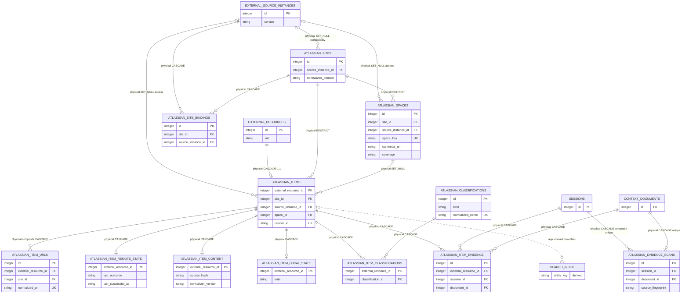

# Atlassian Source Memory

<!-- schema-objects: atlassian_sites, atlassian_site_bindings, atlassian_spaces, atlassian_items, atlassian_item_urls, atlassian_item_remote_state, atlassian_item_content, atlassian_item_local_state, atlassian_classifications, atlassian_item_classifications, atlassian_evidence_scans, atlassian_item_evidence -->

This subject owns the Atlassian-specific extension of a stable user-linkable External Resource. It separates access boundaries, Site domains, optional Spaces, remote identity, URL observations, remote metadata, source bodies, user-authored notes and classifications, freshness evidence, source-backed Session/Local Context sightings, and FTS projection state. Evidence points to Session and Document owners without copying their excerpts or opaque provider payloads. Browse, search, local classification, and extraction perform no external or model call.

[Value Dictionary](value-dictionaries/atlassian-source-memory.md) owns this subject's bounded physical/logical/presentation mappings.

## Focused ERD

## Identity And Ownership Contract

- `external_resources.id` is the only linkable local Item identity. `atlassian_items.external_resource_id` is both its primary key and a cascading foreign key, so a second Atlassian Item ID cannot drift from Workstream, Thread, checkpoint, note, or later Topic/Tag relations.
- Site is the local domain/tenant boundary and is resolved from normalized domain independently of access. Source Instance is an optional access and policy boundary. `atlassian_site_bindings` connects either side without making Provider, service, configuration reference, enabled state, or capability part of Site identity.
- Before remote confirmation, URL reuse is scoped by Site and normalized URL. After confirmation, Site, service, and remote ID are authoritative while every previously observed alternate URL remains an alias.
- `external_resources` owns user-visible title, summary, source role, and Workstream/Thread relations. `atlassian_item_remote_state` owns bounded remote metadata and check evidence. `atlassian_item_content` owns the remote body and its deterministic local projection. `atlassian_item_local_state` and the classification tables own user-authored local memory. None can overwrite another owner.
- `atlassian_item_evidence` owns derived sightings from eligible primary work Session text, bounded approved-tool result fields, and enabled Local Context Documents. It stores only a URL, source location identifiers, and optional bounded title/remote-ID observations; it never owns the Session/Document text or confirms remote identity.
- `atlassian_evidence_scans` owns extractor freshness independently from generic source-file and remote freshness. Source, extractor, or registered Site/service fingerprint changes trigger local re-evaluation; unchanged triples skip parsing.
- Coverage, attention, and freshness are independent. Freshness is derived rather than persisted as a label.
- Direct preview and registration are local-only. An HTTP(S) Jira issue/project or Confluence Page/Space URL resolves or creates its Site from normalized domain and records an Item or Space without creating a Source Instance, Provider alias, configuration reference, capability observation, or remote read. Bootstrap titles come from the URL key, Space key, decoded Page slug, or Page ID fallback. Key-only text is never registration evidence.
- The Add orientation is a read-only projection of persisted Site, Space, and Item rows. Evidence rows, unregistered URL sightings, and unconfirmed discovery candidates are not inputs. Optional access setup separately binds a registered Site to an actual Source Instance configuration. Connected discovery posts one explicit binding; the producer resolves both the Site and Source Instance from that binding before creating a maintenance Run.
- Accessible-Space discovery is an explicit maintenance Run. The current provider catalog has no complete project/Space-list operation, so LocalBrain performs at most one bounded metadata search call, labels its deduplicated results as partial, and registers nothing until the user confirms one candidate.
- Refresh preview is local-only and resolves exact existing Item membership for Item, Space, Thread, Workstream, or all-known scope. It derives default selection from freshness, displays last-check/content times and calculated reads, and performs no capability inspection, provider call, or model call.
- One submitted refresh contains at most 20 pre-authorized reads. Workstream includes its direct and Thread-linked Items with stable-ID deduplication; Thread includes direct mappings only; all-known never expands beyond existing local Items. An Item or Space keeps its current Source Instance when one is known; an unbound local record may use exactly one enabled same-service Site binding and otherwise remains unavailable. A mixed Source Instance selection remains one maintenance Run with per-target source authorization.
- Jira Space refresh checks only selected known Items. A Confluence full-content Space may explicitly request one catalog page of at most 200 regular Pages. New identities are registered as `indexed`-intent Items with `projection_stale = 1`; their bodies are fetched only in later explicit batches.

## Catalog

### `atlassian_sites`

- Purpose and authority: stable local domain or tenant identity resolved by normalized domain, independent of Provider and access configuration.
- Lifecycle: user-registered and non-rebuildable as local identity, even when remote Site ID and display metadata can be confirmed again.
- Producers: `atlassian.py` domain-first Site registration and URL-backed stub registration; `atlassian_registration.py` composes URL-only registration and separate access binding.
- Consumers: Space and Item identity, local inventory, URL collision checks, access binding, and registration or refresh previews.
- Relations and deletion: nullable compatibility/default FK to `external_source_instances.id` with `ON DELETE SET NULL`; parent of bindings with `CASCADE` and Spaces and Items with `RESTRICT`. Removing access does not remove the Site or its local records.
- Recovery: LocalBrain database backup. Reconnecting a domain or Provider does not recreate the same local Site ID automatically.
- DDL ownership: fresh definition plus `idx_atlassian_sites_source` in `schema.sql`; the compatible path repeats the index idempotently.

| Column | Contract |
| --- | --- |
| `id` | `INTEGER PRIMARY KEY`; stable local Site identity. |
| `source_instance_id` | nullable `INTEGER` FK to `external_source_instances.id`, `ON DELETE SET NULL`; legacy/default access projection retained for compatible databases, not Site identity. |
| `normalized_domain` | `TEXT NOT NULL`; lower-cased IDNA host plus non-default port. Domain-first producers reuse one canonical Site before consulting access. |
| `display_name` | nullable `TEXT`; optional remote/display label, not identity. |
| `remote_site_id` | nullable `TEXT`; confirmed provider Site identity, unique within one Source Instance. |
| `canonical_base_url` | `TEXT NOT NULL`; normalized HTTP(S) scheme and domain used for navigation and URL validation. |
| `created_at` | `TEXT NOT NULL DEFAULT CURRENT_TIMESTAMP`; local registration time. |
| `updated_at` | `TEXT NOT NULL DEFAULT CURRENT_TIMESTAMP`; latest identity/label confirmation time. |

Constraints: compatibility uniqueness on `(source_instance_id, normalized_domain)` and `(source_instance_id, remote_site_id)`, non-empty domain, and non-empty optional remote ID. Application producers enforce canonical normalized-domain reuse while retaining legacy rows losslessly. Explicit index: `idx_atlassian_sites_source`.

### `atlassian_site_bindings`

- Purpose and authority: explicit many-to-many access relation between one local Site and one independently configured Source Instance. Provider, Jira/Confluence service, actual configuration reference, enabled state, and capability remain owned by the Source Instance.
- Lifecycle: user-curated and non-rebuildable access intent. Legacy Site ownership is backfilled as a binding; local-only Sites may have zero rows.
- Producers: `atlassian.py` idempotent binding and access-resolution services; `atlassian_registration.py` separate access setup.
- Consumers: connected discovery, refresh authorization, evidence recognition, connection management, and access-scoped inventory filters.
- Relations and deletion: required cascading FKs to Site and Source Instance. Removing either owner removes only the binding; Site descendants and Source Instance capability follow their own owners.
- Recovery: LocalBrain database backup or an explicit user rebind using the real approved configuration reference.
- DDL ownership: fresh definition and `idx_atlassian_site_bindings_source` in `schema.sql`; compatible startup creates the table, index, and legacy bindings idempotently.

| Column | Contract |
| --- | --- |
| `id` | `INTEGER PRIMARY KEY`; stable local binding identity used by connected UI actions. |
| `site_id` | `INTEGER NOT NULL` FK to `atlassian_sites.id`, `ON DELETE CASCADE`. |
| `source_instance_id` | `INTEGER NOT NULL` FK to `external_source_instances.id`, `ON DELETE CASCADE`. |
| `created_at` | `TEXT NOT NULL DEFAULT CURRENT_TIMESTAMP`; explicit or migrated binding creation time. |

Constraints: `UNIQUE(site_id, source_instance_id)`. Explicit index: `idx_atlassian_site_bindings_source`.

### `atlassian_spaces`

- Purpose and authority: optional Jira project or Confluence Space containment within one Site and service, with optional current access ownership.
- Lifecycle: external last-known identity. It can be re-read when access survives, but stable local containment and unavailable historical labels are not assumed recoverable.
- Producers: `atlassian.py` validated Space registration and `atlassian_registration.py` direct-URL or explicitly confirmed partial-catalog registration.
- Consumers: Item containment, registration inventory, hierarchy, explicit coverage display, and refresh scope.
- Relations and deletion: required Site FK with `ON DELETE RESTRICT`; nullable Source Instance FK with `ON DELETE SET NULL`; referenced by Items with `ON DELETE SET NULL`, so explicit Space or access removal keeps Item identity.
- Recovery: database backup or a later explicit external read when the Space remains accessible.
- DDL ownership: fresh definition plus `idx_atlassian_spaces_site` in `schema.sql`; the compatible path repeats the index idempotently.

| Column | Contract |
| --- | --- |
| `id` | `INTEGER PRIMARY KEY`; stable local Space identity. |
| `site_id` | `INTEGER NOT NULL` FK to `atlassian_sites.id`, `ON DELETE RESTRICT`. |
| `source_instance_id` | nullable `INTEGER` FK to `external_source_instances.id`, `ON DELETE SET NULL`; current access owner when known, otherwise local-only. |
| `service` | `TEXT NOT NULL`; constrained to Jira or Confluence and checked against an assigned Source Instance or selected binding by the producer. |
| `remote_id` | nullable `TEXT`; provider Space/project identity, unique within Site and service. |
| `space_key` | nullable `TEXT`; Jira project key or Confluence Space key, unique within Site and service. |
| `name` | `TEXT NOT NULL`; last-confirmed remote/display name. |
| `canonical_url` | `TEXT NOT NULL`; normalized navigation URL retained for local inventory and later explicit refresh scope. It is not a proof that a remote read succeeded. |
| `coverage` | `TEXT NOT NULL`; `selected-content` for Jira projects by default or `full-content` for regular Confluence Pages by default. Existing explicit coverage survives duplicate registration. |
| `created_at` | `TEXT NOT NULL DEFAULT CURRENT_TIMESTAMP`; first local registration time. |
| `updated_at` | `TEXT NOT NULL DEFAULT CURRENT_TIMESTAMP`; latest confirmation time. |

Constraints: service and coverage vocabularies; at least one of `remote_id` or `space_key`; non-empty optional identifiers and canonical URL; `UNIQUE(site_id, service, remote_id)` and `UNIQUE(site_id, service, space_key)`. Explicit index: `idx_atlassian_spaces_site`.

### `atlassian_items`

- Purpose and authority: strict one-to-one Atlassian extension of one stable External Resource, with Site containment, optional current access ownership, and independent coverage/attention axes.
- Lifecycle: non-rebuildable local identity and organization. Remote identifiers can be re-read, but the stable External Resource binding, coverage, attention, and existing relations must survive.
- Producers: `atlassian.py` URL stub registration, in-place remote binding, explicit axis changes, and explicit destructive purge; `atlassian_registration.py` recognizes strict service-specific URLs before invoking the stub contract.
- Consumers: Workstream/Thread/checkpoint links through `external_resources.id`, registration inventory, refresh target resolution, freshness/content state, FTS projection, and Atlassian browse/detail.
- Relations and deletion: primary key is an FK to `external_resources.id` with `ON DELETE CASCADE`; Site deletion is `RESTRICT`; Source Instance and Space deletion are `SET NULL`. The explicit purge API first removes the Item's FTS row and polymorphic Workstream, Thread, and checkpoint references, then removes the External Resource and all source-specific extension rows. Ordinary refresh never deletes the Resource.
- Recovery: database backup. Remote re-discovery cannot recreate the same local Resource ID or user-managed axes.
- DDL ownership: fresh definition plus `idx_atlassian_items_site` and `idx_atlassian_items_space` in `schema.sql`; compatible startup creates them additively.

| Column | Contract |
| --- | --- |
| `external_resource_id` | `INTEGER PRIMARY KEY` and FK to `external_resources.id`, `ON DELETE CASCADE`; sole local Item identity. |
| `site_id` | `INTEGER NOT NULL` FK to `atlassian_sites.id`, `ON DELETE RESTRICT`. |
| `source_instance_id` | nullable `INTEGER` FK to `external_source_instances.id`, `ON DELETE SET NULL`; current access owner when known, otherwise local-only. |
| `space_id` | nullable `INTEGER` FK to `atlassian_spaces.id`, `ON DELETE SET NULL`. |
| `service` | `TEXT NOT NULL`; Jira or Confluence, matched to an assigned Source Instance or selected binding by the producer. |
| `item_type` | `TEXT NOT NULL`; paired Jira issue or Confluence Page type. |
| `remote_id` | nullable `TEXT`; confirmed provider identity, unique within Site and service. |
| `remote_key` | nullable `TEXT`; Jira key or readable Page identity, unique within Site and service when present. |
| `coverage` | `TEXT NOT NULL DEFAULT 'reference'`; independent reference, metadata, or indexed persistence intent. |
| `attention` | `TEXT NOT NULL DEFAULT 'normal'`; independent normal, pinned, ignored, or archived local attention. |
| `confirmed_at` | nullable `TEXT`; first successful remote identity confirmation time. |
| `created_at` | `TEXT NOT NULL DEFAULT CURRENT_TIMESTAMP`; stub or binding creation time. |
| `updated_at` | `TEXT NOT NULL DEFAULT CURRENT_TIMESTAMP`; latest identity or local-axis change. |

Constraints: strict service/item-type pairing; coverage and attention vocabularies; non-empty optional identifiers; `UNIQUE(external_resource_id, site_id)` for composite URL ownership; `UNIQUE(site_id, service, remote_id)` and `UNIQUE(site_id, service, remote_key)`. Explicit indexes: `idx_atlassian_items_site`, `idx_atlassian_items_space`.

### `atlassian_item_urls`

- Purpose and authority: exact observed Atlassian links and normalized Site-scoped canonical/alias identity for one Item.
- Lifecycle: external last-known URL evidence. Observed spellings are retained even when canonical navigation changes.
- Producers: `atlassian.py` stub registration and atomic canonical URL transition during remote binding.
- Consumers: deduplication, safe navigation, alias resolution, FTS path projection, and Session/Local Context evidence attachment.
- Relations and deletion: composite FK `(external_resource_id, site_id)` to `atlassian_items` with `ON DELETE CASCADE`; Site and Item cannot be mixed. URL collision aborts before mutation.
- Recovery: database backup or rediscovery from eligible local evidence and remote identity; rediscovery is not assumed complete.
- DDL ownership: fresh definition, `idx_atlassian_item_urls_item`, and partial unique `idx_atlassian_item_urls_canonical` in `schema.sql`; compatible startup repeats indexes.

| Column | Contract |
| --- | --- |
| `id` | `INTEGER PRIMARY KEY`; URL observation identity. |
| `external_resource_id` | `INTEGER NOT NULL`; composite FK member identifying the Item. |
| `site_id` | `INTEGER NOT NULL`; composite FK member and URL uniqueness boundary. |
| `url_role` | `TEXT NOT NULL`; canonical or alias. |
| `observed_url` | `TEXT NOT NULL`; latest exact HTTP(S) spelling seen or entered. |
| `normalized_url` | `TEXT NOT NULL`; fragment-free normalized URL used for Site-scoped identity. |
| `first_observed_at` | `TEXT NOT NULL DEFAULT CURRENT_TIMESTAMP`; first local observation. |
| `last_observed_at` | `TEXT NOT NULL DEFAULT CURRENT_TIMESTAMP`; latest repeated observation. |

Constraints: canonical/alias vocabulary; non-empty URL values; `UNIQUE(site_id, normalized_url)`; composite cascading Item FK. Explicit indexes: `idx_atlassian_item_urls_item`; partial unique `idx_atlassian_item_urls_canonical` enforces at most one canonical URL per Item.

### `atlassian_item_remote_state`

- Purpose and authority: bounded remote metadata and explicit check/version/failure evidence, separate from body content and local Resource fields.
- Lifecycle: external last-known state. Successful reads can replace it, but failures retain the prior metadata/version and only append current availability evidence.
- Producers: `atlassian.py` application of host-validated FEAT-0045 target results, coordinated atomically for explicit refresh by `atlassian_refresh.py`.
- Consumers: freshness derivation, refresh preview, Item detail, change gating, and diagnostics.
- Relations and deletion: primary key is an FK to `atlassian_items.external_resource_id` with `ON DELETE CASCADE`, enforcing zero-or-one state row per Item.
- Recovery: explicit approved external read when still accessible; otherwise database backup is the only source for unavailable last-known facts.
- DDL ownership: fresh definition and `idx_atlassian_remote_state_check` in `schema.sql`; compatible startup creates them additively.

| Column | Contract |
| --- | --- |
| `external_resource_id` | `INTEGER PRIMARY KEY` and cascading FK to `atlassian_items`; one remote-state row per Item. |
| `metadata_schema_version` | `TEXT NOT NULL DEFAULT 'localbrain.atlassian-metadata.v1'`; local bounded metadata contract version. |
| `metadata_json` | `TEXT NOT NULL DEFAULT '{}'`; canonical incrementally merged remote metadata excluding Jira description and Confluence body at every nesting level. Unobserved fields survive partial refreshes; explicit returned nulls can clear a field value. |
| `remote_version` | nullable `TEXT`; latest successfully confirmed remote version evidence. |
| `remote_updated_at` | nullable `TEXT`; latest successfully confirmed provider update time. |
| `last_attempted_at` | nullable `TEXT`; latest explicit check attempt, successful or not. |
| `last_successful_at` | nullable `TEXT`; latest successful resolved, unchanged, or changed check. |
| `last_confirmed_at` | nullable `TEXT`; latest successful confirmation of remote state. |
| `last_outcome` | nullable `TEXT`; `resolved`, `unchanged`, `changed`, `unavailable`, `not_found`, or `error`. |
| `last_error_code` | nullable `TEXT`; bounded safe failure code only for unsuccessful outcomes. |
| `known_changed` | `INTEGER NOT NULL DEFAULT 0`; explicit remote change exists without an applied eligible body. |
| `projection_stale` | `INTEGER NOT NULL DEFAULT 0`; the requested local projection is absent or mismatched. |
| `updated_at` | `TEXT NOT NULL DEFAULT CURRENT_TIMESTAMP`; latest state application time. |

Constraints: outcome vocabulary; boolean flags; unsuccessful outcomes require a non-empty application-supplied error code no longer than 80 characters, while successful or absent outcomes forbid one. Freshness is derived as unavailable for a latest failure, stale for either change/projection flag, unknown without success, due at Jira seven days or Confluence 30 days, and current otherwise. Explicit index: `idx_atlassian_remote_state_check`.

### `atlassian_item_content`

- Purpose and authority: source-preserving remote body plus deterministic normalized document/text, hashes, version evidence, and FTS projection fingerprint.
- Lifecycle: external last-known content. Changed source replaces it only after validation; failure and `not_found` outcomes retain it.
- Producers: `atlassian.py` deterministic Jira ADF and Confluence ADF/HTML/Markdown/plain normalization and hash-gated result application, coordinated atomically for explicit refresh by `atlassian_refresh.py`.
- Consumers: indexed-only `search_index` projection, Item detail, no-change detection, and deterministic FTS rebuild.
- Relations and deletion: primary key is an FK to `atlassian_items.external_resource_id` with `ON DELETE CASCADE`, enforcing zero-or-one current body per Item.
- Recovery: explicit approved external read when accessible or database backup. The normalized projection can be rebuilt from `source_body`; FTS can be rebuilt from the normalized row.
- DDL ownership: fresh definition in `schema.sql`; no separate explicit named index because primary-key lookup owns all current access.

| Column | Contract |
| --- | --- |
| `external_resource_id` | `INTEGER PRIMARY KEY` and cascading FK to `atlassian_items`; one current body per Item. |
| `source_format` | `TEXT NOT NULL`; Jira ADF, Confluence ADF/HTML/Markdown, or plain text. |
| `source_body` | `TEXT NOT NULL`; exact text or canonical JSON source body, never rendered authority. |
| `source_hash` | `TEXT NOT NULL`; 64-character SHA-256 of `source_body`. |
| `normalized_document_json` | `TEXT NOT NULL`; versioned deterministic block and warning representation. |
| `normalized_text` | `TEXT NOT NULL`; inert text eligible for local FTS. |
| `normalizer_version` | `TEXT NOT NULL`; code contract that produced the normalized document. |
| `normalization_warning` | nullable `TEXT`; bounded unsupported-node or ignored-active-content evidence. |
| `remote_version` | nullable `TEXT`; version associated with the applied body. |
| `remote_updated_at` | nullable `TEXT`; provider update time associated with the applied body. |
| `applied_at` | `TEXT NOT NULL`; time the changed source hash was applied. |
| `search_projection_hash` | nullable `TEXT`; 64-character fingerprint of the complete current role-separated FTS row set when indexed body content exists. |
| `updated_at` | `TEXT NOT NULL DEFAULT CURRENT_TIMESTAMP`; latest content or projection update time. |

Constraints: source-format vocabulary; 64-character source hash and optional projection hash. Explicit indexes: none.

### `atlassian_item_local_state`

- Purpose and authority: user-authored local note state for one stable Atlassian Item, separate from every remotely replaceable field.
- Lifecycle: non-rebuildable local memory. Remote refresh, unavailable results, coverage changes, and evidence reconciliation cannot replace or clear it.
- Producers: `atlassian_browse.py` local-only Item detail update.
- Consumers: Atlassian browse/detail, local-role FTS projection, and grouped Atlassian search results.
- Relations and deletion: primary key is an FK to `atlassian_items.external_resource_id` with `ON DELETE CASCADE`, enforcing zero-or-one note row per Item. Only explicit Item purge removes it.
- Recovery: LocalBrain database backup. Neither provider access nor local evidence rescans can reconstruct user-authored text.
- DDL ownership: fresh definition in `schema.sql`; normal idempotent startup creates it additively on older databases.

| Column | Contract |
| --- | --- |
| `external_resource_id` | `INTEGER PRIMARY KEY` and cascading FK to `atlassian_items`; one local-state row per Item. |
| `note` | `TEXT NOT NULL DEFAULT ''`; user-authored local note up to 50,000 characters. |
| `created_at` | `TEXT NOT NULL DEFAULT CURRENT_TIMESTAMP`; first local-state creation time. |
| `updated_at` | `TEXT NOT NULL DEFAULT CURRENT_TIMESTAMP`; latest local note or classification-save time. |

Constraints: note length at most 50,000 characters. Explicit indexes: none.

### `atlassian_classifications`

- Purpose and authority: reusable user-managed Topic or Tag definition for local Atlassian organization; it is independent from Workstream membership and remote labels.
- Lifecycle: non-rebuildable local vocabulary. Case-insensitive reuse preserves one normalized Topic/Tag identity, while display spelling and Topic description remain locally editable.
- Producers: `atlassian_browse.py` local-only Item detail update.
- Consumers: browse filters, Item detail editing, local-role FTS projection, and grouped Atlassian search results.
- Relations and deletion: parent of membership rows with `ON DELETE CASCADE`; deleting a definition removes only its local Item assignments and never deletes an Item or alters remote state.
- Recovery: LocalBrain database backup. Remote labels and provider metadata are not substitutes for local Topic/Tag intent.
- DDL ownership: fresh definition in `schema.sql`; normal idempotent startup creates it additively on older databases.

| Column | Contract |
| --- | --- |
| `id` | `INTEGER PRIMARY KEY`; stable local classification identity. |
| `kind` | `TEXT NOT NULL`; `topic` or `tag`. |
| `name` | `TEXT NOT NULL`; user-visible spelling, one to 160 characters. |
| `normalized_name` | `TEXT NOT NULL`; case-folded reuse key, one to 320 characters and unique within kind. |
| `description` | nullable `TEXT`; Topic-only local description up to 4,000 characters. |
| `created_at` | `TEXT NOT NULL DEFAULT CURRENT_TIMESTAMP`; first local definition time. |
| `updated_at` | `TEXT NOT NULL DEFAULT CURRENT_TIMESTAMP`; latest local definition update. |

Constraints: kind vocabulary; bounded non-empty names and normalized names; optional bounded description allowed only for Topics; `UNIQUE(kind, normalized_name)`. Explicit indexes: none.

### `atlassian_item_classifications`

- Purpose and authority: user-confirmed many-to-many Topic/Tag assignment for one stable Atlassian Item.
- Lifecycle: non-rebuildable local organization. Saving an Item replaces only that Item's assignment set; remote refresh and evidence scans do not mutate it.
- Producers: `atlassian_browse.py` atomic local-only Item detail update.
- Consumers: browse Topic/Tag filters, Item detail, local-role FTS projection, and grouped Atlassian search.
- Relations and deletion: cascading FKs to `atlassian_items.external_resource_id` and `atlassian_classifications.id`; deletion of either owner removes only the membership row.
- Recovery: LocalBrain database backup. Assignments cannot be inferred authoritatively from remote labels, Workstream links, or search text.
- DDL ownership: fresh definition and `idx_atlassian_item_classifications_classification` in `schema.sql`; compatible startup creates them additively.

| Column | Contract |
| --- | --- |
| `external_resource_id` | `INTEGER NOT NULL` cascading FK to `atlassian_items`; first composite-primary-key column. |
| `classification_id` | `INTEGER NOT NULL` cascading FK to `atlassian_classifications`; second composite-primary-key column. |
| `created_at` | `TEXT NOT NULL DEFAULT CURRENT_TIMESTAMP`; assignment creation time. |

Constraints: composite primary key `(external_resource_id, classification_id)`. Explicit index: `idx_atlassian_item_classifications_classification` for classification-first browse filters.

### `atlassian_evidence_scans`

- Purpose and authority: versioned local extraction freshness for exactly one eligible Session or Context Document.
- Lifecycle: fully derived and replaceable. It advances after a successful bounded reconciliation; an error retains prior Item evidence while recording only a bounded code/message.
- Producers: `atlassian_evidence.py` through Session and Local Context scanner hooks.
- Consumers: scanner skip/retry logic and evidence diagnostics.
- Relations and deletion: nullable FKs to Session and Document, each `ON DELETE CASCADE`, with an exactly-one-source check. Session scan identity is unique by Session plus source path because one normalized Session may span several JSONL files; Document scan identity remains one-to-one. Source deletion therefore removes its scan state without affecting the Atlassian Item.
- Recovery: re-run the local scanner while the source remains available. No external access is required.
- DDL ownership: fresh definition in `schema.sql`; normal idempotent startup creates it additively on older databases.

| Column | Contract |
| --- | --- |
| `id` | `INTEGER PRIMARY KEY`; local scan-state identity. |
| `session_id` | nullable FK to `sessions.id`, `ON DELETE CASCADE`; mutually exclusive with `document_id`. |
| `source_path` | nullable `TEXT` up to 8,000 characters; required only for Session scan state and part of its unique source-file identity. |
| `document_id` | nullable unique FK to `context_documents.id`, `ON DELETE CASCADE`; mutually exclusive with `session_id`. |
| `source_fingerprint` | `TEXT NOT NULL`; 64-character fingerprint of Session file size/mtime identity or Document content hash identity. |
| `site_fingerprint` | `TEXT NOT NULL`; 64-character fingerprint of registered Site/service mappings derived from local Item/Space scope and enabled access bindings. |
| `extractor_version` | `TEXT NOT NULL`; bounded extraction contract version. |
| `status` | `TEXT NOT NULL`; `ok` or `error`. |
| `error_code` | nullable `TEXT`; required non-empty code no longer than 80 characters only for error state. |
| `error_message` | nullable `TEXT`; application-generated message no longer than 500 characters. |
| `scanned_at` | `TEXT NOT NULL`; latest completed reconciliation attempt. |
| `updated_at` | `TEXT NOT NULL DEFAULT CURRENT_TIMESTAMP`; latest row update. |

Constraints: exactly one source FK; `UNIQUE(session_id, source_path)` and unique Document identity; bounded Session path; 64-character fingerprints; status/error parity and bounded errors. Explicit indexes: none; source uniqueness owns current lookup.

### `atlassian_item_evidence`

- Purpose and authority: a derived, source-separated sighting of one recognized configured Atlassian Item URL.
- Lifecycle: fully derived per owning source. A successful changed scan upserts current sightings and removes obsolete sightings from that source, but never deletes the stable Item, remote state/content, or local organization.
- Producers: `atlassian_evidence.py` after URL recognition and FEAT-0046 stable stub reuse.
- Consumers: Item detail, evidence navigation, and the local Session `Related Context` projection when `session_id` points to the viewed primary Session; no refresh or remote-identity path may treat a sighting as successful remote confirmation.
- Relations and deletion: required cascading Item FK plus exactly one cascading Session or Document FK. Session evidence requires a stable event/location identifier; Document evidence uses line and URL occurrence without an excerpt.
- Recovery: rescan the owning local source. If the source is gone, the evidence is intentionally unavailable; Item identity and user state remain in their own tables.
- DDL ownership: fresh definition plus `idx_atlassian_evidence_item`, `idx_atlassian_evidence_session`, and `idx_atlassian_evidence_document` in `schema.sql`.

| Column | Contract |
| --- | --- |
| `id` | `INTEGER PRIMARY KEY`; stable row identity while one evidence key remains present. |
| `external_resource_id` | `INTEGER NOT NULL` FK to `atlassian_items.external_resource_id`, `ON DELETE CASCADE`. |
| `session_id` | nullable FK to `sessions.id`, `ON DELETE CASCADE`; mutually exclusive with `document_id`. |
| `source_path` | nullable `TEXT` up to 8,000 characters; required only for Session evidence so multiple source files contributing to one Session remain independently reconcilable. |
| `document_id` | nullable FK to `context_documents.id`, `ON DELETE CASCADE`; mutually exclusive with `session_id`. |
| `source_channel` | `TEXT NOT NULL`; visible text or approved-tool-result bounded projection. |
| `source_event_id` | nullable `TEXT`; required stable parser event/location identity only for Session evidence. |
| `source_line` | positive `INTEGER`; JSONL source line or Document line. |
| `url_ordinal` | positive `INTEGER`; URL occurrence within the source location. |
| `observed_url` | non-empty `TEXT` up to 8,000 characters; exact bounded spelling. |
| `normalized_url` | non-empty `TEXT` up to 8,000 characters; FEAT-0046 normalization result. |
| `observed_remote_id` | nullable `TEXT` up to 300 characters; unconfirmed bounded observation only. |
| `observed_title` | nullable `TEXT` up to 500 characters; unconfirmed bounded observation only. |
| `observed_at` | nullable `TEXT`; source event time when available. |
| `extractor_version` | `TEXT NOT NULL`; extraction contract that created the sighting. |
| `evidence_key` | unique 64-character fingerprint of Item, source, location, URL, and extractor identity. |
| `first_observed_at` | `TEXT NOT NULL`; first local reconciliation of this evidence key. |
| `last_observed_at` | `TEXT NOT NULL`; latest successful reconciliation. |
| `updated_at` | `TEXT NOT NULL DEFAULT CURRENT_TIMESTAMP`; latest row update. |

Constraints: exactly one source FK; Session location parity; source-channel vocabulary; positive location values; bounded URLs/observations; unique evidence key. Explicit indexes: `idx_atlassian_evidence_item`, `idx_atlassian_evidence_session`, and `idx_atlassian_evidence_document`.

## Freshness, Retention, And Projection

- `due` is advisory local clock math only. It performs no external or model call and does not assert change.
- `stale` requires `known_changed` or `projection_stale`; `unavailable` represents the latest explicit failed check. Both retain last-known metadata, content, URLs, and every local relation.
- A successful no-change result updates remote check evidence only. Unchanged source hashes do not rewrite content; unchanged FTS projection hashes do not replace FTS rows.
- Every Item can create deterministic role-separated `search_index` rows with `entity_type = atlassian_item` and one stable External Resource ID. `atlassian:<service>:identity` contains local identity/title/path text; metadata and content roles appear only when their stored coverage permits them; `atlassian:local` contains the local note and Topic/Tag text.
- Only indexed coverage places normalized remote body text in the content role. Metadata coverage may expose bounded flattened metadata, while reference coverage exposes identity and local text only.
- Result application fails atomically if reference coverage receives metadata or non-indexed coverage receives a body. An explicit downgrade from indexed coverage deletes the stored body and rebuilds the remaining eligible role rows; reference also clears bounded metadata, making that local choice the destructive remote-content action rather than an ordinary refresh side effect.
- Unchanged role-row values are not rewritten. Atlassian search groups matching roles back to one Item and resolves current Source, Site, coverage, freshness, and local-classification state before display. Session/Document search and work-suggestion consumers explicitly filter to their supported types.

## Subject Recovery Boundary

The database is authoritative for stable local Site and Item identity, local coverage/attention, notes, Topic/Tag vocabulary and assignments, aliases, and unavailable last-known state. Approved external reads may refresh remote facts but never recreate user-managed relations or silently purge prior usable data. Evidence scans and sightings are fully derived from still-available eligible local sources and can be rebuilt without touching remote or user-owned state. No startup, browse, search, local classification, freshness calculation, normalization, evidence extraction, or rebuild path performs an external or model call.
