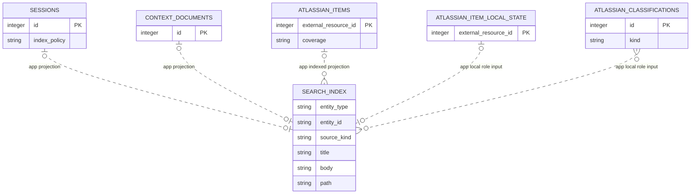

# Derived Retrieval Index

<!-- schema-objects: search_index -->

This subject owns the FTS5 projection used for deterministic local retrieval. It contains no authoritative object state and is always subordinate to eligible Sessions, Context Documents, and stored Atlassian Item identity, remote, and local-memory owners.

[Value Dictionary](value-dictionaries/derived-retrieval-index.md) owns this subject's bounded physical/logical/presentation mappings.

## Focused ERD

## Catalog

### `search_index`

- Purpose and authority: FTS5 search projection for eligible primary work Sessions, enabled Context Documents, and role-separated Atlassian Item identity/metadata/content/local text, retaining unindexed target/provenance fields beside indexed title/body/path text.
- Lifecycle: fully derived projection. It is safe to clear and rebuild from current eligible source objects.
- Producers: `ingest/scanner.py` replaces Session and document rows during scan; `contexts.py` deletes root-owned document projections on disable; `atlassian.py` compares and rebuilds each Item's eligible role rows from current relational identity, remote state/content, and local memory; source cleanup deletes projections before normalized objects.
- Consumers: `queries.py` returns Session/Document results and groups matching Atlassian roles back to one stable Item with current relational context; `retrieval.py` ranked work-context candidates explicitly filter their supported types. Retrieval adds current relational evidence after candidate selection.
- Relations and deletion: no physical FK. `entity_type` plus `entity_id` application-addresses `sessions`, `context_documents`, or `atlassian_items.external_resource_id`; each source lifecycle explicitly removes projections. Maintenance Sessions, subsessions, policy-excluded content, and ineligible Atlassian role text do not enter the projection.
- Recovery: rescan enabled Session and Context sources and rebuild Atlassian role rows from stable External Resource identity, bounded eligible remote state/content, and local note/classification tables. No backup is required for this table itself, though its authoritative local/last-known inputs must exist.
- DDL ownership: FTS5 virtual-table declaration in `schema.sql`; no compatible migration or separate explicit named index. FTS5 shadow tables are SQLite internals.

| Column | Contract |
| --- | --- |
| `entity_type` | FTS5 `UNINDEXED`; application discriminator for `session`, `document`, or `atlassian_item`. |
| `entity_id` | FTS5 `UNINDEXED`; text identity of the projected source object. |
| `source_kind` | FTS5 `UNINDEXED`; normalized source provenance used by consumers. |
| `title` | indexed FTS5 text; display/search title. |
| `body` | indexed FTS5 text; eligible message/document body. |
| `path` | indexed FTS5 text; bounded source or relative-path search field. |

Constraints and tokenizer: `fts5(..., tokenize = 'unicode61')`; Session and Document projections use one row per entity, while Atlassian Items use deterministic source-kind role rows (`identity`, optional `metadata`, optional `content`, and optional `local`). Row-set uniqueness is maintained by compare-and-replace application logic, not a SQL unique constraint. Explicit named indexes: none.

## Subject Recovery Boundary

Rebuilding this projection must apply current eligibility: primary work Sessions only, maintenance/index exclusions, normalized user/assistant message text plus tool names rather than opaque payloads, enabled readable Context Documents, and Atlassian role boundaries. Identity and local memory remain searchable for known Items; bounded metadata requires metadata or indexed coverage; remote body text requires indexed coverage plus stored normalized content. Search results are not source authority and must always resolve back to current relational objects.
