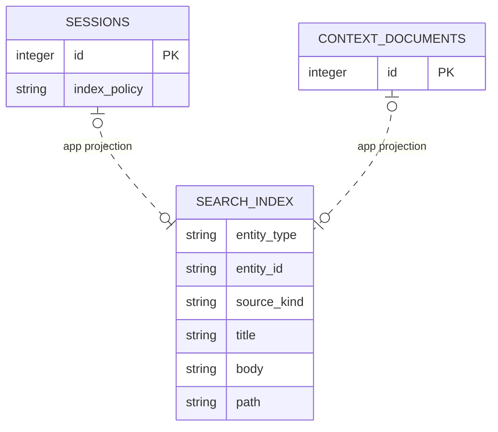

# Derived Retrieval Index

<!-- schema-objects: search_index -->

This subject owns the FTS5 projection used for deterministic local retrieval. It contains no authoritative object state and is always subordinate to eligible Sessions and Context Documents.

## Focused ERD

## Catalog

### `search_index`

- Purpose and authority: FTS5 search projection for eligible primary work Sessions and enabled Context Documents, retaining unindexed target/provenance fields beside indexed title/body/path text.
- Lifecycle: fully derived projection. It is safe to clear and rebuild from current eligible source objects.
- Producers: `ingest/scanner.py` replaces Session and document rows during scan; `contexts.py` deletes root-owned document projections on disable; source cleanup deletes projections before normalized objects.
- Consumers: `queries.py` search results and `retrieval.py` ranked FTS candidates. Retrieval adds current relational evidence after candidate selection.
- Relations and deletion: no physical FK. `entity_type` plus `entity_id` application-addresses `sessions` or `context_documents`; scanner/context lifecycle explicitly removes projections. Maintenance Sessions, subsessions, and policy-excluded content do not enter the projection.
- Recovery: rescan all enabled Session and Context sources. No backup is required for this table itself, though authoritative sources and user registration must exist.
- DDL ownership: FTS5 virtual-table declaration in `schema.sql`; no compatible migration or separate explicit named index. FTS5 shadow tables are SQLite internals.

| Column | Contract |
| --- | --- |
| `entity_type` | FTS5 `UNINDEXED`; application discriminator for `session` or `document`. |
| `entity_id` | FTS5 `UNINDEXED`; text identity of the projected source object. |
| `source_kind` | FTS5 `UNINDEXED`; normalized source provenance used by consumers. |
| `title` | indexed FTS5 text; display/search title. |
| `body` | indexed FTS5 text; eligible message/document body. |
| `path` | indexed FTS5 text; bounded source or relative-path search field. |

Constraints and tokenizer: `fts5(..., tokenize = 'unicode61')`; entity uniqueness is maintained by delete-before-insert application logic, not a SQL unique constraint. Explicit named indexes: none.

## Subject Recovery Boundary

Rebuilding this projection must apply current ingestion eligibility: primary work Sessions only, maintenance/index exclusions, normalized user/assistant message text plus tool names rather than opaque payloads, and enabled readable Context Documents. Search results are not source authority and must always resolve back to current relational objects.
