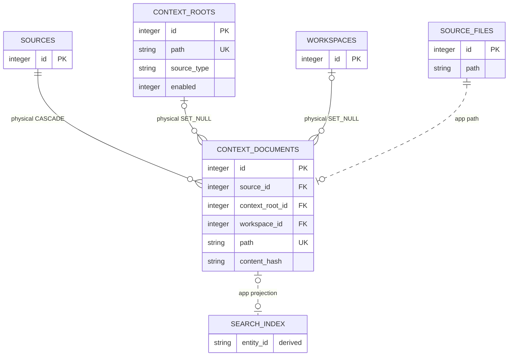

# Local Context Corpus

<!-- schema-objects: context_roots, context_documents -->

This subject owns user-managed Context source registration and the locally indexed document corpus. Generic source/scan rows remain owned by Source Registry And Scans.

## Focused ERD

## Catalog

### `context_roots`

- Purpose and authority: user-managed registry of folders, individual files, and Apple Notes sources, including readability, enablement, scan status, and error state.
- Lifecycle: user-curated and non-rebuildable as a registry. A default Context directory may be discovered compatibly, but user additions/removals and source types require backup.
- Producers: `contexts.py` adds, restores, disables, and validates roots; `ingest/scanner.py` updates scan outcomes; `db.py` compatibly seeds/migrates older folder roots.
- Consumers: Context source listing/detail in `contexts.py` and `queries.py`, scanner source enumeration, Workstream pickers/suggestions, and document visibility filters.
- Relations and deletion: optional physical parent of `context_documents` with `ON DELETE SET NULL`; ordinary removal disables the root and removes indexed rows for that source boundary rather than deleting the registry row or original local content.
- Recovery: restore the LocalBrain database or re-register every root manually, then scan. Original files/Notes remain external authorities.
- DDL ownership: fresh definition in `schema.sql`; `db.py` compatibly adds `source_type`, `readable`, `status`, and `error` and migrates document ownership.

| Column | Contract |
| --- | --- |
| `id` | `INTEGER PRIMARY KEY`; stable Context registration identity. |
| `path` | `TEXT NOT NULL UNIQUE`; canonical local path or source locator. |
| `label` | `TEXT NOT NULL`; user-facing source label. |
| `source_type` | `TEXT NOT NULL DEFAULT 'folder'`; folder, file, or approved adapter type. |
| `readable` | `INTEGER NOT NULL DEFAULT 1`; current source readability signal. |
| `status` | `TEXT NOT NULL DEFAULT 'ready'`; ready, scanning, error, or other bounded source state. |
| `error` | nullable `TEXT`; latest bounded source error. |
| `enabled` | `INTEGER NOT NULL DEFAULT 1`; browse/scan participation. |
| `last_scanned_at` | nullable `TEXT`; latest completed scan time. |
| `created_at` | `TEXT NOT NULL DEFAULT CURRENT_TIMESTAMP`; registration creation time. |
| `updated_at` | `TEXT NOT NULL DEFAULT CURRENT_TIMESTAMP`; latest registry/state update. |

Constraints: uniqueness of `path`. Explicit indexes: none.

### `context_documents`

- Purpose and authority: normalized text and metadata indexed from a registered local file/folder/Notes source, with source path, content fingerprint, and optional current workspace association.
- Lifecycle: source-derived and rebuildable while the external source remains available. The stored body is local indexed content and is never copied into tracked schema evidence.
- Producers: `ingest/scanner.py` upserts documents and removes disappeared rows; `db.py` migrates older root associations and relative paths.
- Consumers: Context browse/detail in `queries.py` and `main.py`, retrieval evidence, Runner context manifests, Workstream links/suggestions, source summaries, and `search_index` projection.
- Relations and deletion: source deletion cascades. Context root and workspace deletion set their keys null, retaining the document until scanner/root lifecycle removes it. Scanner and `contexts.py` explicitly remove matching FTS rows. It is an application target for Workstream, Thread, and checkpoint references.
- Recovery: rescan external sources. If the original content is gone, only a database/host backup can recover the indexed body; LocalBrain is not the authority for the original file.
- DDL ownership: fresh definition plus `idx_documents_mtime` in `schema.sql`; compatible `context_root_id` and `content_type`, migration assignment, and runtime-only `idx_documents_context_root` in `db.py`.

| Column | Contract |
| --- | --- |
| `id` | `INTEGER PRIMARY KEY`; stable indexed-document identity. |
| `source_id` | `INTEGER NOT NULL` FK to `sources.id`, `ON DELETE CASCADE`. |
| `context_root_id` | nullable `INTEGER` FK to `context_roots.id`, `ON DELETE SET NULL`. |
| `workspace_id` | nullable `INTEGER` FK to `workspaces.id`, `ON DELETE SET NULL`. |
| `path` | `TEXT NOT NULL UNIQUE`; canonical external document path/locator. |
| `relative_path` | `TEXT NOT NULL`; root-relative browse path. |
| `title` | `TEXT NOT NULL`; normalized display title. |
| `body` | `TEXT NOT NULL`; locally indexed plaintext content. |
| `content_type` | `TEXT NOT NULL DEFAULT 'text/markdown'`; normalized media/content contract. |
| `size_bytes` | `INTEGER NOT NULL`; source size fingerprint. |
| `mtime_ns` | `INTEGER NOT NULL`; nanosecond source modification fingerprint. |
| `content_hash` | `TEXT NOT NULL`; indexed content fingerprint. |
| `imported_at` | `TEXT NOT NULL DEFAULT CURRENT_TIMESTAMP`; latest indexed write time. |

Constraints: uniqueness of `path`. Explicit indexes: `idx_documents_mtime`, `idx_documents_context_root`, `idx_documents_source`, and `idx_documents_workspace`; the workspace index orders `mtime_ns DESC` after `workspace_id`.

## Subject Recovery Boundary

Root registration is user intent and needs backup; document rows are an index and normally come from rescans. Disabling or removing a root removes LocalBrain browsing/search state but never deletes the original file or Note. Overlap rejection keeps one root owner per indexed document.
