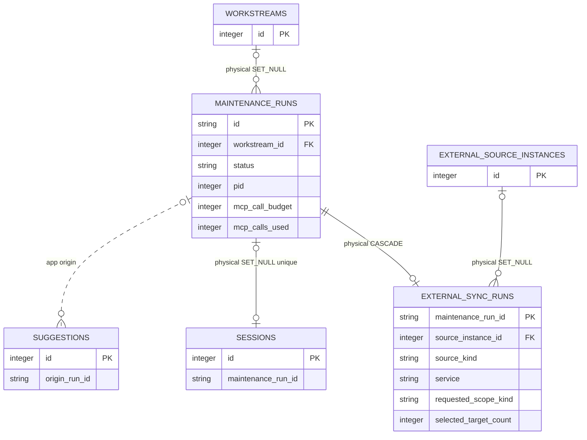

# Maintenance Execution

<!-- schema-objects: maintenance_runs, external_sync_runs -->

This subject owns the Task Runner's durable lifecycle, budgets, process metadata, artifact references, structured result, summary, and failure evidence. It does not own the artifact file contents or accepted organization changes.

## Focused ERD

## Catalog

### `maintenance_runs`

- Purpose and authority: durable state machine for prepared/running/terminal maintenance execution, with local process, bounded MCP budget, artifact paths, structured output, summary, and error evidence.
- Lifecycle: operational history. Database state is durable, while referenced manifest/prompt/stream/result/stderr files live under the private runtime data directory and are required for complete evidence recovery.
- Producers: `runner.py` prepares, starts, streams, reconciles, cancels, parses, and completes Runs. Existing Workstream task preparation writes private artifacts and one `queued` ledger row; `external_sync.py` atomically prepares the common row plus one external-sync projection. `atlassian_refresh.py` composes explicit Item/Space/Thread/Workstream/all-known selections through that same source-neutral boundary. Terminal and recovered paths synchronize the selected native Claude or Codex source. `POST /api/workstreams/{workstream_id}/runs` remains the in-app creation boundary for existing Workstream tasks; `POST /atlassian/refresh` creates only an explicitly previewed external synchronization Run.
- Consumers: Runner list/detail/polling, Workstream detail, Atlassian refresh preview/outcome, restart reconciliation, structured Suggestion creation for existing tasks, the optional external-sync extension, the linked Maintenance Session, and its Usage Records.
- Relations and deletion: `workstream_id` is an optional physical FK to `workstreams.id` with `ON DELETE SET NULL` in both fresh and upgraded databases. Deleting the Workstream removes only that current association and retains the Run. `external_sync_runs.maintenance_run_id` is a primary-key FK with `ON DELETE CASCADE`; `sessions.maintenance_run_id` is a nullable unique physical FK with `ON DELETE SET NULL`; `suggestions.origin_run_id` remains an application edge without cascade.
- Recovery: restore the SQLite database, selected runner's native source history, and runtime artifact directory according to the evidence required. Native JSONL can rebuild its Session and Usage Records; a retained Runner stream can recover console/result evidence but cannot create them. A failed Run must not clear an existing review queue or prior external content.
- DDL ownership: fresh definition in `schema.sql`; numerous compatible fields, `updated_at` value backfill, runtime-only `idx_maintenance_runs_workstream` and `idx_maintenance_runs_status`, and the backup-backed Workstream FK repair in `db.py`. Before the first repair, startup preserves `localbrain.db-pre-maintenance-workstream-fk-v1.bak`, rejects orphan or unexpected shapes, copies every Run value by column name, and verifies dependent Session/Suggestion links plus `foreign_key_check`. Compatible `updated_at` remains nullable without a database default after backfill.
- Internal header boundary: Runner sends `[LOCALBRAIN_RUN: ...] [MODE: maintenance]` at the start of stdin after the ledger row exists. Session ingestion applies maintenance classification and stores the physical relation only when that Run exists. Reusing one registered ID for a second primary Session fails the unique relation; there is no separate user-facing marker creation API or control.

| Column | Contract |
| --- | --- |
| `id` | `TEXT PRIMARY KEY`; stable local Run identity. |
| `workstream_id` | nullable `INTEGER` FK to `workstreams.id`, `ON DELETE SET NULL`; identifies the Workstream from which the maintenance execution was started. |
| `task_type` | nullable `TEXT`; bounded maintenance operation category. |
| `runner` | `TEXT NOT NULL DEFAULT 'claude'`; selected local runner implementation. |
| `cwd` | nullable `TEXT`; local working directory used for execution. |
| `status` | `TEXT NOT NULL DEFAULT 'prepared'`; durable lifecycle state. |
| `pid` | nullable `INTEGER`; active local process identity, never sufficient alone for ownership after restart. |
| `started_at` | nullable `TEXT`; process start time. |
| `completed_at` | nullable `TEXT`; terminal completion time. |
| `source_snapshot_json` | nullable `TEXT`; bounded source-selection snapshot. |
| `manifest_path` | nullable `TEXT`; private runtime reference manifest path. |
| `prompt_path` | nullable `TEXT`; private runtime prompt artifact path. |
| `stream_path` | nullable `TEXT`; private runtime stream artifact path. |
| `result_path` | nullable `TEXT`; private runtime result artifact path. |
| `stderr_path` | nullable `TEXT`; private runtime stderr artifact path. |
| `structured_result_json` | nullable `TEXT`; validated structured result retained for review. |
| `suggestions_created` | `INTEGER NOT NULL DEFAULT 0`; accepted parse output count, not acceptance count. |
| `refresh_suggestions` | `INTEGER NOT NULL DEFAULT 0`; whether eligible pending suggestions were refreshed. |
| `mcp_call_budget` | `INTEGER NOT NULL DEFAULT 20`; advisory ceiling for legacy gap-fill tasks and hard selected-request ceiling for external synchronization. |
| `mcp_calls_used` | `INTEGER NOT NULL DEFAULT 0`; observed call count. |
| `mcp_tool_calls_json` | nullable `TEXT`; bounded tool-call accounting. |
| `mcp_budget_exceeded` | `INTEGER NOT NULL DEFAULT 0`; recorded budget breach signal. |
| `summary` | nullable `TEXT`; terminal human-readable outcome. |
| `error` | nullable `TEXT`; bounded failure evidence. |
| `updated_at` | Fresh schema: `TEXT NOT NULL DEFAULT CURRENT_TIMESTAMP`; compatible addition is nullable `TEXT`, then existing nulls are backfilled from `created_at`. Latest state transition time. |
| `created_at` | `TEXT NOT NULL DEFAULT CURRENT_TIMESTAMP`; preparation time. |

Constraints: fresh and upgraded databases include the optional Workstream foreign key. The reverse Session relation is physically unique and optional. Lifecycle, counters, and runner/task vocabularies are application-enforced. Explicit indexes: `idx_maintenance_runs_workstream`, `idx_maintenance_runs_status`.

### `external_sync_runs`

- Purpose and authority: source-neutral, bounded query projection for Runs whose common parent has `task_type = external_source_sync`. It supports aggregate Source Instance, source/service, scope, target-count, manifest-version, and policy-version lookup without parsing a detailed private manifest.
- Lifecycle: operational history owned one-to-one by a common maintenance Run. The row is not an authoring surface; preparation derives it from the same validated manifest that creates its parent.
- Producers: `external_sync.prepare_external_sync_run` validates the complete manifest and every FEAT-0044 logical read, writes private artifacts, and inserts the parent plus extension under one savepoint. No ordinary maintenance producer creates this row.
- Consumers: external-sync execution validates this projection against the retained manifest before every Run; refresh/history consumers may query its bounded fields. FEAT-0046 consumes the validated result, not this query projection, for source Item application.
- Relations and deletion: `maintenance_run_id` is both primary key and physical FK to `maintenance_runs.id` with `ON DELETE CASCADE`, enforcing zero-or-one extension per Run. `source_instance_id` is a nullable FK to `external_source_instances.id` with `ON DELETE SET NULL`; removing a registration retains historical source kind, service, scope, count, and policy evidence.
- Recovery: restore with the parent ledger and private Run manifest. The row alone cannot recreate selected locators, field allowlists, freshness hints, provider evidence, or results. A missing or mismatched row fails closed before external execution.
- DDL ownership: fresh definition and two query indexes in `schema.sql`; idempotent schema application plus `db.py` index convergence create the same table and indexes on compatible databases without rewriting existing Run rows.

| Column | Contract |
| --- | --- |
| `maintenance_run_id` | `TEXT PRIMARY KEY` and FK to `maintenance_runs.id`, `ON DELETE CASCADE`; one extension per external synchronization Run. |
| `source_instance_id` | nullable `INTEGER` FK to `external_source_instances.id`, `ON DELETE SET NULL`; aggregate access boundary for a single-source Run and intentionally null for a mixed-source Run whose private manifest authorizes each target separately. |
| `source_kind` | `TEXT NOT NULL`; source-neutral family such as `atlassian`, without provider-specific columns. |
| `service` | `TEXT NOT NULL`; aggregate service discriminator such as `jira` or `confluence`, or `mixed` only when selected target services differ. |
| `requested_scope_kind` | `TEXT NOT NULL` constrained to `item`, `space`, `thread`, `workstream`, or `all_known`. |
| `selected_target_count` | non-negative `INTEGER`; number of selected manifest targets, derived at preparation. |
| `manifest_schema_version` | `TEXT NOT NULL`; exact version used to validate detailed private input. |
| `read_policy_version` | `TEXT NOT NULL`; FEAT-0044 policy identity used to authorize every request. |
| `created_at` | `TEXT NOT NULL DEFAULT CURRENT_TIMESTAMP`; projection creation time. |

Constraints: the database enforces one-to-one parent ownership, both physical relations, non-negative selected count, and the scope vocabulary. The producer additionally enforces that only `external_source_sync` parents receive this row and that every projected value equals the validated manifest. Explicit indexes: `idx_external_sync_runs_source_instance`, `idx_external_sync_runs_scope`.

## Subject Recovery Boundary

SQLite restores the Run state machine, external-sync query projection, and references; runtime storage restores the actual execution evidence. Neither is committed to Git. Restart reconciliation marks an abandoned active Run interrupted, finalizes the selected runner's linked Session, and retains already observed Usage Records; it does not silently resume a process, re-call a provider, or mutate Workstream organization.
