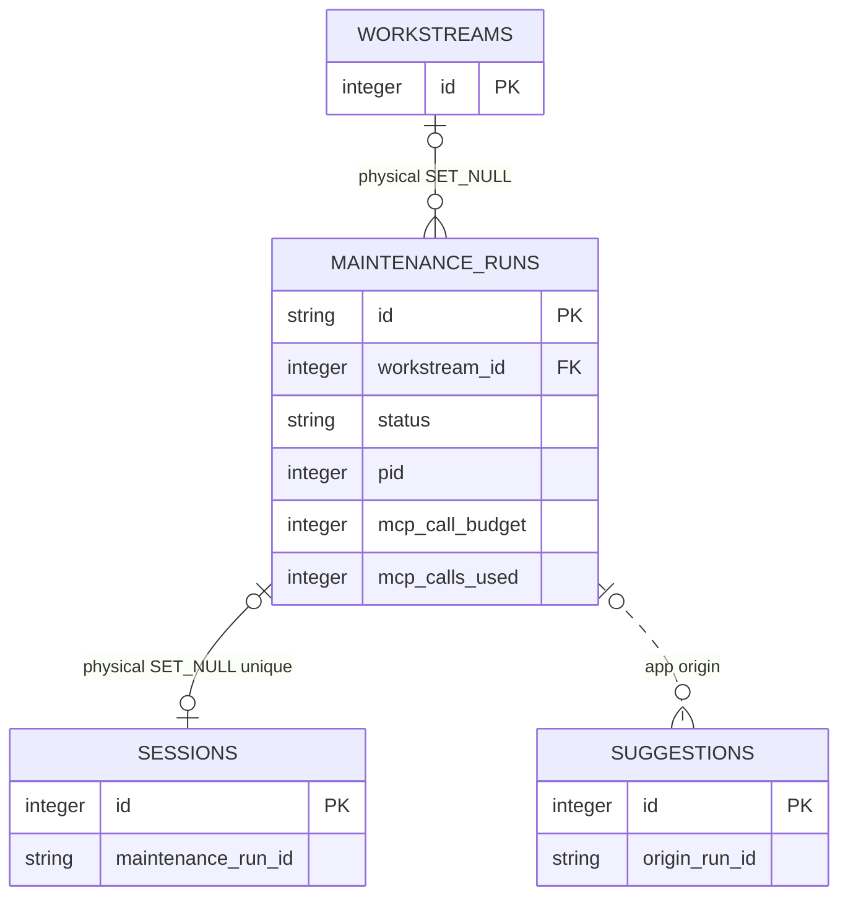

# Maintenance Execution

<!-- schema-objects: maintenance_runs -->

This subject owns the Task Runner's durable lifecycle, budgets, process metadata, artifact references, structured result, summary, and failure evidence. It does not own the artifact file contents or accepted organization changes.

## Focused ERD

## Catalog

### `maintenance_runs`

- Purpose and authority: durable state machine for prepared/running/terminal maintenance execution, with local process, bounded MCP budget, artifact paths, structured output, summary, and error evidence.
- Lifecycle: operational history. Database state is durable, while referenced manifest/prompt/stream/result/stderr files live under the private runtime data directory and are required for complete evidence recovery.
- Producers: `runner.py` prepares, starts, streams, reconciles, cancels, parses, and completes Runs. Task Runner preparation writes private artifacts and inserts a `queued` ledger row; terminal and recovered paths trigger native Claude-source synchronization. `POST /api/workstreams/{workstream_id}/runs` is the only in-app Run creation boundary.
- Consumers: Runner list/detail/polling, Workstream detail, restart reconciliation, structured Suggestion creation, the linked Maintenance Session, and its Usage Records.
- Relations and deletion: `workstream_id` is an optional physical FK to `workstreams.id` with `ON DELETE SET NULL` in both fresh and upgraded databases. Deleting the Workstream removes only that current association and retains the Run. `sessions.maintenance_run_id` is a nullable unique physical FK with `ON DELETE SET NULL`; `suggestions.origin_run_id` remains an application edge without cascade.
- Recovery: restore the SQLite database, native Claude source history, and runtime artifact directory according to the evidence required. The native JSONL can rebuild its Session and Usage Records; a retained Runner stream can recover console/result evidence but cannot create them. A failed Run must not clear an existing review queue.
- DDL ownership: fresh definition in `schema.sql`; numerous compatible fields, `updated_at` value backfill, runtime-only `idx_maintenance_runs_workstream` and `idx_maintenance_runs_status`, and the backup-backed Workstream FK repair in `db.py`. Before the first repair, startup preserves `localbrain.db-pre-maintenance-workstream-fk-v1.bak`, rejects orphan or unexpected shapes, copies every Run value by column name, and verifies dependent Session/Suggestion links plus `foreign_key_check`. Compatible `updated_at` remains nullable without a database default after backfill.
- Internal header boundary: Runner sends `[LOCALBRAIN_RUN: ...] [MODE: maintenance]` at the start of stdin after the ledger row exists. Session ingestion applies maintenance classification and stores the physical relation only when that Run exists. Reusing one registered ID for a second primary Session fails the unique relation; there is no separate user-facing marker creation API or control.

| Column | Contract |
| --- | --- |
| `id` | `TEXT PRIMARY KEY`; stable local Run identity. |
| `workstream_id` | nullable `INTEGER` FK to `workstreams.id`, `ON DELETE SET NULL`; identifies the Workstream from which the maintenance execution was started. |
| `task_type` | nullable `TEXT`; bounded maintenance operation category. |
| `runner` | `TEXT NOT NULL DEFAULT 'claude'`; selected local runner implementation. |
| `cwd` | nullable `TEXT`; local working directory used for execution. |
| `status` | `TEXT NOT NULL DEFAULT 'prepared'`; durable lifecycle state. |
| `pid` | nullable `INTEGER`; active local process identity, never sufficient alone for ownership after restart. |
| `started_at` | nullable `TEXT`; process start time. |
| `completed_at` | nullable `TEXT`; terminal completion time. |
| `source_snapshot_json` | nullable `TEXT`; bounded source-selection snapshot. |
| `manifest_path` | nullable `TEXT`; private runtime reference manifest path. |
| `prompt_path` | nullable `TEXT`; private runtime prompt artifact path. |
| `stream_path` | nullable `TEXT`; private runtime stream artifact path. |
| `result_path` | nullable `TEXT`; private runtime result artifact path. |
| `stderr_path` | nullable `TEXT`; private runtime stderr artifact path. |
| `structured_result_json` | nullable `TEXT`; validated structured result retained for review. |
| `suggestions_created` | `INTEGER NOT NULL DEFAULT 0`; accepted parse output count, not acceptance count. |
| `refresh_suggestions` | `INTEGER NOT NULL DEFAULT 0`; whether eligible pending suggestions were refreshed. |
| `mcp_call_budget` | `INTEGER NOT NULL DEFAULT 20`; advisory call ceiling for the Run. |
| `mcp_calls_used` | `INTEGER NOT NULL DEFAULT 0`; observed call count. |
| `mcp_tool_calls_json` | nullable `TEXT`; bounded tool-call accounting. |
| `mcp_budget_exceeded` | `INTEGER NOT NULL DEFAULT 0`; recorded budget breach signal. |
| `summary` | nullable `TEXT`; terminal human-readable outcome. |
| `error` | nullable `TEXT`; bounded failure evidence. |
| `updated_at` | Fresh schema: `TEXT NOT NULL DEFAULT CURRENT_TIMESTAMP`; compatible addition is nullable `TEXT`, then existing nulls are backfilled from `created_at`. Latest state transition time. |
| `created_at` | `TEXT NOT NULL DEFAULT CURRENT_TIMESTAMP`; preparation time. |

Constraints: fresh and upgraded databases include the optional Workstream foreign key. The reverse Session relation is physically unique and optional. Lifecycle, counters, and runner/task vocabularies are application-enforced. Explicit indexes: `idx_maintenance_runs_workstream`, `idx_maintenance_runs_status`.

## Subject Recovery Boundary

SQLite restores the Run state machine and references; runtime storage restores the actual execution evidence. Neither is committed to Git. Restart reconciliation marks an abandoned active Run interrupted, finalizes the linked Session, and retains already observed Usage Records; it does not silently resume a process or mutate Workstream organization.
