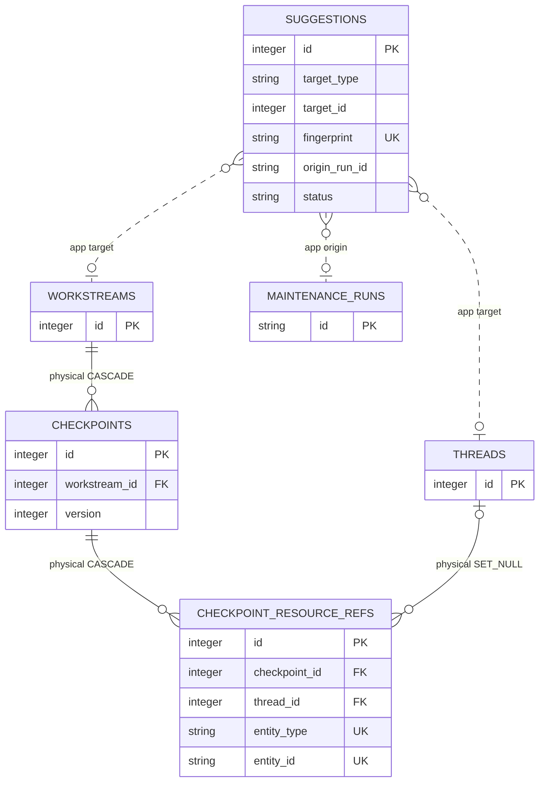

# Review And Resume Continuity

<!-- schema-objects: suggestions, checkpoints, checkpoint_resource_refs -->

This subject owns reversible generated Suggestions, their review state, human-confirmed resume checkpoints, and the exact resource identities captured with a checkpoint.

## Focused ERD

Checkpoint resource targets use the same application mapping as Workstream links: `session`, `document`, `project`, `external`, and `local`. Those target edges are not repeated in this focused diagram so the checkpoint ownership edges remain readable; they are explicit in the global ERD and catalog.

## Catalog

### `suggestions`

- Purpose and authority: proposed organizational or checkpoint changes with evidence, deterministic fingerprint, provenance, confidence, and explicit pending/accepted/rejected review state.
- Lifecycle: generated review state. Pending content can be regenerated, but accepted/rejected decisions, resolution times, and original Run provenance are non-rebuildable history.
- Producers: quick-match generation and refresh in `workstreams.py`; structured Task Runner output and reconciliation in `runner.py`.
- Consumers: Dashboard and Workstream review queues, retrieval exclusions/context, accept/reject actions, and pending counts.
- Relations and deletion: `target_type` plus `target_id` application-addresses a Workstream or Thread; `origin_run_id` application-addresses `maintenance_runs.id`. No physical cascade applies. Refresh replaces eligible pending suggestions while preserving rejected decisions and other protected state.
- Recovery: rerun generation for new pending proposals; restore the database for historical review decisions and exact provenance.
- DDL ownership: fresh definition and `idx_suggestions_target` in `schema.sql`; compatible `origin_run_id`, repeated target index, and runtime-only `idx_suggestions_origin_run` in `db.py`.

| Column | Contract |
| --- | --- |
| `id` | `INTEGER PRIMARY KEY`; review-item identity. |
| `suggestion_type` | `TEXT NOT NULL`; proposed operation category. |
| `target_type` | `TEXT NOT NULL`; application target discriminator, normally Workstream or Thread. |
| `target_id` | `INTEGER NOT NULL`; application target identity. |
| `title` | `TEXT NOT NULL`; concise proposal label. |
| `description` | nullable `TEXT`; proposed change detail. |
| `rationale` | nullable `TEXT`; human-readable evidence/reasoning. |
| `payload_json` | nullable `TEXT`; structured proposal payload applied only after validation/acceptance. |
| `fingerprint` | `TEXT NOT NULL UNIQUE`; stable deduplication identity. |
| `origin_run_id` | nullable `TEXT`; non-FK Task Runner provenance. |
| `status` | `TEXT NOT NULL DEFAULT 'pending'`; explicit review state. |
| `confidence` | nullable `REAL`; bounded generator confidence. |
| `created_at` | `TEXT NOT NULL DEFAULT CURRENT_TIMESTAMP`; proposal creation time. |
| `resolved_at` | nullable `TEXT`; acceptance/rejection time. |

Constraints: uniqueness of `fingerprint`; target/status/payload validation is application-enforced. Explicit indexes: `idx_suggestions_target`, `idx_suggestions_origin_run`.

### `checkpoints`

- Purpose and authority: versioned, human-confirmed resume state for a Workstream, including facts, decisions, open questions, next actions, files, and the activity boundary it summarizes.
- Lifecycle: confirmed continuity snapshot; user-curated and non-rebuildable.
- Producers: `workstreams.py` creates the next Workstream-scoped version and snapshots current links.
- Consumers: Workstream detail/resume presentation and checkpoint history.
- Relations and deletion: Workstream deletion cascades checkpoints, then checkpoint resource references. This destructive path is not an implied cleanup action.
- Recovery: database backup or an explicit export; Sessions and documents do not reconstruct confirmed wording or decision boundaries.
- DDL ownership: fresh definition in `schema.sql`; compatible `based_on_activity_at`, `version`, and `updated_at` plus value backfill in `db.py`. On an older database, `updated_at` remains nullable and has no database default after the one-time backfill. No explicit named index.

| Column | Contract |
| --- | --- |
| `id` | `INTEGER PRIMARY KEY`; checkpoint identity. |
| `workstream_id` | `INTEGER NOT NULL` FK to `workstreams.id`, `ON DELETE CASCADE`. |
| `current_goal` | nullable `TEXT`; confirmed goal at snapshot time. |
| `confirmed_facts` | nullable `TEXT`; confirmed factual context. |
| `recent_decisions` | nullable `TEXT`; decisions that govern resumption. |
| `open_questions` | nullable `TEXT`; unresolved questions. |
| `next_actions` | nullable `TEXT`; confirmed subsequent steps. |
| `files_to_open` | nullable `TEXT`; explicit resume file hints. |
| `confirmed_at` | nullable `TEXT`; human confirmation time. |
| `based_on_activity_at` | nullable `TEXT`; latest linked activity included in the summary. |
| `version` | `INTEGER NOT NULL DEFAULT 1`; monotonic number within the Workstream. |
| `updated_at` | Fresh schema: `TEXT NOT NULL DEFAULT CURRENT_TIMESTAMP`; compatible addition is nullable `TEXT`, then existing nulls are backfilled from `created_at`. Latest compatible/update time. |
| `created_at` | `TEXT NOT NULL DEFAULT CURRENT_TIMESTAMP`; snapshot creation time. |

Constraints: version uniqueness per Workstream is application-enforced by next-version selection, not a SQL unique constraint. Explicit index: `idx_checkpoints_workstream_version`; it orders `version DESC` after `workstream_id` for latest-version allocation and retrieval.

### `checkpoint_resource_refs`

- Purpose and authority: immutable-at-creation snapshot of Workstream- and Thread-level links included in one checkpoint.
- Lifecycle: confirmed continuity snapshot. It is generated from curated links at checkpoint time but cannot be regenerated after those links change.
- Producers: `_snapshot_checkpoint_resources` in `workstreams.py` copies current Workstream/Thread links with `INSERT OR IGNORE`.
- Consumers: checkpoint detail and resume evidence in `workstreams.py`.
- Relations and deletion: checkpoint deletion cascades; Thread deletion sets `thread_id` null while retaining the captured heterogeneous identity. `entity_type` and `entity_id` target Session, Context Document, Workspace, External Resource, or Local Resource by application contract only.
- Recovery: restore the database. Re-running a snapshot produces current, not historical, membership.
- DDL ownership: fresh definition in `schema.sql`; checkpoint/thread lookup uses the leading keys of the table's UNIQUE autoindex, and the compatible migration removes the former redundant named index only after verifying that coverage.

| Column | Contract |
| --- | --- |
| `id` | `INTEGER PRIMARY KEY`; snapshot-reference identity. |
| `checkpoint_id` | `INTEGER NOT NULL` FK to `checkpoints.id`, `ON DELETE CASCADE`. |
| `thread_id` | nullable `INTEGER` FK to `threads.id`, `ON DELETE SET NULL`; null denotes Workstream-level or removed Thread context. |
| `entity_type` | `TEXT NOT NULL`; snapshotted polymorphic target type. |
| `entity_id` | `TEXT NOT NULL`; target identity at checkpoint time. |
| `relation_type` | `TEXT NOT NULL DEFAULT 'evidence'`; captured relation meaning. |
| `created_at` | `TEXT NOT NULL DEFAULT CURRENT_TIMESTAMP`; capture time. |

Constraints: `UNIQUE(checkpoint_id, thread_id, entity_type, entity_id)`. Explicit indexes: none; SQLite owns the composite uniqueness autoindex.

## Subject Recovery Boundary

Suggestion generation is reversible and review-gated; organization changes occur only after acceptance. Regeneration may restore a proposal but never substitutes for prior accepted/rejected state. Checkpoints and their reference sets are historical confirmations and require database backup for exact recovery.
