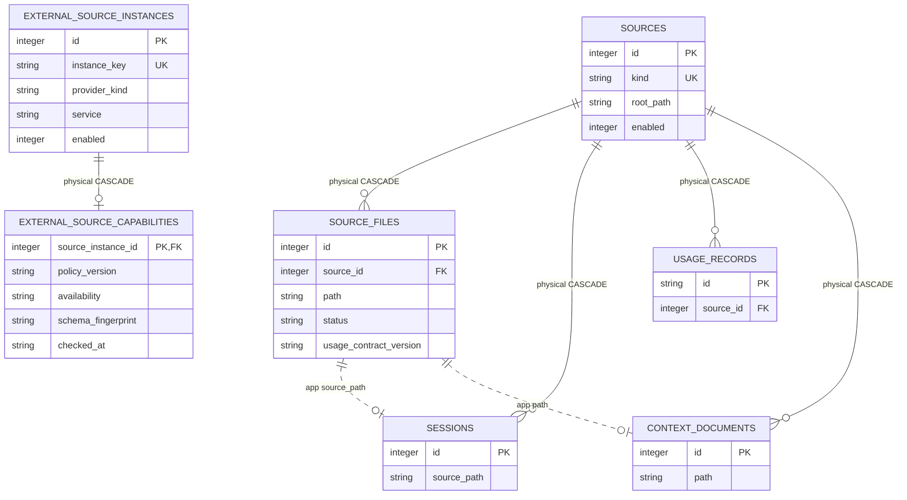

# Source Registry And Scans

<!-- schema-objects: sources, source_files, external_source_instances, external_source_capabilities -->

This subject owns local source identity, configured roots, external Source Instance registration, generic scan and capability freshness, file or schema fingerprints, parser-contract freshness, and bounded errors. It does not own the normalized Sessions, Usage Records, Context Documents, Atlassian Items, or source-specific Atlassian evidence scan rows produced from those sources.

[Value Dictionary](value-dictionaries/source-registry-and-scans.md) owns this subject's bounded physical/logical/presentation mappings.

## Focused ERD

Solid lines are physical foreign keys; dotted lines are scanner-managed correlations.

## Catalog

### `sources`

- Purpose and authority: one application-managed registry row per source kind. Configured Claude, Codex, and Local Context source roots are authoritative; `ingest/scanner.py` upserts their current registry representation.
- Lifecycle: source-derived registry. It is reproducible from configuration and registered roots, but its IDs are physical parents, so ordinary scans update rows in place.
- Producers: `ingest/scanner.py`; `db.py` reads kinds when migration changes must stale Session inputs.
- Consumers: `queries.py`, `activity.py`, `retrieval.py`, `usage_queries.py`, `workstreams.py`, `runner.py`, `main.py`, and CLI scan reporting.
- Relations and deletion: physical parent of `source_files`, `sessions`, `usage_records`, and `context_documents`, all `ON DELETE CASCADE`. Deleting a source would remove normalized descendants and can invalidate application-enforced links or search rows, so no cleanup is implied.
- Recovery: recreate registry rows through approved scans, then rescan source files. Preserve the database for user-curated links and review state that may refer to descendant IDs.
- DDL ownership: complete fresh definition in `schema.sql`; no compatible columns or explicit named indexes in `db.py`.

| Column | Contract |
| --- | --- |
| `id` | `INTEGER PRIMARY KEY`; stable local registry identity and physical parent key. |
| `kind` | `TEXT NOT NULL UNIQUE`; normalized adapter identity such as Claude, Codex, or a Local Context source kind. |
| `name` | `TEXT NOT NULL`; user-facing source label. |
| `root_path` | `TEXT NOT NULL`; configured local scan root or source locator; runtime values remain outside tracked docs. |
| `enabled` | `INTEGER NOT NULL DEFAULT 1`; registry participation flag. |
| `last_scanned_at` | nullable `TEXT`; completion time of the latest source-level scan attempt. |
| `created_at` | `TEXT NOT NULL DEFAULT CURRENT_TIMESTAMP`; registry creation time. |

Constraints: uniqueness of `kind`. Explicit indexes: none; SQLite owns the uniqueness autoindex.

### `source_files`

- Purpose and authority: per-source scan evidence for a local input path, including its file fingerprint, latest attempt state, error, and usage-normalizer contract version.
- Lifecycle: source-derived and rebuildable. Healthy unchanged rows are freshness inputs; failed rows retain the latest error rather than masquerading as absent.
- Producers: `ingest/scanner.py` inserts and updates scan results; `contexts.py` removes Context-owned rows when a root is disabled; `db.py` adds `usage_contract_version` and marks Claude/Codex rows stale when Session or Usage contracts change.
- Consumers: `ingest/scanner.py` generic skip/retry logic, `queries.py` source status, `usage_queries.py` freshness/trust, and `contexts.py` root lifecycle. Atlassian evidence adds an independent extractor/Site fingerprint check before an otherwise-current file is skipped.
- Relations and deletion: `source_id` physically cascades from `sources`. The correlation from `path` to `sessions.source_path` or `context_documents.path` is application-managed; removing a file row alone does not cascade those objects. Scanner reconciliation explicitly removes disappeared normalized rows and their search entries.
- Recovery: rescan the owning source. Errors and exact prior attempt times are operational history and are not reproduced exactly.
- DDL ownership: fresh definition in `schema.sql`; `db.py` compatibly adds `usage_contract_version` and uses it to trigger staleness. No explicit named index.

| Column | Contract |
| --- | --- |
| `id` | `INTEGER PRIMARY KEY`; local scan-evidence identity. |
| `source_id` | `INTEGER NOT NULL` FK to `sources.id`, `ON DELETE CASCADE`. |
| `path` | `TEXT NOT NULL`; source-local file identity used for scanner correlation. |
| `size_bytes` | `INTEGER NOT NULL`; fingerprint size captured at the latest attempt. |
| `mtime_ns` | `INTEGER NOT NULL`; nanosecond file modification fingerprint. |
| `last_scanned_at` | `TEXT NOT NULL`; latest attempt time for this input. |
| `status` | `TEXT NOT NULL DEFAULT 'ok'`; freshness state such as healthy, stale, or error. |
| `error` | nullable `TEXT`; bounded scan or parse error evidence. |
| `usage_contract_version` | nullable `TEXT`; normalizer contract used to decide whether Usage Records remain current. |

Constraints: `UNIQUE(source_id, path)`. Explicit indexes: none; SQLite owns the composite uniqueness autoindex.

### `external_source_instances`

- Purpose and authority: one stable local registration per independently configured external access boundary. The user-managed `instance_key`, provider kind, service, display name, shape-validated configuration reference, and enabled state identify the boundary without storing credentials or remote content.
- Lifecycle: user-curated and non-rebuildable. Local-only Atlassian URL registration does not create a Source Instance. Separate access setup creates or reuses one only when the user supplies a Provider and actual approved configuration reference. Idempotent registration and connection editing may update generated presentation and enabled state, but changing provider, service, or a bound configuration reference under an existing key is an identity conflict. Binding a validated reference invalidates any prior capability observation so site-scoped reads require an explicit recheck.
- Producers: `external_access.py` identity services and separate Atlassian access setup in `atlassian_registration.py`.
- Consumers: `external_access.py` resolves policy and capability state; source-neutral external synchronization and Atlassian registration, refresh, browse, and evidence services consume the stable ID.
- Relations and deletion: physical parent of at most one current `external_source_capabilities` row and any number of `atlassian_site_bindings`, both with `ON DELETE CASCADE`. Nullable compatibility/current-access references from Sites, Spaces, and Items use `ON DELETE SET NULL`, so removing an explicit access boundary does not delete local Atlassian identity or content. Deletion remains an explicit destructive local action and is not part of capability refresh.
- Recovery: restore from the LocalBrain database backup or re-register through an explicit user action. External connector configuration alone is not equivalent because local identity and later user-managed relationships depend on the stable ID.
- DDL ownership: complete fresh definition in `schema.sql`; normal startup creates the absent table on an older database through the same idempotent schema application. No explicit named index.

| Column | Contract |
| --- | --- |
| `id` | `INTEGER PRIMARY KEY`; stable local Source Instance identity. |
| `instance_key` | `TEXT NOT NULL UNIQUE`; stable user-managed local key, independent from a provider display label. |
| `provider_kind` | `TEXT NOT NULL`; versioned policy family, currently `mcp_gateway` or `atlassian_cloud`. |
| `service` | `TEXT NOT NULL`; source service, currently `jira` or `confluence`. |
| `display_name` | `TEXT NOT NULL`; local presentation label that may change without changing identity. |
| `config_ref` | nullable `TEXT`; validated Gateway configuration alias or canonical lowercase Atlassian Cloud ID. Arbitrary opaque values, site URLs, query strings, user-info URLs, and credentials are not accepted. |
| `enabled` | `INTEGER NOT NULL DEFAULT 1`; `0` disables inspection and content authorization without deleting identity or observations. |
| `created_at` | `TEXT NOT NULL DEFAULT CURRENT_TIMESTAMP`; registration time. |
| `updated_at` | `TEXT NOT NULL DEFAULT CURRENT_TIMESTAMP`; latest local registration-state update. |

Constraints: unique `instance_key`; provider kind limited to `mcp_gateway` and `atlassian_cloud`; service limited to `jira` and `confluence`; enabled limited to `0` or `1`. Explicit indexes: none; SQLite owns the uniqueness autoindex.

### `external_source_capabilities`

- Purpose and authority: the latest rebuildable capability observation for one Source Instance, including policy version, schema fingerprint, availability, canonical logical operations, check time, invalidation, and bounded failure evidence. It is operational evidence and never grants a target absent from version-controlled policy.
- Lifecycle: rebuildable operational state. An explicit successful or failed capability check replaces the prior row; invalidation retains the last observation as stale. Startup, page load, search, and ordinary preview do not poll or rewrite it.
- Producers: `external_access.py` validates and stores canonical observations supplied by an explicit approved capability inspection. Ordinary application flows perform no implicit external call.
- Consumers: `external_access.py` intersects the row with static policy before producing a read dispatch; external maintenance execution consumes that validated dispatch.
- Relations and deletion: `source_instance_id` is both the primary key and an FK to `external_source_instances.id`, `ON DELETE CASCADE`, enforcing zero-or-one current observation per registration. The row cannot change Source Instance identity.
- Recovery: discard and rebuild through an explicit capability inspection. Losing the row returns the Instance to `unknown` and authorizes no source-content operation.
- DDL ownership: complete fresh definition in `schema.sql`; normal startup creates the absent table on an older database through the same idempotent schema application. No explicit named index.

| Column | Contract |
| --- | --- |
| `source_instance_id` | `INTEGER PRIMARY KEY` and FK to `external_source_instances.id`, `ON DELETE CASCADE`; one latest observation per Instance. |
| `policy_version` | `TEXT NOT NULL`; static application policy version used to interpret the observation. A mismatch is stale. |
| `schema_fingerprint` | nullable `TEXT`; bounded fingerprint of the inspected provider schema; available observations require a validated SHA-256 value at the producer boundary. |
| `availability` | `TEXT NOT NULL`; `available`, `unavailable`, `unauthorized`, or `error`. |
| `capability_json` | `TEXT NOT NULL`; canonical minimal JSON containing only schema identity and sorted logical operation names. |
| `error_code` | nullable `TEXT`; bounded operational failure category. |
| `error_message` | nullable `TEXT`; application-generated failure explanation with a database limit of 500 characters. Raw provider errors, credentials, content, and connector payloads are never accepted by the producer. |
| `checked_at` | `TEXT NOT NULL`; time of the explicit observation supplied by the producer. |
| `invalidated_at` | nullable `TEXT`; time the observation became stale after an authorization or schema mismatch. |
| `updated_at` | `TEXT NOT NULL DEFAULT CURRENT_TIMESTAMP`; latest replacement or invalidation time. |

Constraints: one row per Source Instance; physical cascade FK; availability vocabulary; `error_message` length at most 500. Explicit indexes: none; the primary-key index owns lookup.

## Subject Recovery Boundary

A full source rescan rebuilds normalized scan state but not the exact chronology of prior errors. An explicit capability inspection can replace capability observations but cannot recreate user-managed Source Instance identity. Disabling a user-managed Context root is owned by the Context subject and intentionally removes its scan rows without deleting original files. Source or Source Instance deletion is not an ordinary recovery operation because physical cascades and application links cross subject boundaries.
