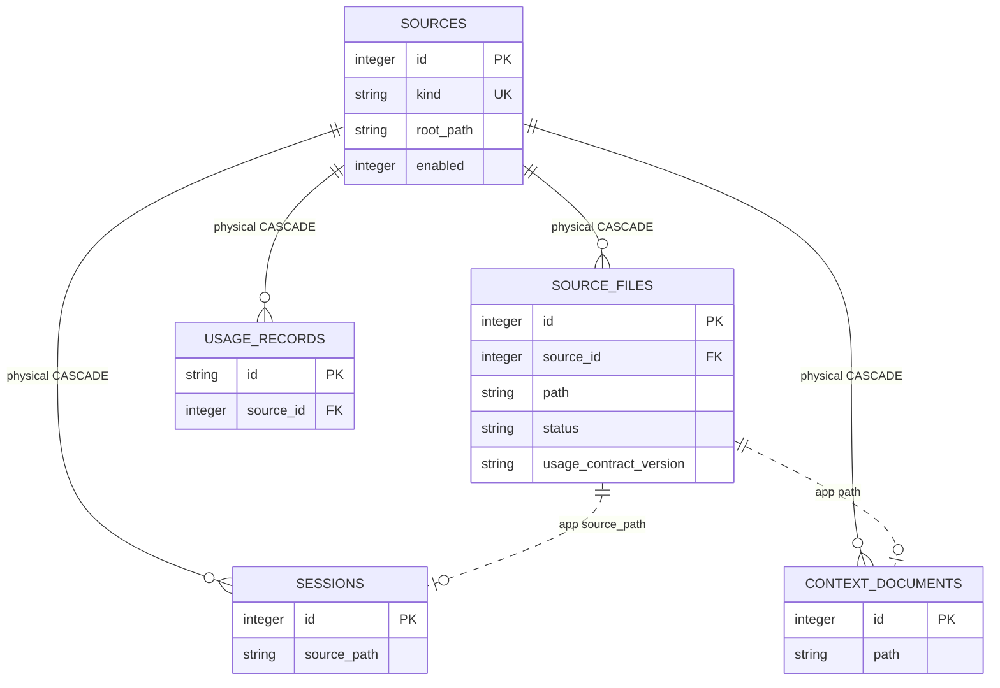

# Source Registry And Scans

<!-- schema-objects: sources, source_files -->

This subject owns source identity, configured roots, scan freshness, file fingerprints, parser-contract freshness, and scan errors. It does not own the normalized Sessions, Usage Records, or Context Documents produced from those files.

## Focused ERD

Solid lines are physical foreign keys; dotted lines are scanner-managed correlations.

## Catalog

### `sources`

- Purpose and authority: one application-managed registry row per source kind. Configured Claude, Codex, and Local Context source roots are authoritative; `ingest/scanner.py` upserts their current registry representation.
- Lifecycle: source-derived registry. It is reproducible from configuration and registered roots, but its IDs are physical parents, so ordinary scans update rows in place.
- Producers: `ingest/scanner.py`; `db.py` reads kinds when migration changes must stale Session inputs.
- Consumers: `queries.py`, `activity.py`, `retrieval.py`, `usage_queries.py`, `workstreams.py`, `runner.py`, `main.py`, and CLI scan reporting.
- Relations and deletion: physical parent of `source_files`, `sessions`, `usage_records`, and `context_documents`, all `ON DELETE CASCADE`. Deleting a source would remove normalized descendants and can invalidate application-enforced links or search rows, so no cleanup is implied.
- Recovery: recreate registry rows through approved scans, then rescan source files. Preserve the database for user-curated links and review state that may refer to descendant IDs.
- DDL ownership: complete fresh definition in `schema.sql`; no compatible columns or explicit named indexes in `db.py`.

| Column | Contract |
| --- | --- |
| `id` | `INTEGER PRIMARY KEY`; stable local registry identity and physical parent key. |
| `kind` | `TEXT NOT NULL UNIQUE`; normalized adapter identity such as Claude, Codex, or a Local Context source kind. |
| `name` | `TEXT NOT NULL`; user-facing source label. |
| `root_path` | `TEXT NOT NULL`; configured local scan root or source locator; runtime values remain outside tracked docs. |
| `enabled` | `INTEGER NOT NULL DEFAULT 1`; registry participation flag. |
| `last_scanned_at` | nullable `TEXT`; completion time of the latest source-level scan attempt. |
| `created_at` | `TEXT NOT NULL DEFAULT CURRENT_TIMESTAMP`; registry creation time. |

Constraints: uniqueness of `kind`. Explicit indexes: none; SQLite owns the uniqueness autoindex.

### `source_files`

- Purpose and authority: per-source scan evidence for a local input path, including its file fingerprint, latest attempt state, error, and usage-normalizer contract version.
- Lifecycle: source-derived and rebuildable. Healthy unchanged rows are freshness inputs; failed rows retain the latest error rather than masquerading as absent.
- Producers: `ingest/scanner.py` inserts and updates scan results; `contexts.py` removes Context-owned rows when a root is disabled; `db.py` adds `usage_contract_version` and marks Claude/Codex rows stale when Session or Usage contracts change.
- Consumers: `ingest/scanner.py` skip/retry logic, `queries.py` source status, `usage_queries.py` freshness/trust, and `contexts.py` root lifecycle.
- Relations and deletion: `source_id` physically cascades from `sources`. The correlation from `path` to `sessions.source_path` or `context_documents.path` is application-managed; removing a file row alone does not cascade those objects. Scanner reconciliation explicitly removes disappeared normalized rows and their search entries.
- Recovery: rescan the owning source. Errors and exact prior attempt times are operational history and are not reproduced exactly.
- DDL ownership: fresh definition in `schema.sql`; `db.py` compatibly adds `usage_contract_version` and uses it to trigger staleness. No explicit named index.

| Column | Contract |
| --- | --- |
| `id` | `INTEGER PRIMARY KEY`; local scan-evidence identity. |
| `source_id` | `INTEGER NOT NULL` FK to `sources.id`, `ON DELETE CASCADE`. |
| `path` | `TEXT NOT NULL`; source-local file identity used for scanner correlation. |
| `size_bytes` | `INTEGER NOT NULL`; fingerprint size captured at the latest attempt. |
| `mtime_ns` | `INTEGER NOT NULL`; nanosecond file modification fingerprint. |
| `last_scanned_at` | `TEXT NOT NULL`; latest attempt time for this input. |
| `status` | `TEXT NOT NULL DEFAULT 'ok'`; freshness state such as healthy, stale, or error. |
| `error` | nullable `TEXT`; bounded scan or parse error evidence. |
| `usage_contract_version` | nullable `TEXT`; normalizer contract used to decide whether Usage Records remain current. |

Constraints: `UNIQUE(source_id, path)`. Explicit indexes: none; SQLite owns the composite uniqueness autoindex.

## Subject Recovery Boundary

A full source rescan rebuilds normalized scan state but not the exact chronology of prior errors. Disabling a user-managed Context root is owned by the Context subject and intentionally removes its scan rows without deleting original files. Source deletion is not an ordinary recovery operation because physical cascades and application links cross subject boundaries.
