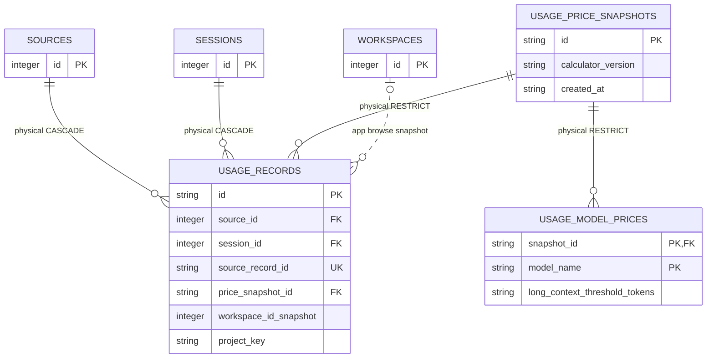

# Usage And Cost Records

<!-- schema-objects: usage_price_snapshots, usage_model_prices, usage_records -->

This subject owns immutable local pricing evidence, normalized token observations, estimated trend cost, calculation capability, source-record identity, and frozen Project attribution. It does not own Session content or current workspace identity.

[Value Dictionary](value-dictionaries/usage-and-cost-records.md) owns this subject's bounded physical/logical/presentation mappings.

## Focused ERD

## Catalog

### `usage_price_snapshots`

- Purpose and authority: immutable identity and provenance for a versioned local pricing set used by estimated-cost calculations.
- Lifecycle: code-seeded reference. `usage.ensure_default_price_snapshot` inserts known versions without overwriting existing evidence.
- Producers: `usage.py` startup seeding.
- Consumers: `usage.py` calculation/version validation and `usage_queries.py` trust/provenance presentation.
- Relations and deletion: physical parent of model prices and Usage Records with `ON DELETE RESTRICT`; cited pricing evidence cannot be removed.
- Recovery: reproduce the exact application version's seeded snapshots. Database backup is preferred when retaining records calculated by an older version.
- DDL ownership: fresh definition in `schema.sql`; seed rows are owned by `usage.py`; no explicit named index.

| Column | Contract |
| --- | --- |
| `id` | `TEXT PRIMARY KEY`; immutable snapshot identity. |
| `label` | `TEXT NOT NULL`; human-readable pricing reference label. |
| `source_ref` | `TEXT NOT NULL`; local provenance description for the reference data. |
| `calculator_version` | `TEXT NOT NULL`; calculation contract compatible with the snapshot. |
| `created_at` | `TEXT NOT NULL`; fixed snapshot creation/effective evidence time. |

Constraints: primary key only. Explicit indexes: none.

### `usage_model_prices`

- Purpose and authority: per-model decimal price strings for one immutable snapshot, including optional long-context thresholds and tiered rates.
- Lifecycle: code-seeded reference and physically restricted once its snapshot is cited.
- Producers: `usage.py` idempotent snapshot seeding.
- Consumers: `usage.py` price selection and exact Decimal-based calculation.
- Relations and deletion: composite identity belongs to `usage_price_snapshots`; deleting the parent is restricted.
- Recovery: recreate from the same versioned code constants. Changing a rate requires a new snapshot, not mutation of cited rows.
- DDL ownership: fresh definition in `schema.sql`; `db.py` compatibly adds all five long-context fields.

| Column | Contract |
| --- | --- |
| `snapshot_id` | `TEXT NOT NULL`, composite PK and FK to `usage_price_snapshots.id`, `ON DELETE RESTRICT`. |
| `model_name` | `TEXT NOT NULL`, composite PK; normalized priced-model identity. |
| `input_usd_per_million` | `TEXT NOT NULL`; exact decimal input rate. |
| `output_usd_per_million` | `TEXT NOT NULL`; exact decimal output rate. |
| `cache_write_usd_per_million` | nullable `TEXT`; exact cache-write rate when supported. |
| `cache_read_usd_per_million` | nullable `TEXT`; exact cache-read rate when supported. |
| `long_context_threshold_tokens` | nullable positive `INTEGER`; per-request threshold enabling long-context rates. |
| `long_context_input_usd_per_million` | nullable `TEXT`; long-context input rate. |
| `long_context_output_usd_per_million` | nullable `TEXT`; long-context output rate. |
| `long_context_cache_write_usd_per_million` | nullable `TEXT`; long-context cache-write rate. |
| `long_context_cache_read_usd_per_million` | nullable `TEXT`; long-context cache-read rate. |

Constraints: `PRIMARY KEY(snapshot_id, model_name)` and positive-or-null threshold check. Explicit indexes: none beyond the composite primary-key autoindex.

### `usage_records`

- Purpose and authority: one normalized direct or aggregate usage observation per source record, with token semantics, capability/calculation state, cited pricing, and frozen Project attribution.
- Lifecycle: mixed source-derived and immutable historical evidence. Source observations can be re-normalized, but exact calculated cost and Project attribution must retain their cited versions and snapshot values. Canonical Claude and personal Codex Usage IDs retain their existing deterministic values; an additional source key reusing a provider scopes the stored ID by that source key so an identical native observation can coexist in both homes.
- Producers: Claude/Codex native source normalizers feed `usage.py`; source repair replaces a source's complete record set, including Run-linked Maintenance Sessions. The Runner stream is not a Usage producer. `db.py` compatibly adds attribution, normalizer, and snapshot fields and backfills missing basis/time.
- Consumers: `usage.py` repair/idempotency, `usage_queries.py` period summary/history/breakdowns/trust, and activity/project attribution tests. Dashboard source options are registry-derived, exact selection and source composition use stable `sources.kind`, and provider kind remains the shared normalizer family. `All` includes every accepted Claude/Codex-adapter Source and source-compatible totals equal their exact source-row sums. Dashboard selection excludes exact Claude `<synthetic>` pseudo-model rows without deleting them.
- Relations and deletion: physical source and Session parents cascade; pricing snapshot deletion is restricted. `workspace_id_snapshot` is an application-only optional current browse join, never attribution authority.
- Recovery: native source records plus the correct normalizer/calculator and price snapshots can rebuild observations, but a Runner stream alone cannot and current paths may not reproduce historical Project attribution. Before repairing a legacy attribution CHECK, startup preserves `localbrain.db-pre-usage-attribution-check-v1.bak` beside the database and validates it with SQLite `quick_check`.
- DDL ownership: fresh `usage_records` definition and three time indexes in `schema.sql`; `db.py` performs a one-way in-place rename from legacy `usage_facts`, replaces only the explicit legacy index names, and owns attribution and normalizer compatible columns. It refuses startup if legacy and canonical tables coexist. Older compatible tables retain their historical column metadata, including nullable `attributed_at`, while a backup-backed transactional repair adds only the missing three-value `attribution_basis` CHECK after exact full-row preflight and comparison.

| Column | Contract |
| --- | --- |
| `id` | `TEXT PRIMARY KEY`; deterministic normalized Usage Record identity, source-key scoped for additional provider-sharing sources. |
| `source_id` | `INTEGER NOT NULL` FK to `sources.id`, `ON DELETE CASCADE`. |
| `session_id` | `INTEGER NOT NULL` FK to `sessions.id`, `ON DELETE CASCADE`. |
| `source_record_id` | `TEXT NOT NULL`; source-scoped usage observation identity. |
| `source_line` | `INTEGER NOT NULL`; source evidence line/order. |
| `occurred_at` | nullable `TEXT`; observation time used for history when valid. |
| `raw_model` | nullable `TEXT`; source model value retained for provenance. |
| `model_name` | nullable `TEXT`; normalized model used for pricing/grouping. |
| `input_tokens` | nullable nonnegative `INTEGER`; direct input token count. |
| `output_tokens` | nullable nonnegative `INTEGER`; direct output token count. |
| `cache_write_tokens` | nullable nonnegative `INTEGER`; cache creation/write tokens. |
| `cache_read_tokens` | nullable nonnegative `INTEGER`; cache read tokens. |
| `reasoning_tokens` | nullable nonnegative `INTEGER`; source-supported reasoning tokens. |
| `source_total_tokens` | nullable nonnegative `INTEGER`; total reported by the source. |
| `total_tokens` | nullable nonnegative `INTEGER`; normalized supported total. |
| `total_semantics` | `TEXT NOT NULL`; states what the selected total represents. |
| `aggregation_scope` | `TEXT NOT NULL DEFAULT 'direct'`; checked to `direct` or `includes_children`. |
| `capability_state` | `TEXT NOT NULL`; checked to `complete`, `partial`, or `malformed`. |
| `capability_json` | `TEXT NOT NULL`; versioned detail for available/missing usage components. |
| `calculation_state` | `TEXT NOT NULL`; checked to `priced`, `unpriced`, `partial`, or `failed`. |
| `estimated_cost_usd` | nullable `TEXT`; exact decimal estimate, present only when priced. |
| `price_snapshot_id` | `TEXT NOT NULL` FK to `usage_price_snapshots.id`, `ON DELETE RESTRICT`. |
| `calculator_version` | `TEXT NOT NULL`; cost formula/version used. |
| `normalizer_version` | `TEXT NOT NULL DEFAULT 'legacy-v1'`; source normalization contract. |
| `calculated_at` | `TEXT NOT NULL`; calculation evidence time. |
| `workspace_id_snapshot` | nullable `INTEGER`; non-FK current browse hint captured at attribution. |
| `project_key` | nullable `TEXT`; immutable grouping identity, including stable unassigned identity. |
| `project_name_snapshot` | nullable `TEXT`; frozen display name. |
| `project_path_snapshot` | nullable `TEXT`; frozen canonical-path evidence. |
| `project_git_root_snapshot` | nullable `TEXT`; frozen repository-root evidence. |
| `attribution_basis` | `TEXT NOT NULL DEFAULT 'unassigned'`, checked to `git_root`, `workspace_path`, or `unassigned`; compatible startup rebuilds only a legacy table missing this CHECK and preserves every stored value exactly. |
| `attributed_at` | Fresh schema: `TEXT NOT NULL`; compatible addition is nullable `TEXT` and startup backfills existing nulls. Time the immutable Project attribution was selected. |
| `imported_at` | `TEXT NOT NULL DEFAULT CURRENT_TIMESTAMP`; persistence time. |

Constraints: fresh and compatible schemas have nonnegative token checks; aggregation, capability, calculation, and attribution checks; priced-cost nullability check; and `UNIQUE(source_id, session_id, source_record_id)`. The attribution repair refuses unknown values rather than rewriting them. Explicit indexes: `idx_usage_records_session_time`, `idx_usage_records_source_time`, `idx_usage_records_model_time`.

## Subject Recovery Boundary

Pricing snapshots are append-only reference evidence. Record replacement is bounded to one Session and rolls back on failure. “Rebuildable from source” is not equivalent to “historically identical”: immutable Project attribution and calculation versions mean an exact recovery requires the database or the same source set, code contracts, snapshot rows, and historical path conditions.
