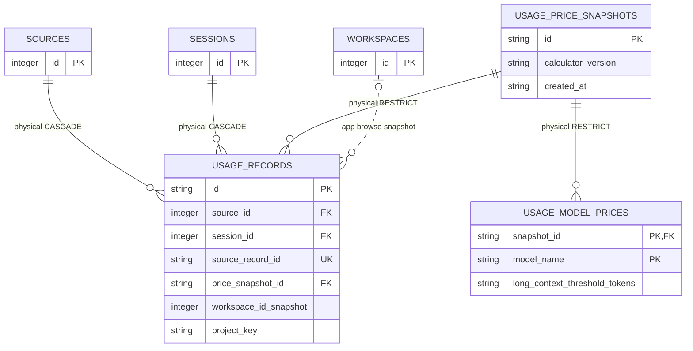

# Usage And Cost Records

<!-- schema-objects: usage_price_snapshots, usage_model_prices, usage_records -->

This subject owns immutable local pricing evidence, normalized token observations, estimated trend cost, calculation capability, source-record identity, and frozen Project attribution. It does not own Session content or current workspace identity.

[Value Dictionary](value-dictionaries/usage-and-cost-records.md) owns this subject's bounded physical/logical/presentation mappings.

## Focused ERD

```mermaid
erDiagram
    SOURCES { integer id PK }
    SESSIONS { integer id PK }
    WORKSPACES { integer id PK }
    USAGE_PRICE_SNAPSHOTS {
        string id PK
        string calculator_version
        string created_at
    }
    USAGE_MODEL_PRICES {
        string snapshot_id PK,FK
        string model_name PK
        string long_context_threshold_tokens
    }
    USAGE_RECORDS {
        string id PK
        integer source_id FK
        integer session_id FK
        string source_record_id UK
        string price_snapshot_id FK
        integer workspace_id_snapshot
        string project_key
    }

    SOURCES ||--o{ USAGE_RECORDS : "physical CASCADE"
    SESSIONS ||--o{ USAGE_RECORDS : "physical CASCADE"
    USAGE_PRICE_SNAPSHOTS ||--o{ USAGE_MODEL_PRICES : "physical RESTRICT"
    USAGE_PRICE_SNAPSHOTS ||--o{ USAGE_RECORDS : "physical RESTRICT"
    WORKSPACES o|..o{ USAGE_RECORDS : "app browse snapshot"
```

## Catalog

### `usage_price_snapshots`

- Purpose and authority: immutable identity and provenance for a versioned local pricing set used by estimated-cost calculations.
- Lifecycle: code-seeded reference. `usage.ensure_default_price_snapshot` retains legacy ccusage snapshots without overwriting evidence; `usage.ensure_official_price_snapshots` adds immutable per-model, per-service-tier rates from the [OpenAI pricing and changelog](https://developers.openai.com/api/docs/pricing), [OpenAI Fast price table](https://openai.com/api-fast-mode/), and [Anthropic pricing](https://platform.claude.com/docs/en/about-claude/pricing), inspected on 2026-09-25. [GPT-6.1 Sol](https://developers.openai.com/api/docs/models/gpt-6.1-sol) adds separate Standard/Fast snapshots effective 2026-09-29 per the [release changelog](https://developers.openai.com/api/docs/changelog), inspected on 2026-10-02: Standard input/cache-read/output is $2/$0.10/$10 per million tokens, Fast is 2x, and above 272,000 input tokens the full request uses 2x input/cache and 1.5x output rates. Its 5% cache-read price does not replace GPT-6 Sol's 10% rate. GPT-5.6 Terra/Luna use the July 30 reduction and Sol the August 21 reduction; GPT-6 Astra's $10/$1/$50 input/cache-read/output rate is Standard, while its published Fast rate is twice that amount. GPT-5.6 Priority before July 30 uses a labeled historical 2x inference because an independently archived tier price was unavailable. Older ccusage snapshots remain cited but are superseded for corrected usage. Exact GPT-5.3-Codex-Spark has no independently published API rate; a separate Standard/Fast snapshot uses the [ccusage 20.0.17 model fallback](https://github.com/ccusage/ccusage/blob/v20.0.17/rust/crates/ccusage/src/pricing.rs) as a labeled trend proxy.
- Historical Fast long-context proxy snapshots for GPT-5.5 and pre-August-5 GPT-5.6 use the dated short-context Fast rate and ccusage-style 2x input/cache-read and 1.5x output context factors. Their labels identify the absent historical publisher rate.
- Producers: `usage.py` startup seeding.
- Consumers: `usage.py` calculation/version validation and `usage_queries.py` coverage/provenance data.
- Relations and deletion: physical parent of model prices and Usage Records with `ON DELETE RESTRICT`; cited pricing evidence cannot be removed.
- Recovery: reproduce the exact application version's seeded snapshots. Database backup is preferred when retaining records calculated by an older version.
- DDL ownership: fresh definition in `schema.sql`; seed rows are owned by `usage.py`; no explicit named index.

| Column | Contract |
| --- | --- |
| `id` | `TEXT PRIMARY KEY`; immutable snapshot identity. |
| `label` | `TEXT NOT NULL`; human-readable pricing reference label. |
| `source_ref` | `TEXT NOT NULL`; local provenance description for the reference data. |
| `calculator_version` | `TEXT NOT NULL`; calculation contract compatible with the snapshot. |
| `created_at` | `TEXT NOT NULL`; fixed snapshot creation/effective evidence time. |

Constraints: primary key only. Explicit indexes: none.

### `usage_model_prices`

- Purpose and authority: per-model decimal price strings for one immutable snapshot, including optional long-context thresholds and tiered rates.
- Lifecycle: code-seeded reference and physically restricted once its snapshot is cited.
- Producers: `usage.py` idempotent snapshot seeding.
- Consumers: `usage.py` price selection and exact Decimal-based calculation.
- Relations and deletion: composite identity belongs to `usage_price_snapshots`; deleting the parent is restricted.
- Recovery: recreate from the same versioned code constants. Changing a rate requires a new snapshot, not mutation of cited rows.
- DDL ownership: fresh definition in `schema.sql`; `db.py` compatibly adds all five long-context fields.

| Column | Contract |
| --- | --- |
| `snapshot_id` | `TEXT NOT NULL`, composite PK and FK to `usage_price_snapshots.id`, `ON DELETE RESTRICT`. |
| `model_name` | `TEXT NOT NULL`, composite PK; normalized priced-model identity. |
| `input_usd_per_million` | `TEXT NOT NULL`; exact decimal input rate. |
| `output_usd_per_million` | `TEXT NOT NULL`; exact decimal output rate. |
| `cache_write_usd_per_million` | nullable `TEXT`; exact cache-write rate when supported. |
| `cache_read_usd_per_million` | nullable `TEXT`; exact cache-read rate when supported. |
| `long_context_threshold_tokens` | nullable positive `INTEGER`; per-request threshold enabling long-context rates. |
| `long_context_input_usd_per_million` | nullable `TEXT`; long-context input rate. |
| `long_context_output_usd_per_million` | nullable `TEXT`; long-context output rate. |
| `long_context_cache_write_usd_per_million` | nullable `TEXT`; long-context cache-write rate. |
| `long_context_cache_read_usd_per_million` | nullable `TEXT`; long-context cache-read rate. |

Constraints: `PRIMARY KEY(snapshot_id, model_name)` and positive-or-null threshold check. Explicit indexes: none beyond the composite primary-key autoindex.

### `usage_records`

- Purpose and authority: one normalized direct or aggregate usage observation per source record, with token semantics, capability/calculation state, cited pricing, and frozen Project attribution.
- Lifecycle: mixed source-derived and immutable historical evidence. Source observations can be re-normalized; the approved 2026-09-25 official-price correction replaces cited cost and snapshot on existing records while retaining Usage identity, token counts, and frozen Project attribution. The 2026-09-26 Spark decision reprices previously unpriced records with a labeled ccusage proxy, and the approved Fast long-context decision reprices eligible partial records with a separate labeled proxy. Both retain Usage identity, token counts, and frozen Project attribution. Historical snapshot rows themselves remain immutable. Canonical Claude and personal Codex Usage IDs retain their existing deterministic values; an additional source key reusing a provider scopes the stored ID by that source key so an identical native observation can coexist in both homes.
- Producers: Claude/Codex native source normalizers feed `usage.py`; a Usage-contract repair replaces only a source's native Usage record set, including Run-linked Maintenance Sessions, and preserves unrelated Session/Event/search/reference rows. Immutable price lookups are cached for the source repair and one Session's upserts are batched inside the existing savepoint. The Codex producer follows `thread_settings_applied` chronologically, using `priority`/`fast` as Fast and `default` as Standard; unmarked or unsupported settings fall back to the current source-home config and record that provenance. It chooses a cited snapshot by exact model, usage date, tier, and context size; the Spark and historical Fast long-context proxies are explicit. Claude preserves cache-write lifetime breakdown for its 5-minute and 1-hour official rates. Startup fills eligible previously unpriced Spark and exact GPT-6.1 Sol records from the unavailable snapshot and eligible partial Fast long-context observations. It uses retained dates, tiers and components, preserves Usage identity, tokens and Project attribution, and never overwrites an already-priced record. Unreadable tier evidence, pre-release usage or insufficient components remain unpriced; repeat startup is idempotent. Historical Codex `last_token_usage` rows whose request components and normalized total are zero while the source total repeats prior history remain stored but are excluded by the dashboard read model. The native Maintenance Task Runner stream is not a Usage producer. Ephemeral personal insight Runs explicitly use `personal_insight_usage.py` as a separate producer: one latest CLI summary per Run, a metadata-only Maintenance Session accounting parent, the exact registered Codex source, and unassigned Project attribution. It preserves observed usage independently of report success and protects that projection during native source reconciliation. New Runs freeze Standard tier; historical unmarked Runs carry the default-tier assumption. Aggregate input above a request-level context threshold remains partial. Repeated recovery preserves the existing Usage identity, price snapshot, and attribution. `db.py` compatibly adds attribution, normalizer, and snapshot fields and backfills missing basis/time.
- Consumers: `usage.py` repair/idempotency, `usage_queries.py` period summary/history/breakdowns/trust, `personal_insight_usage.py` selected-Run cost and frozen price-basis reads, and activity/project attribution tests. Dashboard source options are registry-derived, exact selection and source composition use stable `sources.kind`, and provider kind remains the shared normalizer family. `All` includes every accepted Claude/Codex-adapter Source and source-compatible totals equal their exact source-row sums. Dashboard selection excludes exact Claude `<synthetic>` pseudo-model rows without deleting them.
- Relations and deletion: physical source and Session parents cascade; pricing snapshot deletion is restricted. `workspace_id_snapshot` is an application-only optional current browse join, never attribution authority.
- Recovery: native source records plus the correct normalizer/calculator and price snapshots can rebuild observations, but a native Maintenance Runner stream alone cannot and current paths may not reproduce historical Project attribution. The separate ephemeral-insight producer can recover its accounting projection from the retained Run ledger and usage summary or CLI usage event. Before repairing a legacy attribution CHECK, startup preserves `localbrain.db-pre-usage-attribution-check-v1.bak` beside the database and validates it with SQLite `quick_check`.
- DDL ownership: fresh `usage_records` definition and four time indexes in `schema.sql`; `db.py` performs a one-way in-place rename from legacy `usage_facts`, replaces only the explicit legacy index names, and owns attribution and normalizer compatible columns. It refuses startup if legacy and canonical tables coexist. Older compatible tables retain their historical column metadata, including nullable `attributed_at`, while a backup-backed transactional repair adds only the missing three-value `attribution_basis` CHECK after exact full-row preflight and comparison.

| Column | Contract |
| --- | --- |
| `id` | `TEXT PRIMARY KEY`; deterministic normalized Usage Record identity, source-key scoped for additional provider-sharing sources. |
| `source_id` | `INTEGER NOT NULL` FK to `sources.id`, `ON DELETE CASCADE`. |
| `session_id` | `INTEGER NOT NULL` FK to `sessions.id`, `ON DELETE CASCADE`. |
| `source_record_id` | `TEXT NOT NULL`; source-scoped usage observation identity. |
| `source_line` | `INTEGER NOT NULL`; source evidence line/order; zero denotes a recovered insight Run usage summary without a retained stream line. |
| `occurred_at` | nullable `TEXT`; observation time used for history when valid. |
| `raw_model` | nullable `TEXT`; source model value retained for provenance. |
| `model_name` | nullable `TEXT`; normalized model used for pricing/grouping. |
| `input_tokens` | nullable nonnegative `INTEGER`; direct input token count. |
| `output_tokens` | nullable nonnegative `INTEGER`; direct output token count. |
| `cache_write_tokens` | nullable nonnegative `INTEGER`; cache creation/write tokens. |
| `cache_read_tokens` | nullable nonnegative `INTEGER`; cache read tokens. |
| `reasoning_tokens` | nullable nonnegative `INTEGER`; source-supported reasoning tokens. |
| `source_total_tokens` | nullable nonnegative `INTEGER`; total reported by the source. |
| `total_tokens` | nullable nonnegative `INTEGER`; normalized supported total. |
| `total_semantics` | `TEXT NOT NULL`; states what the selected total represents. |
| `aggregation_scope` | `TEXT NOT NULL DEFAULT 'direct'`; checked to `direct` or `includes_children`. |
| `capability_state` | `TEXT NOT NULL`; checked to `complete`, `partial`, or `malformed`. |
| `capability_json` | `TEXT NOT NULL`; versioned detail for available/missing usage components. |
| `calculation_state` | `TEXT NOT NULL`; checked to `priced`, `unpriced`, `partial`, or `failed`. |
| `estimated_cost_usd` | nullable `TEXT`; exact decimal estimate, present only when priced. |
| `price_snapshot_id` | `TEXT NOT NULL` FK to `usage_price_snapshots.id`, `ON DELETE RESTRICT`. |
| `calculator_version` | `TEXT NOT NULL`; cost formula/version used. |
| `normalizer_version` | `TEXT NOT NULL DEFAULT 'legacy-v1'`; source normalization contract. |
| `calculated_at` | `TEXT NOT NULL`; calculation evidence time. |
| `workspace_id_snapshot` | nullable `INTEGER`; non-FK current browse hint captured at attribution. |
| `project_key` | nullable `TEXT`; immutable grouping identity, including stable unassigned identity. |
| `project_name_snapshot` | nullable `TEXT`; frozen display name. |
| `project_path_snapshot` | nullable `TEXT`; frozen canonical-path evidence. |
| `project_git_root_snapshot` | nullable `TEXT`; frozen repository-root evidence. |
| `attribution_basis` | `TEXT NOT NULL DEFAULT 'unassigned'`, checked to `git_root`, `workspace_path`, or `unassigned`; compatible startup rebuilds only a legacy table missing this CHECK and preserves every stored value exactly. |
| `attributed_at` | Fresh schema: `TEXT NOT NULL`; compatible addition is nullable `TEXT` and startup backfills existing nulls. Time the immutable Project attribution was selected. |
| `imported_at` | `TEXT NOT NULL DEFAULT CURRENT_TIMESTAMP`; persistence time. |

Constraints: fresh and compatible schemas have nonnegative token checks; aggregation, capability, calculation, and attribution checks; priced-cost nullability check; and `UNIQUE(source_id, session_id, source_record_id)`. The attribution repair refuses unknown values rather than rewriting them. Explicit indexes: `idx_usage_records_session_time`, `idx_usage_records_source_time`, `idx_usage_records_time`, `idx_usage_records_model_time`.

## Subject Recovery Boundary

Pricing snapshots are append-only reference evidence. Record replacement is bounded to one Session and rolls back on failure. “Rebuildable from source” is not equivalent to “historically identical”: immutable Project attribution and calculation versions mean an exact recovery requires the database or the same source set, code contracts, snapshot rows, and historical path conditions.
