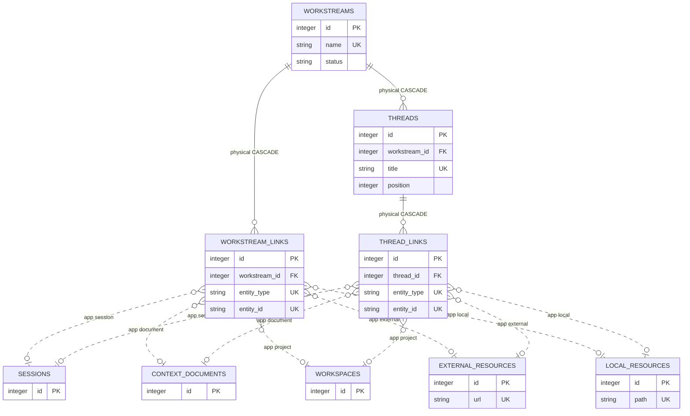

# Work Organization And Resources

<!-- schema-objects: workstreams, threads, workstream_links, thread_links, local_resources, external_resources -->

This subject owns user-created Workstreams and Threads, their current planning state, canonical local/external resources, and user-reviewed links to source-derived entities. None of these tables is safely recreated by a source rescan.

## Focused ERD

Solid lines are physical ownership. Dotted lines represent the five validated polymorphic target types.

## Polymorphic Target Contract

`entity_type` is restricted by application code to `session`, `document`, `project`, `external`, or `local`, resolving respectively to `sessions`, `context_documents`, `workspaces`, `external_resources`, or `local_resources`. `_validate_entity` confirms the target exists; Session targets must also be primary work Sessions. `entity_id` remains text so the shared link shape can address heterogeneous integer identities. SQLite provides no target FK, cascade, or orphan cleanup.

## Catalog

### `workstreams`

- Purpose and authority: user-created top-level organization with current status, summary, and activity marker.
- Lifecycle: user-curated and non-rebuildable.
- Producers: `workstreams.py` create/update/touch operations.
- Consumers: Dashboard and Workstream detail, retrieval scope, Runner context and Run association, Suggestions, Threads, checkpoints, and resource memberships.
- Relations and deletion: physical parent of `threads`, `workstream_links`, and `checkpoints` with cascade; optional parent of `maintenance_runs` with set null. No ordinary delete workflow currently treats this as disposable.
- Recovery: LocalBrain database backup; source rescans cannot recover names, summaries, statuses, or grouping intent.
- DDL ownership: fresh definition in `schema.sql`; no compatible columns or explicit named index.

| Column | Contract |
| --- | --- |
| `id` | `INTEGER PRIMARY KEY`; stable Workstream identity. |
| `name` | `TEXT NOT NULL UNIQUE`; user-owned top-level name. |
| `status` | `TEXT NOT NULL DEFAULT 'active'`; application-bounded active, paused, done, or archived state. |
| `summary` | nullable `TEXT`; user-maintained purpose/context. |
| `last_activity_at` | nullable `TEXT`; latest linked/user organization activity signal. |
| `created_at` | `TEXT NOT NULL DEFAULT CURRENT_TIMESTAMP`; creation time. |
| `updated_at` | `TEXT NOT NULL DEFAULT CURRENT_TIMESTAMP`; latest mutation time. |

Constraints: uniqueness of `name`; status vocabulary is application-enforced. Explicit indexes: none.

### `threads`

- Purpose and authority: ordered, nested work track inside one Workstream, including status, summary, goal, and next action.
- Lifecycle: user-curated and non-rebuildable.
- Producers: `workstreams.py` create and update operations.
- Consumers: Workstream detail, retrieval scoping, Runner structured results, Suggestions, links, checkpoints, and membership queries.
- Relations and deletion: Workstream deletion cascades; Thread deletion cascades `thread_links` and sets historical `checkpoint_resource_refs.thread_id` null.
- Recovery: database backup. Recreating a title does not recreate identity, order, links, or checkpoint history.
- DDL ownership: fresh definition and `idx_threads_workstream` in `schema.sql`; `db.py` repeats the index idempotently.

| Column | Contract |
| --- | --- |
| `id` | `INTEGER PRIMARY KEY`; stable Thread identity. |
| `workstream_id` | `INTEGER NOT NULL` FK to `workstreams.id`, `ON DELETE CASCADE`. |
| `title` | `TEXT NOT NULL`; title unique within its Workstream. |
| `status` | `TEXT NOT NULL DEFAULT 'active'`; application-bounded active, blocked, paused, or done state. |
| `summary` | nullable `TEXT`; current Thread context. |
| `current_goal` | nullable `TEXT`; current intended outcome. |
| `next_action` | nullable `TEXT`; next executable step. |
| `last_activity_at` | nullable `TEXT`; latest Thread-scoped activity signal. |
| `position` | `INTEGER NOT NULL DEFAULT 0`; user-facing order within the Workstream. |
| `created_at` | `TEXT NOT NULL DEFAULT CURRENT_TIMESTAMP`; creation time. |
| `updated_at` | `TEXT NOT NULL DEFAULT CURRENT_TIMESTAMP`; latest mutation time. |

Constraints: `UNIQUE(workstream_id, title)`; status vocabulary is application-enforced. Explicit index: `idx_threads_workstream`.

### `workstream_links`

- Purpose and authority: one reviewed or generated relationship from a Workstream to a heterogeneous resource, shared by multiple Threads.
- Lifecycle: user-curated and non-rebuildable; `linked_by` and `confidence` retain origin context.
- Producers: `workstreams.py` validated add/update/remove operations and accepted suggestions.
- Consumers: Workstream detail, latest activity, memberships, retrieval exclusions/scope, Runner manifests, checkpoint snapshots, and suggestion deduplication.
- Relations and deletion: Workstream deletion cascades. Target edges are application-enforced and do not cascade; target removal can leave historical/unresolved identity.
- Recovery: database backup or accepted external workflow record; source scanning does not infer the same relation reliably.
- DDL ownership: fresh definition and `idx_workstream_links_entity` in `schema.sql`; relation type compatible addition and repeated index in `db.py`.

| Column | Contract |
| --- | --- |
| `id` | `INTEGER PRIMARY KEY`; link identity. |
| `workstream_id` | `INTEGER NOT NULL` FK to `workstreams.id`, `ON DELETE CASCADE`. |
| `entity_type` | `TEXT NOT NULL`; application-enforced target discriminator. |
| `entity_id` | `TEXT NOT NULL`; target identity interpreted by `entity_type`. |
| `relation_type` | `TEXT NOT NULL DEFAULT 'related-to'`; user/reviewed relation meaning. |
| `confidence` | nullable `REAL`; generated-link confidence when applicable. |
| `linked_by` | `TEXT NOT NULL DEFAULT 'user'`; user or generator provenance. |
| `created_at` | `TEXT NOT NULL DEFAULT CURRENT_TIMESTAMP`; link creation time. |

Constraints: `UNIQUE(workstream_id, entity_type, entity_id)`. Explicit index: `idx_workstream_links_entity`.

### `thread_links`

- Purpose and authority: one reviewed or generated relationship from a Thread to a heterogeneous resource.
- Lifecycle: user-curated and non-rebuildable.
- Producers: `workstreams.py` validated add/update/remove operations and accepted suggestions.
- Consumers: Workstream/Thread detail, activity, memberships, retrieval scope, Runner manifests, checkpoint snapshots, and suggestion deduplication.
- Relations and deletion: Thread deletion cascades. Target relations are application-enforced and have no SQLite cascade.
- Recovery: database backup; inference may suggest a new link but cannot restore review provenance exactly.
- DDL ownership: fresh definition and `idx_thread_links_entity` in `schema.sql`; `db.py` repeats the index idempotently.

| Column | Contract |
| --- | --- |
| `id` | `INTEGER PRIMARY KEY`; link identity. |
| `thread_id` | `INTEGER NOT NULL` FK to `threads.id`, `ON DELETE CASCADE`. |
| `entity_type` | `TEXT NOT NULL`; application-enforced target discriminator. |
| `entity_id` | `TEXT NOT NULL`; target identity interpreted by `entity_type`. |
| `relation_type` | `TEXT NOT NULL DEFAULT 'related-to'`; relation meaning. |
| `confidence` | nullable `REAL`; generated-link confidence. |
| `linked_by` | `TEXT NOT NULL DEFAULT 'user'`; origin provenance. |
| `created_at` | `TEXT NOT NULL DEFAULT CURRENT_TIMESTAMP`; link creation time. |

Constraints: `UNIQUE(thread_id, entity_type, entity_id)`. Explicit index: `idx_thread_links_entity`.

### `local_resources`

- Purpose and authority: canonical user-visible local repository, directory, file, or generic path resource independent of indexed Context Documents.
- Lifecycle: user-curated and non-rebuildable as organization, even though existence can be rechecked.
- Producers: `workstreams.py` canonical registration and update; Runner structured output can propose/register reviewed local resources.
- Consumers: resource picker/detail, Workstream/Thread link resolution, retrieval context, and Runner reference manifests.
- Relations and deletion: application target of link and checkpoint tables only; SQLite does not cascade target deletion.
- Recovery: database backup plus local filesystem. A path scan cannot reconstruct title, summary, discovery provenance, or memberships.
- DDL ownership: fresh definition in `schema.sql`; path lookup and uniqueness use the `UNIQUE(path)` autoindex, and the compatible migration removes the former redundant named path index only after verifying that coverage.

| Column | Contract |
| --- | --- |
| `id` | `INTEGER PRIMARY KEY`; canonical local-resource identity. |
| `path` | `TEXT NOT NULL UNIQUE`; canonical local locator. |
| `resource_type` | `TEXT NOT NULL DEFAULT 'path'`; repository, directory, file, or generic path category. |
| `title` | `TEXT NOT NULL`; user-facing name. |
| `summary` | nullable `TEXT`; user/reviewed description. |
| `exists_now` | `INTEGER NOT NULL DEFAULT 0`; current existence signal. |
| `discovered_by` | `TEXT NOT NULL DEFAULT 'user'`; registration provenance. |
| `created_at` | `TEXT NOT NULL DEFAULT CURRENT_TIMESTAMP`; creation time. |
| `updated_at` | `TEXT NOT NULL DEFAULT CURRENT_TIMESTAMP`; latest metadata/existence update. |

Constraints: uniqueness of `path`; resource-type vocabulary is application-enforced. Explicit indexes: none; SQLite owns the path uniqueness autoindex.

### `external_resources`

- Purpose and authority: canonical user-visible external reference such as Jira, Wiki, Slack, Git, document, or generic URL; storage does not imply external ingestion or writes.
- Lifecycle: user-curated and non-rebuildable.
- Producers: `workstreams.py` registration/update and reviewed Runner structured output.
- Consumers: resource picker/detail, link resolution, retrieval context, and Runner manifests.
- Relations and deletion: application target of link and checkpoint tables only; no SQLite cascade. Approved integrations remain read-only unless separately planned.
- Recovery: database backup or manual re-entry from the original reference system.
- DDL ownership: fresh definition in `schema.sql`; no compatible migration or explicit named index.

| Column | Contract |
| --- | --- |
| `id` | `INTEGER PRIMARY KEY`; canonical external-resource identity. |
| `resource_type` | `TEXT NOT NULL`; application-bounded Jira, Wiki, Slack, Git, document, or URL type. |
| `title` | `TEXT NOT NULL`; user-facing label. |
| `url` | `TEXT NOT NULL UNIQUE`; canonical external locator. |
| `summary` | nullable `TEXT`; user/reviewed description. |
| `source_role` | nullable `TEXT`; role of the reference in the current work context. |
| `created_at` | `TEXT NOT NULL DEFAULT CURRENT_TIMESTAMP`; creation time. |
| `updated_at` | `TEXT NOT NULL DEFAULT CURRENT_TIMESTAMP`; latest metadata update. |

Constraints: uniqueness of `url`; resource type is application-enforced. Explicit indexes: none.

## Subject Recovery Boundary

Database backup is the recovery authority for organization and resources. Source rows may be rescanned and external/local locators may still exist, but neither operation recreates user intent, stable polymorphic identities, relation types, accepted suggestions, or Thread placement.
