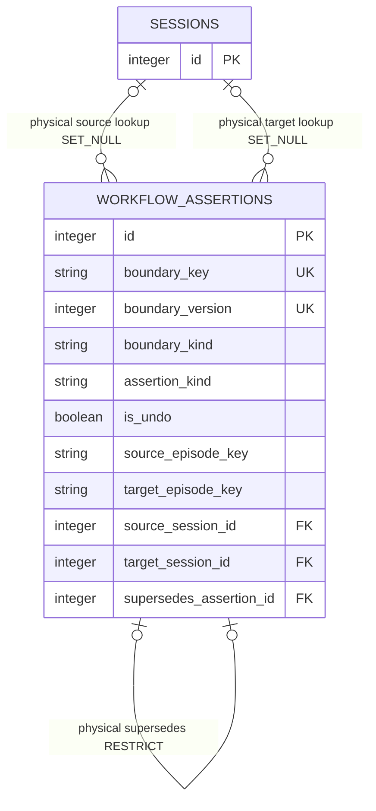

# Workflow Assertions

<!-- schema-objects: workflow_assertions -->

This subject owns durable user-confirmed corrections to the derived workflow
projection. It does not own Sessions, source evidence, deterministic candidates,
Workstream/Thread organization, or the effective graph produced at read time.

[Value Dictionary](value-dictionaries/workflow-assertions.md) owns this subject's
bounded physical/logical/presentation mappings.

## Focused ERD

The two Session relations are optional lookup aids. Stable Episode keys own the
durable target, so removing and later recreating a source Session never cascades
or changes assertion meaning.

## Catalog

### `workflow_assertions`

- Purpose and authority: append-only local ledger of one user-confirmed
  workflow relation or lifecycle boundary transition. It records the exact
  before/after state and supersession history used to overlay the deterministic
  Session Focus projection; it never rewrites the base candidate or its reasons.
- Lifecycle: user-curated and non-rebuildable. Initial action, correction,
  reopen, and undo each append one next boundary version. An active row is the
  row with no successor referencing it. Ordinary product behavior never updates
  or deletes history, and assertion state requires database backup for recovery.
- Producers: validated, user-initiated operations in
  `workflow_assertions.py`. Session ingestion, source reconciliation,
  Suggestions, Workstream organization, connectors, and models never write the
  table.
- Consumers: `workflow_assertions.py` resolves active chains, returns bounded
  history, computes optimistic projection revisions, and overlays effective
  relation/lifecycle state after FEAT-0086 candidate production.
  `workflow_correction_view.py` presents active state and exact contextual
  transitions; the Session Workflow Focus correction POST is the first product
  mutation consumer. Focus GET remains a read consumer.
- Relations and deletion: nullable `source_session_id` and
  `target_session_id` reference current `sessions.id` with `ON DELETE SET NULL`.
  `supersedes_assertion_id` is a nullable unique self-FK with `ON DELETE
  RESTRICT`, preventing two chain successors and destructive history removal.
  `source_episode_key`, optional `target_episode_key`, and `boundary_key` remain
  after lookup loss and are the application authority for later re-resolution.
- Recovery: restore the LocalBrain database backup. Restoring or rescanning
  Claude/Codex source files can re-resolve the same stable Episode key but cannot
  reconstruct user notes, correction order, supersession, or undo history.
- DDL ownership: complete fresh definition plus
  `idx_workflow_assertions_source_created` and
  `idx_workflow_assertions_target_created` in `schema.sql`; normal idempotent
  schema application creates the absent table and indexes on a compatible older
  database without rewriting existing rows. No backup-backed repair or runtime-
  only index is required.

| Column | Contract |
| --- | --- |
| `id` | `INTEGER PRIMARY KEY`; stable local assertion-history identity and supersession target. |
| `boundary_key` | 64-character `TEXT NOT NULL`; SHA-256 over a length-delimited boundary kind and stable Episode key(s). |
| `boundary_version` | positive `INTEGER NOT NULL`; next monotonic version within one boundary key. |
| `boundary_kind` | `TEXT NOT NULL`; exactly `relation` or `lifecycle`. |
| `assertion_kind` | `TEXT NOT NULL`; exactly `same-flow`, `split-here`, `merge-into`, `close`, or `reopen`. Undo retains the kind it reverses. |
| `is_undo` | checked `INTEGER NOT NULL DEFAULT 0`; `1` marks an explicit superseding reversal and `0` an ordinary assertion. |
| `source_episode_key` | `TEXT NOT NULL`; exact current FEAT-0085 `session:` plus 64-character digest identity. For lifecycle this is the selected Episode. |
| `target_episode_key` | nullable `TEXT`; required exact Episode key for relation boundaries and absent for lifecycle boundaries. |
| `source_session_id` | nullable FK to `sessions.id`, `ON DELETE SET NULL`; current navigation/lookup aid, never durable identity. |
| `target_session_id` | nullable FK to `sessions.id`, `ON DELETE SET NULL`; relation-target lookup aid and always absent for lifecycle rows. |
| `before_meaning` | exact checked relation or lifecycle meaning before this record applied. |
| `after_meaning` | exact checked relation or lifecycle meaning after this record applied. |
| `before_closure_reason` | nullable checked close reason; present if and only if `before_meaning` is `lifecycle:closed`. |
| `after_closure_reason` | nullable checked close reason; present if and only if `after_meaning` is `lifecycle:closed`. |
| `note` | nullable trimmed user text from 1 through 1,000 code points; empty input is normalized to absent. |
| `authority` | `TEXT NOT NULL DEFAULT 'user-confirmed'`; the sole durable assertion authority. |
| `contract_version` | `TEXT NOT NULL`; exactly `localbrain.workflow-assertion.v1`. |
| `supersedes_assertion_id` | nullable unique self-FK, `ON DELETE RESTRICT`; exact prior active row reversed or replaced. |
| `created_at` | `TEXT NOT NULL`; application-normalized UTC action time. |

Constraints: `UNIQUE(boundary_key, boundary_version)` and unique nullable
`supersedes_assertion_id`; 64-character boundary digest; exact Session Episode
key shape; relation-versus-lifecycle endpoint, action, meaning, and closure-
reason correlation; bounded trimmed note; exact authority/version; and action-
specific forward or reversal meaning pairs. Application validation additionally
requires currently resolved endpoints, strict forward observation time, no
self-edge/cycle/contradictory active boundary, tip-only close, active-closure
reopen, exact optimistic revision, and exact active assertion supersession.
Explicit indexes: `idx_workflow_assertions_source_created` and
`idx_workflow_assertions_target_created`; table uniqueness autoindexes own
boundary-version and successor lookups.

## Assertion And Overlay Rules

- `same-flow` produces `relation:continues`; `split-here` changes an existing
  `continues` pair to `relation:branches-from`; `merge-into` produces
  `relation:merged-into`. All relation endpoints must resolve and move strictly
  forward in current observed time.
- `close` changes a current tip from `unknown` or `open` to `closed`, or appends
  a superseding close-reason correction, using only `completed`, `abandoned`,
  `superseded`, `merged`, or `other`. `reopen` supersedes an active user closure
  and makes the Episode explicitly open. Quietness, age, Session end, and
  dismissal never create a row.
- Undo is not a sixth assertion kind. It appends the inverse before/after state
  with `is_undo = 1`; undoing that current reversal deterministically reapplies
  the prior user state while every row stays inspectable.
- Active assertions overlay only when their stable endpoints resolve and remain
  compatible with forward-time and acyclic graph rules. Missing or newly
  incompatible endpoints produce an explicit unresolved summary; the ledger is
  retained and the base projection is not silently rewritten.
- The effective projection retains `base_relations`, base Episode lifecycle,
  current assertion summaries, and a revision digest. A user relation exposes
  `user-confirmed` authority and a `user-assertion` reason while the original
  candidate and complete reasons remain separately inspectable.

## Subject Recovery Boundary

This ledger is the authority for user correction history, not for the source
facts it references. Database backup is the only complete recovery path. Source
deletion may make an assertion temporarily unresolved but must never cascade,
erase, close, reopen, or reinterpret it. Restoring the same source-scoped native
Session identity makes its stable Episode key eligible for deterministic
re-resolution; it does not update historical lookup IDs or timestamps.
