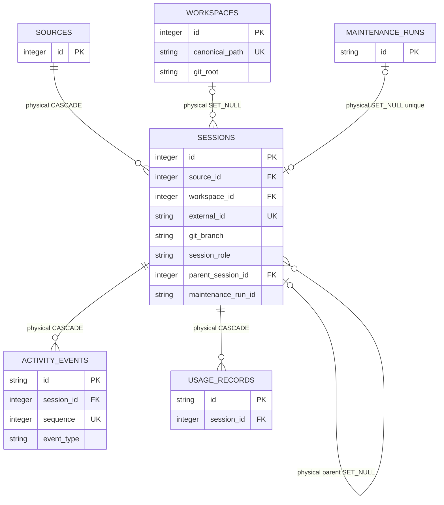

# Workspace And Session Activity

<!-- schema-objects: workspaces, sessions, activity_events -->

This subject owns current workspace identity, source-backed Session identity and hierarchy, historical working context, normalized activity events, and Session classification. Usage observations are owned separately.

## Focused ERD

## Catalog

### `workspaces`

- Purpose and authority: current canonical project/workspace identity discovered from Session working directories; the containing Git repository root is current discovery, not historical branch state.
- Lifecycle: mixed source identity and curated references. Discovery can rebuild path metadata, but Workstream/Thread links and Usage Record snapshot browsing use its stable ID, so delete-and-recreate is not equivalent to update-in-place.
- Producers: `ingest/scanner.py` upserts path, display name, Git root, existence, and activity; `db.py` removes the obsolete `git_branch` column during compatible migration.
- Consumers: inventory/detail queries, retrieval, Workstream resource pickers and links, Runner context, activity attribution, and Usage Record attribution/browse joins.
- Relations and deletion: physical optional parent of `sessions` and `context_documents`, both `SET NULL`. It is an application target for `project` polymorphic links and `usage_records.workspace_id_snapshot`; those are not cascaded by SQLite.
- Recovery: rescan Sessions to rediscover paths. Preserve or restore the database to retain stable link targets and historical current-row resolution.
- DDL ownership: fresh definition in `schema.sql`; compatible migration in `db.py` drops legacy `git_branch`. No explicit named index.

| Column | Contract |
| --- | --- |
| `id` | `INTEGER PRIMARY KEY`; stable local project identity. |
| `canonical_path` | `TEXT NOT NULL UNIQUE`; normalized current workspace path. |
| `display_name` | `TEXT NOT NULL`; current user-facing project label. |
| `git_root` | nullable `TEXT`; current discovered repository root, not branch history. |
| `exists_now` | `INTEGER NOT NULL DEFAULT 0`; current filesystem existence signal. |
| `last_activity_at` | nullable `TEXT`; latest attributed Session activity. |
| `created_at` | `TEXT NOT NULL DEFAULT CURRENT_TIMESTAMP`; first registry creation. |
| `updated_at` | `TEXT NOT NULL DEFAULT CURRENT_TIMESTAMP`; latest registry update. |

Constraints: uniqueness of `canonical_path`. Explicit indexes: none.

### `sessions`

- Purpose and authority: one normalized Claude or Codex Session/subsession per native source external identity. An in-app Task Runner Run is represented by its persisted native Claude primary Session, linked to the Run ledger rather than duplicated by LocalBrain.
- Lifecycle: all Sessions are source-derived from retained native JSONL. Stable IDs are preserved so curated links and Usage Records remain valid. A Run-linked primary and its resolved child Sessions keep metadata while maintenance index/event policy is restricted; the private Runner stream is an operational artifact only.
- Producers: `ingest/scanner.py` plus Claude/Codex parsers create Sessions and Usage Records; parent reconciliation updates self-references and propagates maintenance policy to Claude children. `runner.py` triggers Claude-only synchronization after terminal and recovered Runs. `db.py` owns the classification/Run-link constraint repair and stales source files when parser contracts change.
- Consumers: Session inventory/detail, dashboard counts, normalized activity, retrieval, Workstream linking/suggestions, Runner context, search projection, Usage Records, and Usage Dashboard denominators.
- Relations and deletion: physical `source_id` cascades; optional `workspace_id`, `parent_session_id`, and unique `maintenance_run_id` set null. Deleting a Session cascades `activity_events` and `usage_records`; scanner also removes its search row. Polymorphic links and checkpoint refs are application edges and can retain an unresolved historical ID.
- Recovery: rescan the authoritative native source file and reconcile parents. Restoring only a Task Runner stream cannot rebuild a Session or Usage Record; restore native Claude JSONL and the Run ledger together. A full database rebuild cannot restore user-curated links, exact operational history, or confirmed review state without backup.
- DDL ownership: fresh definition and `idx_sessions_last_event`, `idx_sessions_workspace` in `schema.sql`; compatible columns, backup-backed classification/Run-link table repair, and runtime-only `idx_sessions_class`, `idx_sessions_role`, `idx_sessions_parent` in `db.py`. Before that structural repair, startup preserves `localbrain.db-pre-maintenance-session-contract-v1.bak` and validates it with SQLite `quick_check`. An older additive layout may have the same approved columns in a different physical order; migration validates every name/type/null/default/key contract, copies values by canonical column name, and converges only the physical order.

| Column | Contract |
| --- | --- |
| `id` | `INTEGER PRIMARY KEY`; stable normalized Session identity. |
| `source_id` | `INTEGER NOT NULL` FK to `sources.id`, `ON DELETE CASCADE`. |
| `workspace_id` | nullable `INTEGER` FK to `workspaces.id`, `ON DELETE SET NULL`. |
| `external_id` | `TEXT NOT NULL`; source-scoped Session or subsession identity. |
| `source_path` | `TEXT NOT NULL`; authoritative native Claude or Codex JSONL path. |
| `cwd_raw` | nullable `TEXT`; historical working directory exactly as normalized from source evidence. |
| `git_branch` | nullable `TEXT`; branch observed in authoritative Session metadata. |
| `title` | `TEXT NOT NULL`; normalized display title. |
| `started_at` | nullable `TEXT`; first known Session time. |
| `ended_at` | nullable `TEXT`; declared or last known end time. |
| `last_event_at` | nullable `TEXT`; latest normalized event time. |
| `event_count` | `INTEGER NOT NULL DEFAULT 0`; normalized source event count. |
| `user_message_count` | `INTEGER NOT NULL DEFAULT 0`; normalized user-message count. |
| `assistant_message_count` | `INTEGER NOT NULL DEFAULT 0`; normalized assistant-message count. |
| `session_class` | `TEXT NOT NULL DEFAULT 'work'`; checked to `work` or `maintenance`. |
| `session_role` | `TEXT NOT NULL DEFAULT 'primary'`; checked to `primary` or `subsession`. |
| `parent_external_id` | nullable `TEXT`; source-backed parent identity retained even when unresolved. |
| `parent_session_id` | nullable self-FK, `ON DELETE SET NULL`; resolved same-source parent. |
| `index_policy` | `TEXT NOT NULL DEFAULT 'full'`; checked to `full` or `metadata_only`. |
| `maintenance_run_id` | nullable unique `TEXT` FK to `maintenance_runs.id`, `ON DELETE SET NULL`; present only for a primary metadata-only Maintenance Session. |
| `imported_at` | `TEXT NOT NULL DEFAULT CURRENT_TIMESTAMP`; latest normalized import write time. |

Constraints: `UNIQUE(source_id, external_id)`, unique nullable `maintenance_run_id`, checks for the two-value class, role, and index-policy vocabularies, and a linked-Session shape check requiring `maintenance`, `primary`, and `metadata_only`. Explicit indexes: `idx_sessions_last_event`, `idx_sessions_workspace`, `idx_sessions_class`, `idx_sessions_role`, `idx_sessions_parent`.

### `activity_events`

- Purpose and authority: normalized, ordered Session events used for conversation presentation, activity calculation, retrieval evidence, and tool/message counts without exposing raw event payload files.
- Lifecycle: source-derived and rebuildable. Scanner replaces the Session's event set atomically during re-import.
- Producers: `ingest/scanner.py` from normalized parser events.
- Consumers: `queries.py` Session detail and counts, `activity.py` active-time attribution, and `retrieval.py` evidence loading.
- Relations and deletion: `session_id` cascades from `sessions`; replacement deletes prior rows before inserting the new normalized sequence.
- Recovery: rescan the Session source. Opaque tool arguments/results are not indexed by default; a later concrete metadata requirement must introduce an explicit bounded contract rather than relying on an unused generic JSON slot.
- DDL ownership: fresh definition in `schema.sql`; event ordering uses the leading `session_id, sequence` keys of the table's UNIQUE autoindex. Compatible migration removes the former redundant named index only after verifying that coverage and removes the legacy metadata column only when every value is `NULL`.

| Column | Contract |
| --- | --- |
| `id` | `TEXT PRIMARY KEY`; deterministic normalized event identity. |
| `session_id` | `INTEGER NOT NULL` FK to `sessions.id`, `ON DELETE CASCADE`. |
| `sequence` | `INTEGER NOT NULL`; normalized order within the Session. |
| `occurred_at` | nullable `TEXT`; observed event time. |
| `event_type` | `TEXT NOT NULL`; normalized message/tool event category. |
| `role` | nullable `TEXT`; conversational role when applicable. |
| `text` | nullable `TEXT`; normalized human/assistant content eligible under ingestion policy. |
| `tool_name` | nullable `TEXT`; tool identity without opaque arguments/results by default. |
| `source_line` | `INTEGER NOT NULL`; source evidence location. |

Constraints: `UNIQUE(session_id, sequence, event_type, source_line)`. Explicit indexes: none; SQLite owns the composite uniqueness autoindex used for Session event ordering.

## Subject Recovery Boundary

Session source files can recreate Workspaces, Sessions, and Activity Events, but current project resolution and self-referential parent IDs may differ if local paths or source sets change. Preserve `cwd_raw`, `parent_external_id`, and Session branch evidence. Restore the database, not only source files, when curated polymorphic links or exact stable IDs matter.
