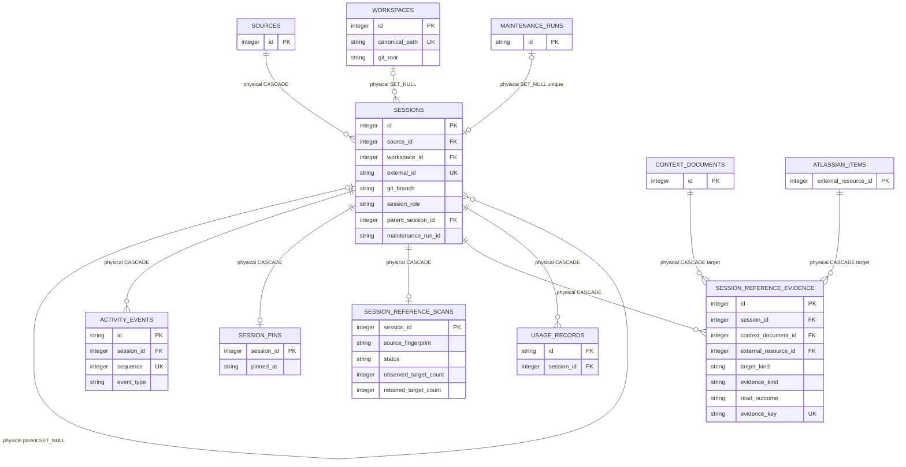

# Workspace And Session Activity

<!-- schema-objects: workspaces, sessions, activity_events, session_pins, session_reference_scans, session_reference_evidence -->

This subject owns current workspace identity, source-backed Session identity and hierarchy, historical working context, normalized activity events, Session classification, separate user-owned Session pin intent, and source-neutral derived evidence that a primary work Session referenced a target. Usage observations are owned separately. Atlassian Source Memory continues to own reusable Item identity and its legacy Session/Document URL sightings; generalized Session reference evidence owns only the Session-facing observed identity, outcome, and source location.

[Value Dictionary](value-dictionaries/workspace-and-session-activity.md) owns this subject's bounded physical/logical/presentation mappings.

## Focused ERD

## Catalog

### `workspaces`

- Purpose and authority: current canonical project/workspace identity discovered from Session working directories; the containing Git repository root is current discovery, not historical branch state.
- Lifecycle: mixed source identity and curated references. Discovery can rebuild path metadata, but Workstream/Thread links and Usage Record snapshot browsing use its stable ID, so delete-and-recreate is not equivalent to update-in-place.
- Producers: `ingest/scanner.py` upserts path, display name, Git root, existence, and activity; `db.py` removes the obsolete `git_branch` column during compatible migration.
- Consumers: inventory/detail queries, retrieval, Workstream resource pickers and links, Runner context, activity attribution, and Usage Record attribution/browse joins.
- Relations and deletion: physical optional parent of `sessions` and `context_documents`, both `SET NULL`. It is an application target for `project` polymorphic links and `usage_records.workspace_id_snapshot`; those are not cascaded by SQLite.
- Recovery: rescan Sessions to rediscover paths. Preserve or restore the database to retain stable link targets and historical current-row resolution.
- DDL ownership: fresh definition in `schema.sql`; compatible migration in `db.py` drops legacy `git_branch`. No explicit named index.

| Column | Contract |
| --- | --- |
| `id` | `INTEGER PRIMARY KEY`; stable local project identity. |
| `canonical_path` | `TEXT NOT NULL UNIQUE`; normalized current workspace path. |
| `display_name` | `TEXT NOT NULL`; current user-facing project label. |
| `git_root` | nullable `TEXT`; current discovered repository root, not branch history. |
| `exists_now` | `INTEGER NOT NULL DEFAULT 0`; current filesystem existence signal. |
| `last_activity_at` | nullable `TEXT`; latest attributed Session activity. |
| `created_at` | `TEXT NOT NULL DEFAULT CURRENT_TIMESTAMP`; first registry creation. |
| `updated_at` | `TEXT NOT NULL DEFAULT CURRENT_TIMESTAMP`; latest registry update. |

Constraints: uniqueness of `canonical_path`. Explicit indexes: none.

### `sessions`

- Purpose and authority: one normalized Claude or Codex Session/subsession per
  stable local source and native external identity. Source key owns provenance and
  statistical separation, while the Source registry provider kind owns parser and
  normalization behavior. An in-app Task Runner Run is represented by the selected
  runner's persisted native primary Session, linked to the Run ledger rather than
  duplicated by LocalBrain.
- Lifecycle: all Sessions are source-derived from meaningful retained native JSONL
  accepted by the owning provider's Session-candidate contract. Meaningful means
  the parsed file contains at least one normalized Activity Event or direct Usage
  Record; metadata-only stubs retain no Session or source-file projection and are
  reconsidered on later syncs. Codex conversation ingestion prefers native
  `event_msg` user/assistant records per role and falls back to `response_item`
  message content only when the matching role and turn are absent. Response-only
  user records exclude Codex-expanded repository/environment instructions and
  `<skill>` bodies before retaining the final user-authored record in a turn, so
  the literal `$skill` prompt remains visible without duplicating provider context.
  Claude
  primary files and direct `subagents/*.jsonl` children are accepted, while deeper
  internal `subagents` artifacts such as workflow journals are not Sessions. Codex
  `source.subagent.other=guardian` files remain normalized so their stable source
  identity, parent relation, and directly observed Usage Records survive, but the
  parser classifies them as maintenance plus metadata-only: their approval prompts
  and decisions produce no Activity Events, question counts, search text, or
  ordinary Session/Subsession presentation. A successful scan reconciles a
  previously imported row that is no longer an
  accepted candidate without deleting the native file. Native tools can remove
  accepted JSONL files under their own retention policies; Claude Code is a
  confirmed example because it deletes Session files older than
  `cleanupPeriodDays` at startup. LocalBrain is therefore a source mirror rather
  than an immutable Session archive. Stable IDs are preserved while their
  accepted source files remain so curated links and Usage Records remain valid.
  The same native external ID may exist under personal Codex and Codex Company
  because Session identity is unique within `source_id`, not provider kind. A
  Run-linked primary and its resolved child Sessions keep metadata while
  maintenance index/event policy is restricted; the private Runner stream is an
  operational artifact only.
- Producers: `ingest/scanner.py` plus Claude/Codex parsers create Sessions and Usage Records; parent reconciliation updates self-references and propagates maintenance policy to Claude or Codex children. `runner.py` synchronizes the selected native source after terminal and recovered Runs. Session projection freshness is independently versioned in `source_files`, so classification/parser changes can rebuild Sessions, Activity Events, and search without replacing Usage merely because the Session contract changed. `db.py` owns the classification/Run-link constraint repair.
- Consumers: Session inventory/detail, dashboard counts, normalized activity, retrieval, Workstream linking/suggestions, Runner context, search projection, Usage Records, and Usage Dashboard denominators. Sessions inventory headline, rows, pagination, and Project grouping share the same `work` plus `primary` denominator with no age cutoff. A selected source matches the stable `sources.kind`, not `provider_kind`, so personal and company Codex remain statistically separate while sharing one adapter.
- Relations and deletion: physical `source_id` cascades; optional `workspace_id`, `parent_session_id`, and unique `maintenance_run_id` set null. After a successful scan of a present source root, disappearance of one previously imported native JSONL or confirmation that it remains a zero-Event, zero-Usage stub is deletion authority for its normalized Session. Deleting that Session cascades `activity_events`, `usage_records`, derived `session_reference_scans` and `session_reference_evidence`, and the optional user-owned `session_pins` row; scanner also removes its search and source-file projection while preserving a present native stub. A wholly missing source root does not trigger the same stale-file reconciliation. Polymorphic links and checkpoint refs are application edges and can retain an unresolved historical ID.
- Recovery: rescan the authoritative native source file and reconcile parents. Restoring only a Task Runner stream cannot rebuild a Session or Usage Record; restore the selected runner's native Claude or Codex JSONL and the Run ledger together. A full database rebuild cannot restore user-curated links, exact operational history, or confirmed review state without backup.
- DDL ownership: fresh definition and `idx_sessions_last_event`, `idx_sessions_workspace` in `schema.sql`; compatible columns, backup-backed classification/Run-link table repair, and runtime-only `idx_sessions_class`, `idx_sessions_role`, `idx_sessions_parent` in `db.py`. Before that structural repair, startup preserves `localbrain.db-pre-maintenance-session-contract-v1.bak` and validates it with SQLite `quick_check`. An older additive layout may have the same approved columns in a different physical order; migration validates every name/type/null/default/key contract, copies values by canonical column name, and converges only the physical order.

| Column | Contract |
| --- | --- |
| `id` | `INTEGER PRIMARY KEY`; stable normalized Session identity. |
| `source_id` | `INTEGER NOT NULL` FK to `sources.id`, `ON DELETE CASCADE`. |
| `workspace_id` | nullable `INTEGER` FK to `workspaces.id`, `ON DELETE SET NULL`. |
| `external_id` | `TEXT NOT NULL`; source-scoped Session or subsession identity. |
| `source_path` | `TEXT NOT NULL`; authoritative native Claude or Codex JSONL path. |
| `cwd_raw` | nullable `TEXT`; historical working directory exactly as normalized from source evidence. |
| `git_branch` | nullable `TEXT`; branch observed in authoritative Session metadata. |
| `title` | `TEXT NOT NULL`; normalized display title. |
| `started_at` | nullable `TEXT`; first known Session time. |
| `ended_at` | nullable `TEXT`; declared or last known end time. |
| `last_event_at` | nullable `TEXT`; latest normalized event time. |
| `event_count` | `INTEGER NOT NULL DEFAULT 0`; normalized source event count. |
| `user_message_count` | `INTEGER NOT NULL DEFAULT 0`; normalized user-message count. |
| `assistant_message_count` | `INTEGER NOT NULL DEFAULT 0`; normalized assistant-message count. |
| `session_class` | `TEXT NOT NULL DEFAULT 'work'`; checked to `work` or `maintenance`. `maintenance` owns non-work execution activity, including linked LocalBrain Runs and recognized provider-internal helpers. |
| `session_role` | `TEXT NOT NULL DEFAULT 'primary'`; checked to `primary` or `subsession`. |
| `parent_external_id` | nullable `TEXT`; source-backed parent identity retained even when unresolved. |
| `parent_session_id` | nullable self-FK, `ON DELETE SET NULL`; resolved same-source parent. |
| `index_policy` | `TEXT NOT NULL DEFAULT 'full'`; checked to `full` or `metadata_only`. |
| `maintenance_run_id` | nullable unique `TEXT` FK to `maintenance_runs.id`, `ON DELETE SET NULL`; present only for a primary metadata-only Maintenance Session. |
| `imported_at` | `TEXT NOT NULL DEFAULT CURRENT_TIMESTAMP`; latest normalized import write time. |

Constraints: `UNIQUE(source_id, external_id)`, unique nullable `maintenance_run_id`, checks for the two-value class, role, and index-policy vocabularies, and a linked-Session shape check requiring `maintenance`, `primary`, and `metadata_only`. Explicit indexes: `idx_sessions_last_event`, `idx_sessions_workspace`, `idx_sessions_class`, `idx_sessions_role`, `idx_sessions_parent`.

### `activity_events`

- Purpose and authority: normalized, ordered Session events used for conversation presentation, activity calculation, retrieval evidence, and tool/message counts without exposing raw event payload files.
- Lifecycle: source-derived and rebuildable. Scanner replaces the Session's event set atomically during re-import. Canonical Claude and personal Codex event IDs retain their existing deterministic values; an additional source key reusing either provider scopes the stored event ID by that source key so identical native event identities can coexist.
- Producers: `ingest/scanner.py` from normalized parser events.
- Consumers: `queries.py` Session detail and counts, `activity.py` active-time attribution, and `retrieval.py` evidence loading. Primary Session `관련 자료` consumes the separate normalized reference-evidence projection rather than reparsing Activity Event text at request time; workspace membership alone is not a related-material relation. The projection adds no Session column or relationship row.
- Relations and deletion: `session_id` cascades from `sessions`; replacement deletes prior rows before inserting the new normalized sequence.
- Recovery: rescan the Session source. Opaque tool arguments/results are not indexed by default; a later concrete metadata requirement must introduce an explicit bounded contract rather than relying on an unused generic JSON slot.
- DDL ownership: fresh definition in `schema.sql`; event ordering uses the leading `session_id, sequence` keys of the table's UNIQUE autoindex. Compatible migration removes the former redundant named index only after verifying that coverage and removes the legacy metadata column only when every value is `NULL`.

| Column | Contract |
| --- | --- |
| `id` | `TEXT PRIMARY KEY`; deterministic normalized event identity, source-key scoped for additional provider-sharing sources. |
| `session_id` | `INTEGER NOT NULL` FK to `sessions.id`, `ON DELETE CASCADE`. |
| `sequence` | `INTEGER NOT NULL`; normalized order within the Session. |
| `occurred_at` | nullable `TEXT`; observed event time. |
| `event_type` | `TEXT NOT NULL`; normalized message/tool event category. |
| `role` | nullable `TEXT`; conversational role when applicable. |
| `text` | nullable `TEXT`; normalized human/assistant content eligible under ingestion policy. |
| `tool_name` | nullable `TEXT`; tool identity without opaque arguments/results by default. |
| `source_line` | `INTEGER NOT NULL`; source evidence location. |

Constraints: `UNIQUE(session_id, sequence, event_type, source_line)`. Explicit indexes: none; SQLite owns the composite uniqueness autoindex used for Session event ordering.

### `session_pins`

- Purpose and authority: current owner-selected recall state for an eligible persisted primary work Session. Row presence means pinned; absence means unpinned. The table has no status, active, or soft-delete value.
- Lifecycle: user-curated and non-rebuildable. Pinning inserts one row, repeated pin is idempotent and preserves `pinned_at`, unpinning deletes only that row, and pinning again creates a new timestamp.
- Producers: trusted local pin/unpin operations in `session_pins.py`. Session scanners and source adapters never write this table.
- Consumers: pinned Session membership, bounded internal queries, and the uncapped product recall projection in `session_pins.py`; Sessions inventory/detail controls and the global `Pinned Sessions` panel are downstream consumers.
- Relations and deletion: `session_id` is both primary key and FK to `sessions.id`, `ON DELETE CASCADE`. Explicit Session or source deletion removes the pin because no reopenable Session remains. Ordinary Session upserts preserve the stable Session row and its pin.
- Recovery: restore the LocalBrain database backup. Native Claude or Codex Session files can rebuild the Session but cannot reconstruct owner pin intent or its pin time.
- DDL ownership: complete fresh definition in `schema.sql`; normal startup creates the absent table on a compatible older database through the same idempotent schema application. No explicit named index.

| Column | Contract |
| --- | --- |
| `session_id` | `INTEGER PRIMARY KEY` and FK to `sessions.id`, `ON DELETE CASCADE`; the one row is the complete pin state. |
| `pinned_at` | `TEXT NOT NULL`; first time of the current pin interval, preserved by repeated pin and replaced only after unpin plus re-pin. |

Constraints: one row per Session, required pin time, and cascading physical ownership. Application eligibility admits only persisted `work` plus `primary` Sessions. Explicit indexes: none; the primary-key index owns membership and join lookup.

### `session_reference_scans`

- Purpose and authority: the aggregate local extraction state for one eligible primary work Session across its current contributing source files. It owns source fingerprint/version compatibility, the latest completed or failed reconciliation state, and the observed-versus-retained target bound; it does not own Session content or source health for unrelated ingestion work.
- Lifecycle: fully derived and rebuildable. A successful `ok` or `partial` reconciliation replaces current evidence and advances the row; an `error` records only bounded diagnostics while prior valid evidence may remain stale. Maintenance Sessions and Subsessions are ineligible producer inputs.
- Producers: the FEAT-0073 Session reference reconciler after provider parsing and source-level Session reconciliation complete.
- Consumers: Session reference skip/retry diagnostics and the bounded primary Session detail projection. A detail request never reads JSONL to reinterpret this state.
- Relations and deletion: `session_id` is both primary key and FK to `sessions.id`, `ON DELETE CASCADE`. Removing the Session removes only its derived scan state and cannot delete a Document, Resource, remote Item fact, or organization link.
- Recovery: synchronize the still-available registered Session source. If the source is unavailable, retain prior valid evidence plus error state until a later successful reconciliation.
- DDL ownership: complete fresh definition in `schema.sql`; ordinary idempotent schema application creates the absent table on compatible older databases without rewriting retained rows. No runtime-only migration or named index is required.

| Column | Contract |
| --- | --- |
| `session_id` | `INTEGER PRIMARY KEY` and FK to `sessions.id`, `ON DELETE CASCADE`; one aggregate reference state per Session. |
| `source_fingerprint` | `TEXT NOT NULL`; exactly 64 characters identifying the ordered current contributing source set. |
| `extractor_version` | `TEXT NOT NULL`; non-empty version no longer than 80 characters. |
| `status` | `TEXT NOT NULL`; checked to `ok`, `partial`, or `error`. |
| `observed_target_count` | non-negative `INTEGER NOT NULL DEFAULT 0`; total unique targets observed before the safety bound. |
| `retained_target_count` | `INTEGER NOT NULL DEFAULT 0`; non-negative retained unique targets, never above observed count or 100. |
| `error_code` | nullable `TEXT`; required non-empty value no longer than 80 characters only for `error`. |
| `error_message` | nullable `TEXT`; application-generated diagnostic no longer than 500 characters and allowed only for `error`. |
| `scanned_at` | `TEXT NOT NULL`; latest reconciliation attempt time. |
| `updated_at` | `TEXT NOT NULL DEFAULT CURRENT_TIMESTAMP`; latest row write. |

Constraints: 64-character source fingerprint; bounded extractor and error values; non-negative counts; retained count no greater than observed count or 100; `ok` requires equal counts, `partial` requires 100 retained and more observed, and `error` requires a code while completed states prohibit diagnostics. Explicit indexes: none; the Session primary key owns lookup and uniqueness.

### `session_reference_evidence`

- Purpose and authority: one privacy-minimized normalized evidence location showing that an eligible primary work Session visibly mentioned, observed through an approved result, or completed an approved read attempt for one target. The row owns Session-facing observed identity and read outcome, not Activity Event text, Resource title, Document content, remote truth, or organization membership.
- Lifecycle: fully derived per Session source evidence. Successful reconciliation
  replaces each contributing source path's current deterministic evidence-key set,
  then finalizes one aggregate Session bound and removes obsolete rows. Failed
  parsing or reconciliation retains the last valid set through
  `session_reference_scans.error`. Replays, compaction, and rescans reuse
  deterministic keys and cannot add duplicate locations. A partial/error
  multi-file Session reparses current siblings before finalization so evidence
  previously outside the 100-target bound can re-enter when stronger targets
  disappear.
- Producers: shared Claude/Codex `ParsedReferenceCandidate` adapters and the
  source-neutral resolver/reconciler in `session_references.py`, invoked only by
  Session synchronization.
- Consumers: the bounded FEAT-0073 read projection and FEAT-0074 primary Session `관련 자료` rail. The rail maps evidence to `MCP 조회`, `MCP 조회 실패`, `사용자 메시지에서 언급`, `Agent 응답에서 언급`, or `도구 결과에서 확인`, uses `observed_identity` before shared Resource titles, orders retained direct targets by their oldest `observed_at` with deterministic source-location fallback, and keeps the direct target under its strongest group when an explicit organization relation also exists. Read counts use distinct completed resource-read call IDs; mention and observation counts use distinct normalized source locations.
- Relations and deletion: required Session FK plus an optional target FK selected by `target_kind`. Session, exact Context Document target, or configured Atlassian Item deletion cascades the now-unresolvable derived row. The edge points from evidence to the shared target, so evidence reconciliation never deletes or mutates the Document, External Resource/Item, remote content, note, classification, Thread, or Workstream.
- Recovery: rescan the authoritative Session source while its exact eligible Document and configured Atlassian Item targets remain resolvable. Generic safe URLs are rebuilt from the Session source without creating shared Resource rows.
- Atlassian descriptor projection remains a generic `url` target until an exact
  configured Item resolves. For recognized Item, structure, or Site families,
  `target_key` hashes the canonical semantic domain/service/kind/identity tuple
  rather than the whole safe URL. Locator spelling and non-authoritative
  container hint do not enter grouping. `normalized_url` retains only the
  canonical allowlisted safe locator needed for later deterministic reparse;
  RapidBoard can retain positive `rapidView` and one validated `projectKey`
  hint, while raw query, JQL, and unrelated parameters are discarded.
- DDL ownership: complete fresh definition and `idx_session_reference_evidence_session`, `idx_session_reference_evidence_document`, and `idx_session_reference_evidence_atlassian` in `schema.sql`; ordinary idempotent schema application adds them to compatible older databases.

| Column | Contract |
| --- | --- |
| `id` | `INTEGER PRIMARY KEY`; local row identity while one deterministic evidence key remains. |
| `session_id` | `INTEGER NOT NULL` FK to `sessions.id`, `ON DELETE CASCADE`. |
| `source_path` | non-empty `TEXT NOT NULL` up to 8,000 characters; authoritative contributing Session file identity. |
| `source_event_id` | nullable non-empty `TEXT` up to 1,000 characters; provider event identity when available. |
| `source_line` | positive `INTEGER NOT NULL`; source JSONL location. |
| `evidence_ordinal` | positive `INTEGER NOT NULL`; normalized occurrence within the source location. |
| `target_kind` | `TEXT NOT NULL`; checked to `url`, `context_document`, or `atlassian_item`. |
| `target_key` | non-empty `TEXT NOT NULL` up to 300 characters; opaque deterministic grouping key, never display copy. Generic URL grouping hashes the whole safe URL; a recognized Atlassian Item/structure/Site URL hashes its canonical semantic descriptor so locator aliases and container hints cannot split identity. |
| `context_document_id` | nullable FK to `context_documents.id`, `ON DELETE CASCADE`; required only for `context_document`. |
| `external_resource_id` | nullable FK to `atlassian_items.external_resource_id`, `ON DELETE CASCADE`; required only for `atlassian_item`. |
| `evidence_kind` | `TEXT NOT NULL`; checked to `user_mention`, `assistant_mention`, `tool_result`, or `resource_read`. |
| `read_outcome` | nullable `TEXT`; `success` or `failure` and required only for `resource_read`. |
| `observed_identity` | non-empty `TEXT NOT NULL` up to 500 characters; bounded Session-facing issue key, file identity, or safe host/path identity. |
| `normalized_url` | nullable non-empty `TEXT` up to 8,000 characters; required for URL and Atlassian targets and prohibited for Context Documents. It contains only approved normalized safe destination data. Generic URLs contain no query; a recognized Atlassian descriptor may retain only its canonical bounded identity-query projection and optional approved grouping hint. |
| `tool_name` | nullable non-empty `TEXT` up to 200 characters; required only for approved tool-result and resource-read evidence. |
| `tool_call_id` | nullable non-empty `TEXT` up to 500 characters; required only for approved tool-result and completed resource-read correlation. |
| `observed_at` | nullable `TEXT`; source event/result time when available. |
| `extractor_version` | non-empty `TEXT NOT NULL` up to 80 characters; producer contract version. |
| `evidence_key` | unique 64-character `TEXT NOT NULL` fingerprint of Session source path and native location, target, evidence kind/outcome, and extractor contract. |
| `first_observed_at` | `TEXT NOT NULL`; first local reconciliation of this evidence key. |
| `last_observed_at` | `TEXT NOT NULL`; latest successful reconciliation retaining the key. |
| `updated_at` | `TEXT NOT NULL DEFAULT CURRENT_TIMESTAMP`; latest row write. |

Constraints: exact target-kind/FK/normalized-URL parity; exact evidence-kind/read-outcome/tool identity parity; positive locations; bounded paths, identities, URLs, tool fields, and extractor version; unique 64-character evidence key. The producer retains at most 100 target keys per Session and at most 50 deterministic evidence locations per retained target. Explicit indexes: `idx_session_reference_evidence_session` for target grouping and stable evidence order, `idx_session_reference_evidence_document`, and `idx_session_reference_evidence_atlassian` for target lifecycle and reverse diagnostics.

## Subject Recovery Boundary

Session source files can recreate Workspaces, Sessions, Activity Events, Session reference scan state, and Session reference evidence, but current project resolution, exact target availability, and self-referential parent IDs may differ if local paths or source sets change. They cannot recreate Session pins. Preserve `cwd_raw`, `parent_external_id`, and Session branch evidence. Restore the database, not only source files, when pin intent, curated polymorphic links, or exact stable IDs matter.
